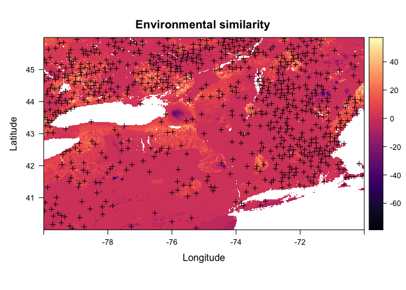
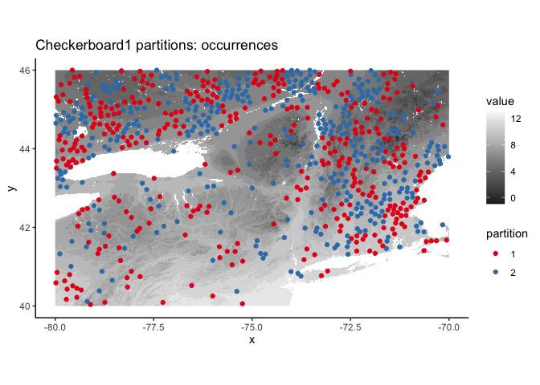
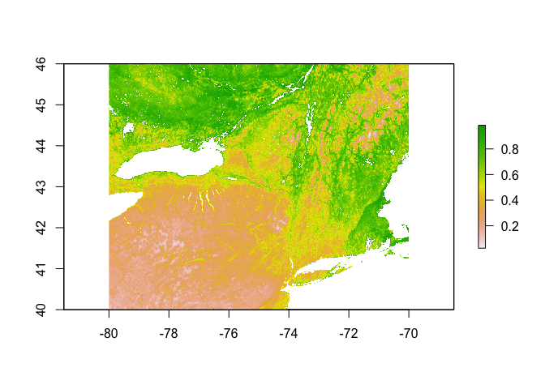
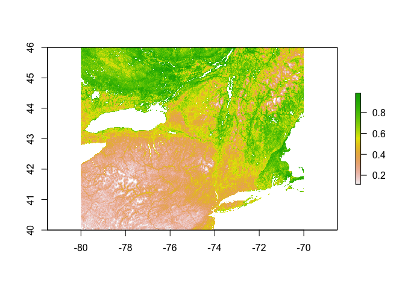
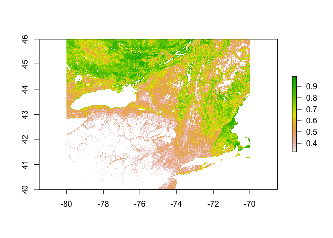
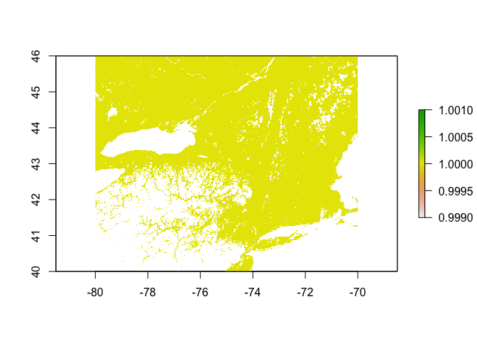

Apocynum androsaemifolium SDM | MaxEnt
================
Mark Buckner
2021-09-24

  - [Load Occurrence Data and
    Predictors](#load-occurance-data-and-predictors)
  - [MESS](#mess)
  - [Random Background Points](#random-background-points)
  - [Partition for Model Evaluation](#partition-for-model-evaluation)
  - [Env. Similarity of Partions](#env-similarity-of-partions)
  - [Tune model](#tune-model)
  - [Model turning results and
    Selection](#model-turning-results-and-selection)
  - [Prediction](#prediction)
  - [Threshold](#threshold)
  - [Minimum training presence](#minimum-training-presence)
  - [10th percentile training
    presence](#10th-percentile-training-presence)

``` r
library(spatial)
library(rgdal)
library(ENMeval, attach.required = T)
library(rmaxent)
library(raster)
library(tidyverse)
library(lubridate)
library(knitr)
```

### Load Occurance Data and Predictors

Occurrence and predictor data processed in `occ_pred_data_1km.Rmd`.
Occurrence data needs to have the unique identifiers removed and
projected to the project projection (`+proj=longlat +ellps=WGS84
+datum=WGS84 +no_defs`) to create a `matrix array`. The predictors are
described below.

Bioclimatic variables (USGS descriptions available
[here](https://pubs.usgs.gov/ds/691/ds691.pdf))

  - Bio 1 : Mean Annual Temperature
  - Bio 2 : Annual Mean Diurnal Range
  - Bio 3 : Isothermality
  - Bio 4 : Temperature Seasonality
  - Bio 5 : Max Temperature of Warmest Month
  - Bio 7 : Annual Temperature Range
  - Bio 8 : Mean Temperature of Wettest Quarter
  - Bio 9 : Mean Temperature of Driest Quarter
  - Bio 10 : Mean Temperature of Warmest Quarter
  - Bio 11 : Mean Temperature of Coldest Quarter
  - Bio 12 : Annual Precipitation
  - Bio 13 : Precipitation of Wettest Month
  - Bio 14 : Precipitation of Driest Month
  - Bio 15 : Precipitation Seasonality
  - Bio 16 : Precipitation of Wettest Quarter
  - Bio 17 : Precipitation of Driest Quarter
  - Bio 18 : Precipitation of Warmest Quarter
  - Bio 19 : Precipitation of Coldest Quarter

Topographical and soils data

  - DEM : Elevation in m
  - Proximity to Water : Arbitrary
  - Soil Water Content : 0cm depth
  - Soil Sand Content : 0cm depth

<!-- end list -->

``` r
#Occurrences
occ <- read_csv("../../occ/Aa_NE70.csv")

occs <- select(occ, lat, lon)
occs <- rgdal::project(as.matrix(occs[,c("lon","lat")]), proj = "+proj=longlat +ellps=WGS84 +datum=WGS84 +no_defs")

#Predictors
#env <- stackOpen("../../pred/pred_stack_ne/stack")
env <- stack("../../pred/pred_stack_ne/baseline.tif")
names(env) <- c(paste("bio", seq(1,19), sep = ""), "dem", "wprox", "sand", "h20")

plot(env[[1:12]])
```

<!-- -->

``` r
plot(env[[13:nlayers(env)]])
```

<!-- -->

``` r
plot(env[[1]], main="Mean ann. temp. | A. androsaemifolium Occ.")
points(occs, pch = 16, cex = 0.5)
```

<!-- -->

``` r
#Load spThin dataset from Lc_Mn_SDM_1km_RF.Rmd
occs <- read_csv("../../occ/Aa_NE_thinned_full/Aa_ne_thinned_thin1.csv") %>% 
  select(lat,lon)
  
occs <- rgdal::project(as.matrix(occs[,c("lon","lat")]), proj = "+proj=longlat +ellps=WGS84 +datum=WGS84 +no_defs")

plot(env[[1]], main="Mean ann. temp. | A. androsaemifolium Occ.")
points(occs, pch = 16, cex = 0.5)
```

<!-- --> 
### MESS

``` r
occs.z <- raster::extract(env, occs)
occs.sim <- similarity(env, occs.z)
occs.mess <- occs.sim$similarity_min
occs.sp <- sp::SpatialPoints(occs)

myScale <- seq(cellStats(occs.mess, min), cellStats(occs.mess, max), length.out = 100)
rasterVis::levelplot(occs.mess, main = "Environmental similarity", at = myScale, margin = FALSE) + 
  latticeExtra::layer(sp.points(occs.sp, col="black"))
```

<!-- -->

### Random Background Points

``` r
(points <- sum(!is.na(getValues(env[[1]])))*0.15)
```

    ## [1] 109344.6

``` r
bg <- dismo::randomPoints(env, n = round(points)) %>% as.data.frame()
colnames(bg) <- colnames(occs)

plot(env[[1]])
points(bg, pch = 20, cex = 0.3)
```

<!-- -->

### Partition for Model Evaluation

``` r
check <- get.checkerboard1(occs, env, bg, aggregation.factor = 100)
table(check$occs.grp)
```

    ## 
    ##   1   2 
    ## 367 370

``` r
evalplot.grps(pts = occs, pts.grp = check$occs.grp, envs = env) + 
  ggplot2::ggtitle("Checkerboard1 partitions: occurrences")
```

    ## Plotting first raster in stack...

<!-- -->

### Env. Similarity of Partions

``` r
occs.z <- cbind(occs, raster::extract(env, occs))
bg.z <- cbind(bg, raster::extract(env, bg))
evalplot.envSim.hist(sim.type = "mess", ref.data = "occs", occs.z = occs.z, bg.z = bg.z, 
                     occs.grp = check$occs.grp, bg.grp = check$bg.grp)
```

<!-- -->

``` r
evalplot.envSim.hist(sim.type = "most_diff", ref.data = "occs", occs.z = occs.z, bg.z = bg.z, 
                     occs.grp = check$occs.grp, bg.grp = check$bg.grp)
```

<!-- -->

``` r
evalplot.envSim.map(sim.type = "mess", ref.data = "occs", envs = env, occs.z = occs.z, 
                    bg.z = bg.z, occs.grp = check$occs.grp, bg.grp = check$bg.grp, bb.buf = 7)
```

<!-- -->

### Tune model

``` r
#https://www.l3harrisgeospatial.com/Support/Self-Help-Tools/Help-Articles/Help-Articles-Detail/ArtMID/10220/ArticleID/23780/macOS-Catalina-1015-ENVIIDL-and-Legacy-Java-6-Dependencies
library(rJava)

e.mx <- ENMevaluate(occs = occs, envs = env, bg = bg, 
                    algorithm = 'maxent.jar', partitions = 'checkerboard1', parallel = TRUE, 
                    tune.args = list(fc = c("L","LQ","LQH","H"), rm = 1:5))
```

    ## *** Running initial checks... ***

    ## * Removed 9 occurrence points with NA predictor variable values.

    ## * Clamping predictor variable rasters...

    ## * Model evaluations with checkerboard (2-fold) cross validation...

    ## 
    ## *** Running ENMeval v2.0.0 with maxent.jar v3.4.1 from dismo package v1.3.3 ***

    ##   |                                                                              |                                                                      |   0%

    ## 
    ## Of 4 total cores using 4...

    ## Running in parallel using doSNOW...

    ##   |                                                                              |====                                                                  |   5%  |                                                                              |=======                                                               |  10%  |                                                                              |==========                                                            |  15%  |                                                                              |==============                                                        |  20%  |                                                                              |==================                                                    |  25%  |                                                                              |=====================                                                 |  30%  |                                                                              |========================                                              |  35%  |                                                                              |============================                                          |  40%  |                                                                              |================================                                      |  45%  |                                                                              |===================================                                   |  50%  |                                                                              |======================================                                |  55%  |                                                                              |==========================================                            |  60%  |                                                                              |==============================================                        |  65%  |                                                                              |=================================================                     |  70%  |                                                                              |====================================================                  |  75%  |                                                                              |========================================================              |  80%  |                                                                              |============================================================          |  85%  |                                                                              |===============================================================       |  90%  |                                                                              |==================================================================    |  95%  |                                                                              |======================================================================| 100%
    ## This is MaxEnt version 3.4.1 
    ## This is MaxEnt version 3.4.1 
    ## This is MaxEnt version 3.4.1 
    ## This is MaxEnt version 3.4.1 
    ## This is MaxEnt version 3.4.1 
    ## This is MaxEnt version 3.4.1 
    ## This is MaxEnt version 3.4.1 
    ## This is MaxEnt version 3.4.1 
    ## This is MaxEnt version 3.4.1 
    ## This is MaxEnt version 3.4.1 
    ## This is MaxEnt version 3.4.1 
    ## This is MaxEnt version 3.4.1 
    ## This is MaxEnt version 3.4.1 
    ## This is MaxEnt version 3.4.1 
    ## This is MaxEnt version 3.4.1 
    ## This is MaxEnt version 3.4.1 
    ## This is MaxEnt version 3.4.1 
    ## This is MaxEnt version 3.4.1 
    ## This is MaxEnt version 3.4.1 
    ## This is MaxEnt version 3.4.1 
    ## This is MaxEnt version 3.4.1 
    ## This is MaxEnt version 3.4.1 
    ## This is MaxEnt version 3.4.1 
    ## This is MaxEnt version 3.4.1 
    ## This is MaxEnt version 3.4.1 
    ## This is MaxEnt version 3.4.1 
    ## This is MaxEnt version 3.4.1 
    ## This is MaxEnt version 3.4.1 
    ## This is MaxEnt version 3.4.1 
    ## This is MaxEnt version 3.4.1 
    ## This is MaxEnt version 3.4.1 
    ## This is MaxEnt version 3.4.1 
    ## This is MaxEnt version 3.4.1 
    ## This is MaxEnt version 3.4.1 
    ## This is MaxEnt version 3.4.1 
    ## This is MaxEnt version 3.4.1 
    ## This is MaxEnt version 3.4.1 
    ## This is MaxEnt version 3.4.1 
    ## This is MaxEnt version 3.4.1 
    ## This is MaxEnt version 3.4.1

    ## ENMevaluate completed in 60 minutes 19 seconds.

``` r
e.mx
```

    ## An object of class:  ENMevaluation 
    ##  occurrence/background points:  728 / 109345 
    ##  partition method:  checkerboard1 
    ##  partition settings:  none 
    ##  clamp:  TRUE 
    ##  clamp directions:  left: bio1, bio2, bio3, bio4, bio5, bio6, bio7, bio8, bio9, bio10, bio11, bio12, bio13, bio14, bio15, bio16, bio17, bio18, bio19, dem, wprox, sand, h20
    ##                     right: bio1, bio2, bio3, bio4, bio5, bio6, bio7, bio8, bio9, bio10, bio11, bio12, bio13, bio14, bio15, bio16, bio17, bio18, bio19, dem, wprox, sand, h20 
    ##  algorithm:  maxent.jar 
    ##  tune settings:  fc: L,LQ,LQH,H
    ##                  rm: 1,2,3,4,5 
    ##  overlap:  TRUE 
    ## Refer to ?ENMevaluation for information on slots.

### Model turning results and Selection

``` r
evalplot.stats(e = e.mx, stats = c("AICc"), color = "fc", x.var = "rm", 
               error.bars = FALSE)
```

<!-- -->

``` r
evalplot.stats(e = e.mx, stats = c("auc.val"), color = "fc", x.var = "rm", 
               error.bars = FALSE)
```

<!-- --> Method
1: ∆AICc \< 2, then AUC

``` r
res <- eval.results(e.mx)
kable(res)
```

| fc  | rm | tune.args    | auc.train | cbi.train | auc.diff.avg | auc.diff.sd | auc.val.avg | auc.val.sd | cbi.val.avg | cbi.val.sd | or.10p.avg | or.10p.sd | or.mtp.avg | or.mtp.sd |     AICc | delta.AICc |     w.AIC | ncoef |
| :-- | :- | :----------- | --------: | --------: | -----------: | ----------: | ----------: | ---------: | ----------: | ---------: | ---------: | --------: | ---------: | --------: | -------: | ---------: | --------: | ----: |
| L   | 1  | fc.L\_rm.1   | 0.6820026 |     0.935 |    0.0292249 |   0.0177830 |   0.6740587 |  0.0209160 |      0.9225 |  0.0304056 |  0.1104792 | 0.0403875 |  0.0028249 | 0.0039950 | 19397.30 |  10.913356 | 0.0040843 |    14 |
| LQ  | 1  | fc.LQ\_rm.1  | 0.6869098 |     0.960 |    0.0276102 |   0.0232383 |   0.6772168 |  0.0179890 |      0.9105 |  0.0572756 |  0.1201396 | 0.0380696 |  0.0014124 | 0.0019975 | 19386.38 |   0.000000 | 0.9570229 |    17 |
| LQH | 1  | fc.LQH\_rm.1 | 0.7257325 |     0.998 |    0.0500417 |   0.0399571 |   0.6900192 |  0.0195155 |      0.9890 |  0.0028284 |  0.1323983 | 0.0434211 |  0.0055742 | 0.0041018 | 19514.43 | 128.041165 | 0.0000000 |   137 |
| H   | 1  | fc.H\_rm.1   | 0.7266038 |     0.998 |    0.0510194 |   0.0404309 |   0.6891967 |  0.0186523 |      0.9860 |  0.0014142 |  0.1362579 | 0.0568693 |  0.0055742 | 0.0041018 | 19515.54 | 129.152952 | 0.0000000 |   138 |
| L   | 2  | fc.L\_rm.2   | 0.6790464 |     0.913 |    0.0305736 |   0.0117333 |   0.6733702 |  0.0220896 |      0.9205 |  0.0431335 |  0.1146409 | 0.0382832 |  0.0000000 | 0.0000000 | 19399.32 |  12.933445 | 0.0014875 |    10 |
| LQ  | 2  | fc.LQ\_rm.2  | 0.6827780 |     0.923 |    0.0259704 |   0.0175085 |   0.6740030 |  0.0196784 |      0.9175 |  0.0530330 |  0.1202151 | 0.0341814 |  0.0013369 | 0.0018907 | 19393.22 |   6.837788 | 0.0313412 |    13 |
| LQH | 2  | fc.LQH\_rm.2 | 0.7144851 |     0.996 |    0.0293679 |   0.0367870 |   0.6931230 |  0.0212992 |      0.9860 |  0.0070711 |  0.1202906 | 0.0302933 |  0.0027493 | 0.0001068 | 19423.66 |  37.278858 | 0.0000000 |    81 |
| H   | 2  | fc.H\_rm.2   | 0.7135527 |     0.996 |    0.0302395 |   0.0383951 |   0.6888262 |  0.0187056 |      0.9740 |  0.0028284 |  0.1202906 | 0.0302933 |  0.0014124 | 0.0019975 | 19495.74 | 109.354564 | 0.0000000 |   106 |
| L   | 3  | fc.L\_rm.3   | 0.6782025 |     0.923 |    0.0313068 |   0.0111465 |   0.6725709 |  0.0217055 |      0.9275 |  0.0544472 |  0.1133040 | 0.0363925 |  0.0000000 | 0.0000000 | 19401.04 |  14.655541 | 0.0006288 |     9 |
| LQ  | 3  | fc.LQ\_rm.3  | 0.6804938 |     0.924 |    0.0275166 |   0.0160364 |   0.6728167 |  0.0204702 |      0.9050 |  0.0537401 |  0.1147165 | 0.0343951 |  0.0013369 | 0.0018907 | 19397.92 |  11.535977 | 0.0029917 |    11 |
| LQH | 3  | fc.LQH\_rm.3 | 0.7070548 |     0.996 |    0.0287704 |   0.0256784 |   0.6888513 |  0.0214403 |      0.9815 |  0.0077782 |  0.1187272 | 0.0400670 |  0.0054987 | 0.0002136 | 19425.65 |  39.260856 | 0.0000000 |    68 |
| H   | 3  | fc.H\_rm.3   | 0.7047292 |     0.994 |    0.0253661 |   0.0284586 |   0.6874664 |  0.0178921 |      0.9620 |  0.0212132 |  0.1028354 | 0.0096028 |  0.0014124 | 0.0019975 | 19507.23 | 120.849398 | 0.0000000 |    96 |
| L   | 4  | fc.L\_rm.4   | 0.6778341 |     0.912 |    0.0314135 |   0.0111901 |   0.6720754 |  0.0216077 |      0.9235 |  0.0671751 |  0.1091423 | 0.0384968 |  0.0013369 | 0.0018907 | 19401.66 |  15.274901 | 0.0004613 |     8 |
| LQ  | 4  | fc.LQ\_rm.4  | 0.6788017 |     0.894 |    0.0295130 |   0.0140444 |   0.6722312 |  0.0213178 |      0.9070 |  0.0593970 |  0.1161289 | 0.0323976 |  0.0013369 | 0.0018907 | 19398.89 |  12.508498 | 0.0018397 |     8 |
| LQH | 4  | fc.LQH\_rm.4 | 0.6997033 |     0.995 |    0.0290053 |   0.0201351 |   0.6844194 |  0.0205501 |      0.9665 |  0.0176777 |  0.1173147 | 0.0420645 |  0.0054987 | 0.0002136 | 19414.54 |  28.155608 | 0.0000007 |    50 |
| H   | 4  | fc.H\_rm.4   | 0.7003401 |     0.990 |    0.0227372 |   0.0243135 |   0.6856300 |  0.0138027 |      0.9520 |  0.0311127 |  0.1162799 | 0.0246213 |  0.0014124 | 0.0019975 | 19423.01 |  36.629377 | 0.0000000 |    53 |
| L   | 5  | fc.L\_rm.5   | 0.6774936 |     0.909 |    0.0312430 |   0.0115393 |   0.6714582 |  0.0213414 |      0.9160 |  0.0806102 |  0.1063929 | 0.0386036 |  0.0013369 | 0.0018907 | 19404.61 |  18.229203 | 0.0001053 |     8 |
| LQ  | 5  | fc.LQ\_rm.5  | 0.6781623 |     0.896 |    0.0302465 |   0.0131135 |   0.6712643 |  0.0207871 |      0.9090 |  0.0876812 |  0.1092178 | 0.0346087 |  0.0013369 | 0.0018907 | 19406.73 |  20.347913 | 0.0000365 |    10 |
| LQH | 5  | fc.LQH\_rm.5 | 0.6928371 |     0.995 |    0.0297937 |   0.0174878 |   0.6790857 |  0.0189196 |      0.9475 |  0.0487904 |  0.1132285 | 0.0402807 |  0.0041618 | 0.0021043 | 19424.34 |  37.958387 | 0.0000000 |    43 |
| H   | 5  | fc.H\_rm.5   | 0.6962050 |     0.987 |    0.0218480 |   0.0212466 |   0.6833222 |  0.0107112 |      0.9280 |  0.0551543 |  0.1148675 | 0.0266188 |  0.0041618 | 0.0021043 | 19440.95 |  54.568922 | 0.0000000 |    52 |

``` r
opt.aicc <- res %>% 
  filter(delta.AICc <= 2) %>% 
  slice_max(auc.val.avg)
kable(opt.aicc)
```

| fc | rm | tune.args   | auc.train | cbi.train | auc.diff.avg | auc.diff.sd | auc.val.avg | auc.val.sd | cbi.val.avg | cbi.val.sd | or.10p.avg | or.10p.sd | or.mtp.avg | or.mtp.sd |     AICc | delta.AICc |     w.AIC | ncoef |
| :- | :- | :---------- | --------: | --------: | -----------: | ----------: | ----------: | ---------: | ----------: | ---------: | ---------: | --------: | ---------: | --------: | -------: | ---------: | --------: | ----: |
| LQ | 1  | fc.LQ\_rm.1 | 0.6869098 |      0.96 |    0.0276102 |   0.0232383 |   0.6772168 |   0.017989 |      0.9105 |  0.0572756 |  0.1201396 | 0.0380696 |  0.0014124 | 0.0019975 | 19386.38 |          0 | 0.9570229 |    17 |

Method 2: OR and AUC

``` r
opt.seq <- res %>% 
  filter(or.10p.avg == min(or.10p.avg)) %>% 
  filter(auc.val.avg == max(auc.val.avg))
opt.seq
```

    ##   fc rm tune.args auc.train cbi.train auc.diff.avg auc.diff.sd auc.val.avg
    ## 1  H  3 fc.H_rm.3 0.7047292     0.994   0.02536611  0.02845855   0.6874664
    ##   auc.val.sd cbi.val.avg cbi.val.sd or.10p.avg   or.10p.sd  or.mtp.avg
    ## 1 0.01789214       0.962  0.0212132  0.1028354 0.009602843 0.001412429
    ##     or.mtp.sd     AICc delta.AICc        w.AIC ncoef
    ## 1 0.001997477 19507.23   120.8494 5.480359e-27    96

Here I use AICc.

``` r
par(mar = c(1, 1, 1, 1)) 
dismo::response(eval.models(e.mx)[[opt.aicc$tune.args]])
```

    ## This is MaxEnt version 3.4.1

    ## This is MaxEnt version 3.4.1

    ## This is MaxEnt version 3.4.1

    ## This is MaxEnt version 3.4.1

    ## This is MaxEnt version 3.4.1

    ## This is MaxEnt version 3.4.1

    ## This is MaxEnt version 3.4.1

    ## This is MaxEnt version 3.4.1

    ## This is MaxEnt version 3.4.1

    ## This is MaxEnt version 3.4.1

    ## This is MaxEnt version 3.4.1

    ## This is MaxEnt version 3.4.1

    ## This is MaxEnt version 3.4.1

    ## This is MaxEnt version 3.4.1

    ## This is MaxEnt version 3.4.1

    ## This is MaxEnt version 3.4.1

    ## This is MaxEnt version 3.4.1

    ## This is MaxEnt version 3.4.1

    ## This is MaxEnt version 3.4.1

    ## This is MaxEnt version 3.4.1

    ## This is MaxEnt version 3.4.1

    ## This is MaxEnt version 3.4.1

    ## This is MaxEnt version 3.4.1

<!-- -->

``` r
plot(eval.models(e.mx)[[opt.aicc$tune.args]])
```

<!-- -->

### Prediction

``` r
pred.seq <- eval.predictions(e.mx)[[opt.aicc$tune.args]]
plot(pred.seq)
```

<!-- -->

``` r
writeRaster(pred.seq, "../../pred/out/Aa/Aa_SDM_ME_1km.tif", overwrite = TRUE)
```

### Threshold

``` r
#Function code: https://babichmorrowc.github.io/post/2019-04-12-sdm-threshold/
sdm_threshold <- function(sdm, occs, type = "mtp", binary = FALSE){
  occPredVals <- raster::extract(sdm, occs)
  if(type == "mtp"){
    thresh <- min(na.omit(occPredVals))
  } else if(type == "p10"){
    if(length(occPredVals) < 10){
      p10 <- floor(length(occPredVals) * 0.9)
    } else {
      p10 <- ceiling(length(occPredVals) * 0.9)
    }
    thresh <- rev(sort(occPredVals))[p10]
  }
  sdm_thresh <- sdm
  sdm_thresh[sdm_thresh < thresh] <- NA
  if(binary){
    sdm_thresh[sdm_thresh >= thresh] <- 1
  }
  return(sdm_thresh)
}
```

### Minimum training presence

``` r
mtp <- sdm_threshold(pred.seq, occs, type = "mtp")
plot(mtp)
```

<!-- -->

``` r
writeRaster(mtp, "../../pred/out/Aa/Aa_SDM_ME_1km_mtp.tif", overwrite = TRUE)
```

### 10th percentile training presence

``` r
p10 <- sdm_threshold(pred.seq, occs, type = "p10")
plot(p10)
```

<!-- -->

``` r
p10.b <- sdm_threshold(pred.seq, occs, type = "p10", binary = TRUE)
plot(p10.b)
```

<!-- -->

``` r
writeRaster(p10, "../../pred/out/Aa/Aa_SDM_ME_1km_p10.tif", overwrite = TRUE)
```
