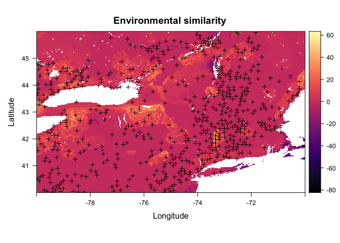
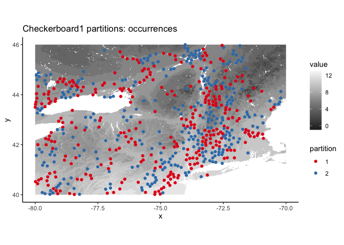
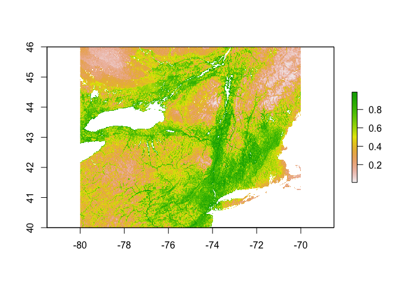
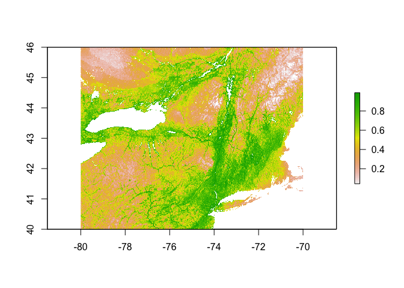
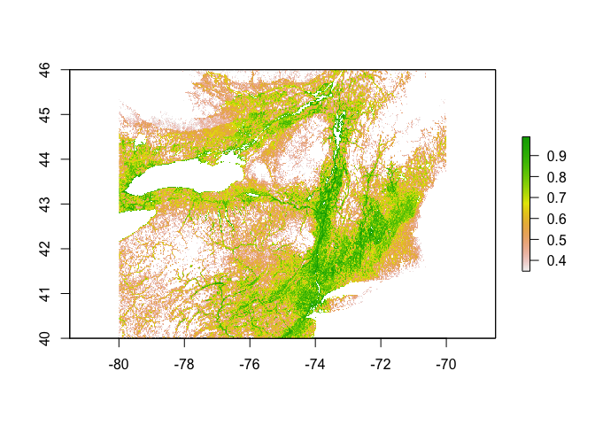
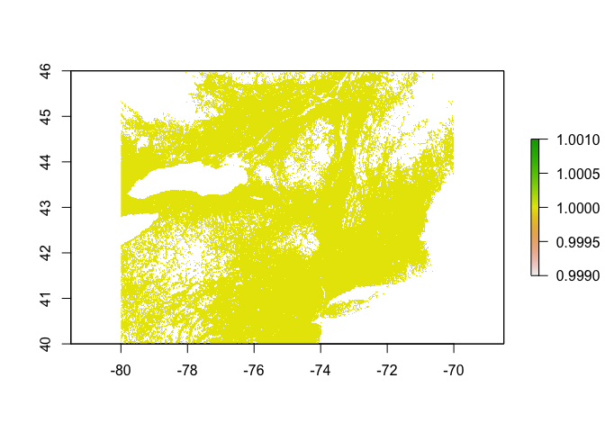

Lysimachia Ciliata SDM | MaxEnt
================
Mark Buckner
2021-09-24

  - [Load Occurance Data and
    Predictors](#load-occurance-data-and-predictors)
      - [MESS](#mess)
      - [Random Background Points](#random-background-points)
      - [Partition for Model
        Evaluation](#partition-for-model-evaluation)
      - [Env. Similarity of Partions](#env-similarity-of-partions)
      - [Tune model](#tune-model)
      - [Model turning results and
        Selection](#model-turning-results-and-selection)
      - [Prediction](#prediction)
      - [Threshold](#threshold)
      - [Minimum training presence](#minimum-training-presence)
      - [10th percentile training
        presence](#10th-percentile-training-presence)

``` r
library(spatial)
library(rgdal)
library(ENMeval, attach.required = T)
library(rmaxent)
library(raster)
library(tidyverse)
library(lubridate)
library(knitr)
```

## Load Occurance Data and Predictors

Occurrence and predictor data processed in `occ_pred_data_1km.Rmd`.
Occurrence data needs to have the unique identifiers removed and
projected to the project projection (`+proj=longlat +ellps=WGS84
+datum=WGS84 +no_defs`) to create a `matrix array`. The predictors are
described below.

Bioclimatic variables (USGS descriptions available
[here](https://pubs.usgs.gov/ds/691/ds691.pdf))

  - Bio 1 : Mean Annual Temperature
  - Bio 2 : Annual Mean Diurnal Range
  - Bio 3 : Isothermality
  - Bio 4 : Temperature Seasonality
  - Bio 5 : Max Temperature of Warmest Month
  - Bio 7 : Annual Temperature Range
  - Bio 8 : Mean Temperature of Wettest Quarter
  - Bio 9 : Mean Temperature of Driest Quarter
  - Bio 10 : Mean Temperature of Warmest Quarter
  - Bio 11 : Mean Temperature of Coldest Quarter
  - Bio 12 : Annual Precipitation
  - Bio 13 : Precipitation of Wettest Month
  - Bio 14 : Precipitation of Driest Month
  - Bio 15 : Precipitation Seasonality
  - Bio 16 : Precipitation of Wettest Quarter
  - Bio 17 : Precipitation of Driest Quarter
  - Bio 18 : Precipitation of Warmest Quarter
  - Bio 19 : Precipitation of Coldest Quarter

Topographical and soils data

  - DEM : Elevation in m
  - Proximity to Water : Arbitrary
  - Soil Water Content : 0cm depth
  - Soil Sand Content : 0cm depth

<!-- end list -->

``` r
#Occurrences
occ <- read_csv("../../occ/Lc_NE70.csv")

occs <- select(occ, lat, lon)
occs <- rgdal::project(as.matrix(occs[,c("lon","lat")]), proj = "+proj=longlat +ellps=WGS84 +datum=WGS84 +no_defs")

#Predictors
#env <- stackOpen("../../pred/pred_stack_ne/stack")
env <- stack("../../pred/pred_stack_ne/baseline.tif")
names(env) <- c(paste("bio", seq(1,19), sep = ""), "dem", "wprox", "sand", "h20")


plot(env[[1:12]])
```

<!-- -->

``` r
plot(env[[13:nlayers(env)]])
```

<!-- -->

``` r
plot(env[[1]], main="Mean ann. temp. | L. ciliata Occ.")
points(occs, pch = 16, cex = 0.5)
```

<!-- -->

``` r
#Load spThin dataset from Lc_Mn_SDM_1km_RF.Rmd
occs <- read_csv("../../occ/lc_NE_thinned_full/Lc_ne_thinned_thin1.csv") %>% 
  select(lat,lon)
  
occs <- rgdal::project(as.matrix(occs[,c("lon","lat")]), proj = "+proj=longlat +ellps=WGS84 +datum=WGS84 +no_defs")

plot(env[[1]], main="Mean ann. temp. | L. ciliata Occ.")
points(occs, pch = 16, cex = 0.5)
```

<!-- --> 

### MESS

``` r
occs.z <- raster::extract(env, occs)
occs.sim <- similarity(env, occs.z)
occs.mess <- occs.sim$similarity_min
occs.sp <- sp::SpatialPoints(occs)

myScale <- seq(cellStats(occs.mess, min), cellStats(occs.mess, max), length.out = 100)
rasterVis::levelplot(occs.mess, main = "Environmental similarity", at = myScale, margin = FALSE) + 
  latticeExtra::layer(sp.points(occs.sp, col="black"))
```

<!-- --> 

### Random Background Points

``` r
(points <- sum(!is.na(getValues(env[[1]])))*0.15)
```

    ## [1] 109344.6

``` r
bg <- dismo::randomPoints(env, n = round(points)) %>% as.data.frame()
colnames(bg) <- colnames(occs)

plot(env[[1]])
points(bg, pch = 20, cex = 0.1)
```

<!-- -->

### Partition for Model Evaluation

``` r
check <- get.checkerboard1(occs, env, bg, aggregation.factor = 100)
table(check$occs.grp)
```

    ## 
    ##   1   2 
    ## 302 294

``` r
evalplot.grps(pts = occs, pts.grp = check$occs.grp, envs = env) + 
  ggplot2::ggtitle("Checkerboard1 partitions: occurrences")
```

    ## Plotting first raster in stack...

<!-- -->

### Env. Similarity of Partions

``` r
occs.z <- cbind(occs, raster::extract(env, occs))
bg.z <- cbind(bg, raster::extract(env, bg))
evalplot.envSim.hist(sim.type = "mess", ref.data = "occs", occs.z = occs.z, bg.z = bg.z, 
                     occs.grp = check$occs.grp, bg.grp = check$bg.grp)
```

    ## Warning in RColorBrewer::brewer.pal(nk, "Set1"): minimal value for n is 3, returning requested palette with 3 different levels

    ## Warning: Removed 12 rows containing non-finite values (stat_bin).

<!-- -->

``` r
evalplot.envSim.hist(sim.type = "most_diff", ref.data = "occs", occs.z = occs.z, bg.z = bg.z, 
                     occs.grp = check$occs.grp, bg.grp = check$bg.grp)
```

    ## Warning in RColorBrewer::brewer.pal(nk, "Set1"): minimal value for n is 3, returning requested palette with 3 different levels

<!-- -->

``` r
evalplot.envSim.map(sim.type = "mess", ref.data = "occs", envs = env, occs.z = occs.z, 
                    bg.z = bg.z, occs.grp = check$occs.grp, bg.grp = check$bg.grp, bb.buf = 7)
```

<!-- -->

### Tune model

``` r
#Needed a multistep process to get rJava to install. 
#First: https://stackoverflow.com/questions/63830621/installing-rjava-on-macos-catalina-10-15-6
#This allowed for rJava to install without an error but crash when running. Alert said Java 6 required.
#Second: https://www.l3harrisgeospatial.com/Support/Self-Help-Tools/Help-Articles/Help-Articles-Detail/ArtMID/10220/ArticleID/23780/macOS-Catalina-1015-ENVIIDL-and-Legacy-Java-6-Dependencies
#Allows for Java 6 install and normal rJava function

library(rJava)

e.mx <- ENMevaluate(occs = occs, envs = env, bg = bg, 
                    algorithm = 'maxent.jar', partitions = 'checkerboard1', parallel = TRUE, 
                    tune.args = list(fc = c("L","LQ","LQH","H"), rm = 1:5))
```

    ## *** Running initial checks... ***

    ## * Removed 12 occurrence points with NA predictor variable values.

    ## * Clamping predictor variable rasters...

    ## * Model evaluations with checkerboard (2-fold) cross validation...

    ## 
    ## *** Running ENMeval v2.0.0 with maxent.jar v3.4.1 from dismo package v1.3.3 ***

    ##   |                                                                              |                                                                      |   0%

    ## 
    ## Of 4 total cores using 4...

    ## Running in parallel using doSNOW...

    ##   |                                                                              |====                                                                  |   5%  |                                                                              |=======                                                               |  10%  |                                                                              |==========                                                            |  15%  |                                                                              |==============                                                        |  20%  |                                                                              |==================                                                    |  25%  |                                                                              |=====================                                                 |  30%  |                                                                              |========================                                              |  35%  |                                                                              |============================                                          |  40%  |                                                                              |================================                                      |  45%  |                                                                              |===================================                                   |  50%  |                                                                              |======================================                                |  55%  |                                                                              |==========================================                            |  60%  |                                                                              |==============================================                        |  65%  |                                                                              |=================================================                     |  70%  |                                                                              |====================================================                  |  75%  |                                                                              |========================================================              |  80%  |                                                                              |============================================================          |  85%  |                                                                              |===============================================================       |  90%  |                                                                              |==================================================================    |  95%  |                                                                              |======================================================================| 100%
    ## This is MaxEnt version 3.4.1 
    ## This is MaxEnt version 3.4.1 
    ## This is MaxEnt version 3.4.1 
    ## This is MaxEnt version 3.4.1 
    ## This is MaxEnt version 3.4.1 
    ## This is MaxEnt version 3.4.1 
    ## This is MaxEnt version 3.4.1 
    ## This is MaxEnt version 3.4.1 
    ## This is MaxEnt version 3.4.1 
    ## This is MaxEnt version 3.4.1 
    ## This is MaxEnt version 3.4.1 
    ## This is MaxEnt version 3.4.1 
    ## This is MaxEnt version 3.4.1 
    ## This is MaxEnt version 3.4.1 
    ## This is MaxEnt version 3.4.1 
    ## This is MaxEnt version 3.4.1 
    ## This is MaxEnt version 3.4.1 
    ## This is MaxEnt version 3.4.1 
    ## This is MaxEnt version 3.4.1 
    ## This is MaxEnt version 3.4.1 
    ## This is MaxEnt version 3.4.1 
    ## This is MaxEnt version 3.4.1 
    ## This is MaxEnt version 3.4.1 
    ## This is MaxEnt version 3.4.1 
    ## This is MaxEnt version 3.4.1 
    ## This is MaxEnt version 3.4.1 
    ## This is MaxEnt version 3.4.1 
    ## This is MaxEnt version 3.4.1 
    ## This is MaxEnt version 3.4.1 
    ## This is MaxEnt version 3.4.1 
    ## This is MaxEnt version 3.4.1 
    ## This is MaxEnt version 3.4.1 
    ## This is MaxEnt version 3.4.1 
    ## This is MaxEnt version 3.4.1 
    ## This is MaxEnt version 3.4.1 
    ## This is MaxEnt version 3.4.1 
    ## This is MaxEnt version 3.4.1 
    ## This is MaxEnt version 3.4.1 
    ## This is MaxEnt version 3.4.1 
    ## This is MaxEnt version 3.4.1

    ## ENMevaluate completed in 70 minutes 19.1 seconds.

``` r
e.mx
```

    ## An object of class:  ENMevaluation 
    ##  occurrence/background points:  584 / 109345 
    ##  partition method:  checkerboard1 
    ##  partition settings:  none 
    ##  clamp:  TRUE 
    ##  clamp directions:  left: bio1, bio2, bio3, bio4, bio5, bio6, bio7, bio8, bio9, bio10, bio11, bio12, bio13, bio14, bio15, bio16, bio17, bio18, bio19, dem, wprox, sand, h20
    ##                     right: bio1, bio2, bio3, bio4, bio5, bio6, bio7, bio8, bio9, bio10, bio11, bio12, bio13, bio14, bio15, bio16, bio17, bio18, bio19, dem, wprox, sand, h20 
    ##  algorithm:  maxent.jar 
    ##  tune settings:  fc: L,LQ,LQH,H
    ##                  rm: 1,2,3,4,5 
    ##  overlap:  TRUE 
    ## Refer to ?ENMevaluation for information on slots.

### Model turning results and Selection

``` r
evalplot.stats(e = e.mx, stats = c("AICc"), color = "fc", x.var = "rm", 
               error.bars = FALSE)
```

<!-- -->

``` r
evalplot.stats(e = e.mx, stats = c("auc.val"), color = "fc", x.var = "rm", 
               error.bars = FALSE)
```

<!-- --> Method
1: ∆AICc \< 2, then AUC

``` r
res <- eval.results(e.mx)
kable(res)
```

| fc  | rm | tune.args    | auc.train | cbi.train | auc.diff.avg | auc.diff.sd | auc.val.avg | auc.val.sd | cbi.val.avg | cbi.val.sd | or.10p.avg | or.10p.sd | or.mtp.avg | or.mtp.sd |     AICc | delta.AICc | w.AIC | ncoef |
| :-- | :- | :----------- | --------: | --------: | -----------: | ----------: | ----------: | ---------: | ----------: | ---------: | ---------: | --------: | ---------: | --------: | -------: | ---------: | ----: | ----: |
| L   | 1  | fc.L\_rm.1   | 0.6749964 |     0.948 |    0.0314229 |   0.0118542 |   0.6513532 |  0.0058613 |      0.9465 |  0.0247487 |  0.1267373 | 0.0103002 |  0.0034130 | 0.0048267 | 15583.14 |   84.75588 |     0 |    16 |
| LQ  | 1  | fc.LQ\_rm.1  | 0.7016669 |     0.997 |    0.0341113 |   0.0095489 |   0.6772371 |  0.0007024 |      0.9790 |  0.0084853 |  0.1438490 | 0.0055399 |  0.0068494 | 0.0000332 | 15498.39 |    0.00000 |     1 |    21 |
| LQH | 1  | fc.LQH\_rm.1 | 0.7412250 |     0.998 |    0.0610237 |   0.0193575 |   0.6986467 |  0.0081394 |      0.9850 |  0.0042426 |  0.1661506 | 0.0225991 |  0.0120158 | 0.0121662 | 15660.07 |  161.68478 |     0 |   141 |
| H   | 1  | fc.H\_rm.1   | 0.7419106 |     0.997 |    0.0571096 |   0.0244208 |   0.7009686 |  0.0123713 |      0.9815 |  0.0035355 |  0.1541583 | 0.0201194 |  0.0120040 | 0.0073229 | 15746.77 |  248.38229 |     0 |   165 |
| L   | 2  | fc.L\_rm.2   | 0.6718550 |     0.947 |    0.0273991 |   0.0167837 |   0.6521869 |  0.0106762 |      0.9480 |  0.0268701 |  0.1096021 | 0.0053740 |  0.0017065 | 0.0024133 | 15590.86 |   92.47365 |     0 |    14 |
| LQ  | 2  | fc.LQ\_rm.2  | 0.6864755 |     0.987 |    0.0287098 |   0.0107759 |   0.6672238 |  0.0049909 |      0.9770 |  0.0042426 |  0.1266904 | 0.0090728 |  0.0034130 | 0.0048267 | 15536.03 |   37.64782 |     0 |    14 |
| LQH | 2  | fc.LQH\_rm.2 | 0.7311443 |     0.998 |    0.0403996 |   0.0231908 |   0.6990956 |  0.0100178 |      0.9730 |  0.0240416 |  0.1421191 | 0.0017333 |  0.0034130 | 0.0048267 | 15632.44 |  134.05530 |     0 |   117 |
| H   | 2  | fc.H\_rm.2   | 0.7296962 |     0.997 |    0.0405594 |   0.0276302 |   0.6994095 |  0.0155136 |      0.9790 |  0.0084853 |  0.1523697 | 0.0113700 |  0.0051312 | 0.0023967 | 15671.00 |  172.61054 |     0 |   128 |
| L   | 3  | fc.L\_rm.3   | 0.6691689 |     0.950 |    0.0245578 |   0.0203940 |   0.6523331 |  0.0122247 |      0.9280 |  0.0466690 |  0.1164866 | 0.0199370 |  0.0017065 | 0.0024133 | 15594.51 |   96.12308 |     0 |    11 |
| LQ  | 3  | fc.LQ\_rm.3  | 0.6842976 |     0.974 |    0.0249276 |   0.0144332 |   0.6665949 |  0.0088099 |      0.9765 |  0.0035355 |  0.1249604 | 0.0163460 |  0.0034130 | 0.0048267 | 15545.94 |   47.55618 |     0 |    14 |
| LQH | 3  | fc.LQH\_rm.3 | 0.7240577 |     0.998 |    0.0310296 |   0.0232812 |   0.6969661 |  0.0108091 |      0.9740 |  0.0240416 |  0.1301502 | 0.0054735 |  0.0034130 | 0.0048267 | 15586.78 |   88.39808 |     0 |    90 |
| H   | 3  | fc.H\_rm.3   | 0.7210956 |     0.998 |    0.0298536 |   0.0284185 |   0.6949623 |  0.0161622 |      0.9800 |  0.0127279 |  0.1318098 | 0.0163128 |  0.0034130 | 0.0048267 | 15715.80 |  217.41031 |     0 |   129 |
| L   | 4  | fc.L\_rm.4   | 0.6679144 |     0.951 |    0.0220762 |   0.0229912 |   0.6521327 |  0.0130861 |      0.9075 |  0.0502046 |  0.1078838 | 0.0029441 |  0.0017065 | 0.0024133 | 15598.23 |   99.84627 |     0 |    10 |
| LQ  | 4  | fc.LQ\_rm.4  | 0.6836003 |     0.972 |    0.0234545 |   0.0172448 |   0.6669390 |  0.0122250 |      0.9795 |  0.0007071 |  0.1283734 | 0.0211726 |  0.0034130 | 0.0048267 | 15548.41 |   50.02200 |     0 |    12 |
| LQH | 4  | fc.LQH\_rm.4 | 0.7166795 |     0.997 |    0.0266721 |   0.0262596 |   0.6954747 |  0.0126455 |      0.9735 |  0.0247487 |  0.1267138 | 0.0006137 |  0.0034130 | 0.0048267 | 15627.87 |  129.48472 |     0 |    93 |
| H   | 4  | fc.H\_rm.4   | 0.7139029 |     0.996 |    0.0263852 |   0.0307934 |   0.6915409 |  0.0166309 |      0.9810 |  0.0056569 |  0.1283617 | 0.0260159 |  0.0034130 | 0.0048267 | 15662.48 |  164.09355 |     0 |   101 |
| L   | 5  | fc.L\_rm.5   | 0.6663186 |     0.940 |    0.0206563 |   0.0238597 |   0.6515689 |  0.0141492 |      0.8785 |  0.0516188 |  0.1164515 | 0.0054072 |  0.0017065 | 0.0024133 | 15605.70 |  107.31007 |     0 |    10 |
| LQ  | 5  | fc.LQ\_rm.5  | 0.6826191 |     0.965 |    0.0228463 |   0.0191699 |   0.6661657 |  0.0149575 |      0.9705 |  0.0035355 |  0.1318333 | 0.0066263 |  0.0034130 | 0.0048267 | 15554.01 |   55.62179 |     0 |    11 |
| LQH | 5  | fc.LQH\_rm.5 | 0.7124890 |     0.998 |    0.0252858 |   0.0261571 |   0.6924557 |  0.0131369 |      0.9815 |  0.0106066 |  0.1301151 | 0.0090562 |  0.0034130 | 0.0048267 | 15568.02 |   69.63064 |     0 |    63 |
| H   | 5  | fc.H\_rm.5   | 0.7084697 |     0.996 |    0.0242674 |   0.0311934 |   0.6845581 |  0.0132881 |      0.9785 |  0.0049497 |  0.1420604 | 0.0259496 |  0.0034130 | 0.0048267 | 15686.18 |  187.79304 |     0 |   100 |

``` r
opt.aicc <- res %>% 
  filter(delta.AICc <= 2) %>% 
  slice_max(auc.val.avg)
kable(opt.aicc)
```

| fc | rm | tune.args   | auc.train | cbi.train | auc.diff.avg | auc.diff.sd | auc.val.avg | auc.val.sd | cbi.val.avg | cbi.val.sd | or.10p.avg | or.10p.sd | or.mtp.avg | or.mtp.sd |     AICc | delta.AICc | w.AIC | ncoef |
| :- | :- | :---------- | --------: | --------: | -----------: | ----------: | ----------: | ---------: | ----------: | ---------: | ---------: | --------: | ---------: | --------: | -------: | ---------: | ----: | ----: |
| LQ | 1  | fc.LQ\_rm.1 | 0.7016669 |     0.997 |    0.0341113 |   0.0095489 |   0.6772371 |  0.0007024 |       0.979 |  0.0084853 |   0.143849 | 0.0055399 |  0.0068494 |  3.32e-05 | 15498.39 |          0 |     1 |    21 |

``` r
par(mar = c(4, 2, 0.5, 1)) 
dismo::response(eval.models(e.mx)[[opt.aicc$tune.args]])
```

    ## This is MaxEnt version 3.4.1

    ## This is MaxEnt version 3.4.1

    ## This is MaxEnt version 3.4.1

    ## This is MaxEnt version 3.4.1

    ## This is MaxEnt version 3.4.1

    ## This is MaxEnt version 3.4.1

    ## This is MaxEnt version 3.4.1

    ## This is MaxEnt version 3.4.1

    ## This is MaxEnt version 3.4.1

    ## This is MaxEnt version 3.4.1

    ## This is MaxEnt version 3.4.1

    ## This is MaxEnt version 3.4.1

    ## This is MaxEnt version 3.4.1

    ## This is MaxEnt version 3.4.1

    ## This is MaxEnt version 3.4.1

    ## This is MaxEnt version 3.4.1

    ## This is MaxEnt version 3.4.1

    ## This is MaxEnt version 3.4.1

    ## This is MaxEnt version 3.4.1

    ## This is MaxEnt version 3.4.1

    ## This is MaxEnt version 3.4.1

    ## This is MaxEnt version 3.4.1

    ## This is MaxEnt version 3.4.1


``` r
par(mar = c(4, 2, 1, 1)) 
plot(eval.models(e.mx)[[opt.aicc$tune.args]])
```


``` r
par(mar = c(5.1, 4.1, 4.1, 2.1))
```

### Prediction

``` r
pred.seq <- eval.predictions(e.mx)[[opt.aicc$tune.args]]
plot(pred.seq)
```

<!-- -->

``` r
writeRaster(pred.seq, "../../pred/out/Lc/Lc_SDM_ME_1km.tif", overwrite = TRUE)
```

### Threshold

``` r
#Function code: https://babichmorrowc.github.io/post/2019-04-12-sdm-threshold/
sdm_threshold <- function(sdm, occs, type = "mtp", binary = FALSE){
  occPredVals <- raster::extract(sdm, occs)
  if(type == "mtp"){
    thresh <- min(na.omit(occPredVals))
  } else if(type == "p10"){
    if(length(occPredVals) < 10){
      p10 <- floor(length(occPredVals) * 0.9)
    } else {
      p10 <- ceiling(length(occPredVals) * 0.9)
    }
    thresh <- rev(sort(occPredVals))[p10]
  }
  sdm_thresh <- sdm
  sdm_thresh[sdm_thresh < thresh] <- NA
  if(binary){
    sdm_thresh[sdm_thresh >= thresh] <- 1
  }
  return(sdm_thresh)
}
```

### Minimum training presence

``` r
mtp <- sdm_threshold(pred.seq, occs, type = "mtp")
plot(mtp)
```

<!-- -->

``` r
writeRaster(mtp, "../../pred/out/Lc/Lc_SDM_ME_1km_mtp.tif", overwrite = TRUE)
```

### 10th percentile training presence

``` r
p10 <- sdm_threshold(pred.seq, occs, type = "p10")
plot(p10)
```

<!-- -->

``` r
p10.b <- sdm_threshold(pred.seq, occs, type = "p10", binary = TRUE)
plot(p10.b)
```

<!-- -->

``` r
writeRaster(p10, "../../pred/out/Lc/Lc_SDM_ME_1km_p10.tif", overwrite = TRUE)
```
