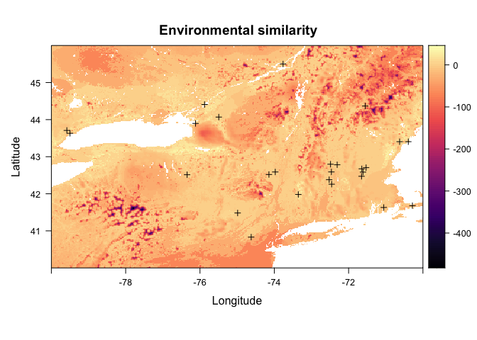
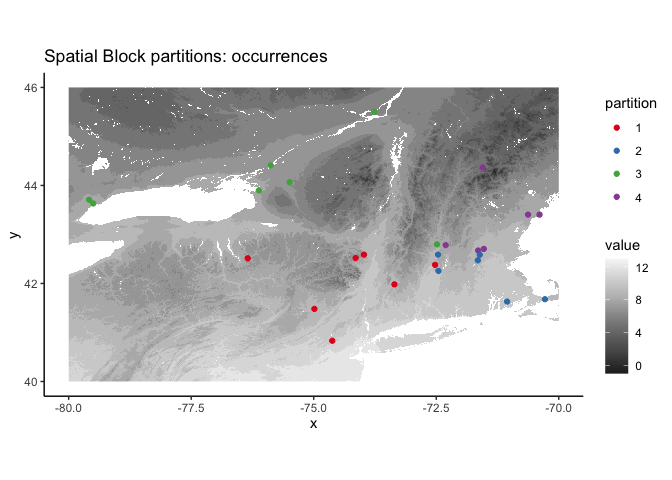
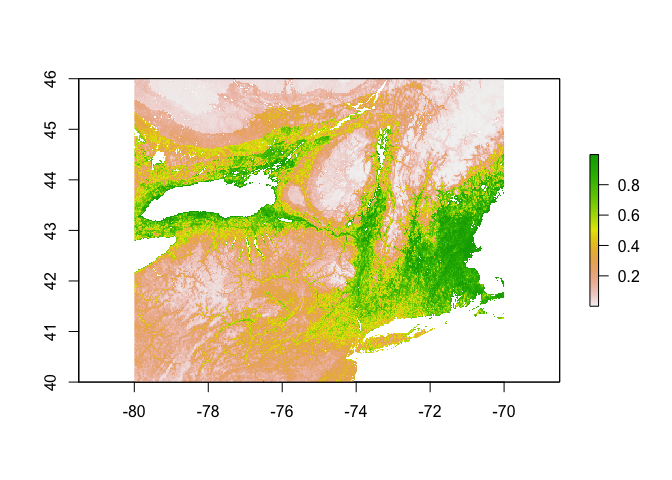
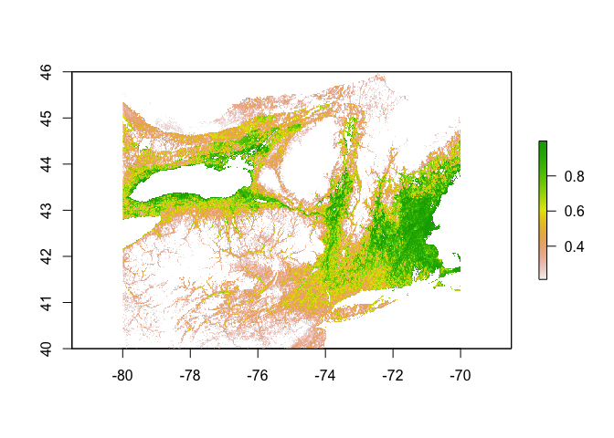
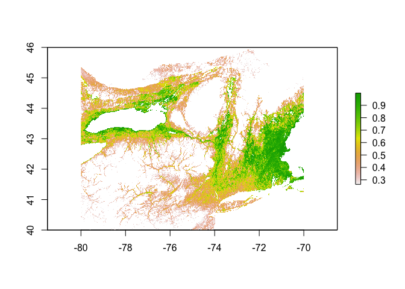
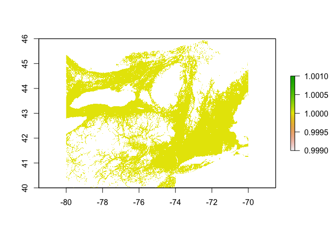

Macropis Nuda SDM | MaxEnt
================
Mark Buckner
2021-09-24

  - [Load Occurance Data and
    Predictors](#load-occurance-data-and-predictors)
  - [MESS](#mess)
  - [Random Background Points](#random-background-points)
  - [Partition for Model Evaluation](#partition-for-model-evaluation)
  - [Env. Similarity of Partions](#env-similarity-of-partions)
  - [Tune model](#tune-model)
  - [Model turning results and
    Selection](#model-turning-results-and-selection)
  - [Prediction](#prediction)
  - [Threshold](#threshold)
  - [Minimum training presence](#minimum-training-presence)
  - [10th percentile training
    presence](#10th-percentile-training-presence)

``` r
library(spatial)
library(rgdal)
library(ENMeval, attach.required = T)
library(rmaxent)
library(raster)
library(tidyverse)
library(lubridate)
library(knitr)
```

### Load Occurance Data and Predictors

Occurrence and predictor data processed in `occ_pred_data_1km.Rmd`.
Occurrence data needs to have the unique identifiers removed and
projected to the project projection (`+proj=longlat +ellps=WGS84
+datum=WGS84 +no_defs`) to create a `matrix array`. The predictors are
described below.

Bioclimatic variables (USGS descriptions available
[here](https://pubs.usgs.gov/ds/691/ds691.pdf))

  - Bio 1 : Mean Annual Temperature
  - Bio 2 : Annual Mean Diurnal Range
  - Bio 3 : Isothermality
  - Bio 4 : Temperature Seasonality
  - Bio 5 : Max Temperature of Warmest Month
  - Bio 7 : Annual Temperature Range
  - Bio 8 : Mean Temperature of Wettest Quarter
  - Bio 9 : Mean Temperature of Driest Quarter
  - Bio 10 : Mean Temperature of Warmest Quarter
  - Bio 11 : Mean Temperature of Coldest Quarter
  - Bio 12 : Annual Precipitation
  - Bio 13 : Precipitation of Wettest Month
  - Bio 14 : Precipitation of Driest Month
  - Bio 15 : Precipitation Seasonality
  - Bio 16 : Precipitation of Wettest Quarter
  - Bio 17 : Precipitation of Driest Quarter
  - Bio 18 : Precipitation of Warmest Quarter
  - Bio 19 : Precipitation of Coldest Quarter

Topographical and soils data

  - DEM : Elevation in m
  - Proximity to Water : Arbitrary
  - Soil Water Content : 0cm depth
  - Soil Sand Content : 0cm depth

Host Plant

  - 1km resolution *Lysimachia ciliata* SDM
  - 1km resolution *Apocynum androsaemifolium* SDM (Commonly visits to
    nectar)

<!-- end list -->

``` r
#Predictors
#env <- stackOpen("../../pred/pred_stack_ne/stack")
env <- stack("../../pred/pred_stack_ne/baseline.tif")
names(env) <- c(paste("bio", seq(1,19), sep = ""), "dem", "wprox", "sand", "h20")

lc <- raster("../../pred/out/Lc/Lc_SDM_ME_1km.tif")
aa <- raster("../../pred/out/Aa/Aa_SDM_ME_1km.tif")

env <- addLayer(env, lc, aa)

plot(env[[1:12]])
```

<!-- -->

``` r
plot(env[[13:nlayers(env)]])
```

<!-- -->

``` r
#Occurrences
occ <- read_csv("../../occ/Mn_NE70.csv")

occs <- select(occ, lat, lon)
occs <- rgdal::project(as.matrix(occs[,c("lon","lat")]), proj = "+proj=longlat +ellps=WGS84 +datum=WGS84 +no_defs")

plot(env[[1]], main="Mean ann. temp. | M. nuda Occ.")
points(occs, pch = 16, cex = 0.5)
```

<!-- -->

``` r
#Load spThin dataset from Lc_Mn_SDM_1km_RF.Rmd
occs <- read_csv("../../occ/Mn_NE_thinned_full/Mn_ne_thinned_thin1.csv") %>% 
  select(lat,lon)
  
occs <- rgdal::project(as.matrix(occs[,c("lon","lat")]), proj = "+proj=longlat +ellps=WGS84 +datum=WGS84 +no_defs")

plot(env[[1]], main="Mean ann. temp. | M. nuda Occ.")
points(occs, pch = 16, cex = 0.5)
```

<!-- --> 

### MESS

``` r
occs.z <- raster::extract(env, occs)
occs.sim <- similarity(env, occs.z)
occs.mess <- occs.sim$similarity_min
occs.sp <- sp::SpatialPoints(occs)

myScale <- seq(cellStats(occs.mess, min), cellStats(occs.mess, max), length.out = 100)
rasterVis::levelplot(occs.mess, main = "Environmental similarity", at = myScale, margin = FALSE) + 
  latticeExtra::layer(sp.points(occs.sp, col="black"))
```

<!-- -->

### Random Background Points

``` r
(points <- sum(!is.na(getValues(env[[1]])))*0.15)
```

    ## [1] 109344.6

``` r
bg <- dismo::randomPoints(env, n = round(points)) %>% as.data.frame()
colnames(bg) <- colnames(occs)

plot(env[[1]])
points(bg, pch = 20, cex = 0.3)
```

<!-- -->

### Partition for Model Evaluation

``` r
block <- get.block(occs, bg)

evalplot.grps(pts = occs, pts.grp = block$occs.grp, envs = env) + 
  ggplot2::ggtitle("Spatial Block partitions: occurrences")
```

<!-- -->

### Env. Similarity of Partions

``` r
occs.z <- cbind(occs, raster::extract(env, occs))
bg.z <- cbind(bg, raster::extract(env, bg))
evalplot.envSim.hist(sim.type = "mess", ref.data = "occs", occs.z = occs.z, bg.z = bg.z, 
                     occs.grp = block$occs.grp, bg.grp = block$bg.grp)
```

<!-- -->

``` r
#evalplot.envSim.hist(sim.type = "most_diff", ref.data = "occs", occs.z = occs.z, bg.z = bg.z, 
#                     occs.grp = block$occs.grp, bg.grp = block$bg.grp)

evalplot.envSim.map(sim.type = "mess", ref.data = "occs", envs = env, occs.z = occs.z, 
                    bg.z = bg.z, occs.grp = block$occs.grp, bg.grp = block$bg.grp, bb.buf = 7)
```

    ## * Similarity values calculated by contrasting occurrences with all cell values in raster extent.

    ## Warning in .checkLevels(levels(x)[[1]], value): the number of rows in the raster
    ## attributes (factors) data.frame is unexpected

    ## Warning in sort(newv[, 1]) == sort(old[, 1]): longer object length is not a
    ## multiple of shorter object length

    ## Warning in .checkLevels(levels(x)[[1]], value): the values in the "ID" column in
    ## the raster attributes (factors) data.frame have changed

<!-- -->

### Tune model

``` r
library(rJava)

e.mx <- ENMevaluate(occs = occs, envs = env, bg = bg, 
                    algorithm = 'maxent.jar', partitions = 'block', parallel = TRUE, 
                    tune.args = list(fc = c("L","LQ","LQH","H"), rm = 1:5))
```

    ## *** Running initial checks... ***

    ## * Clamping predictor variable rasters...

    ## * Model evaluations with spatial block (4-fold) cross validation and lat_lon orientation...

    ## 
    ## *** Running ENMeval v2.0.0 with maxent.jar v3.4.1 from dismo package v1.3.3 ***

    ##   |                                                                              |                                                                      |   0%

    ## 
    ## Of 4 total cores using 4...

    ## Running in parallel using doSNOW...

    ##   |                                                                              |====                                                                  |   5%  |                                                                              |=======                                                               |  10%  |                                                                              |==========                                                            |  15%  |                                                                              |==============                                                        |  20%  |                                                                              |==================                                                    |  25%  |                                                                              |=====================                                                 |  30%  |                                                                              |========================                                              |  35%  |                                                                              |============================                                          |  40%  |                                                                              |================================                                      |  45%  |                                                                              |===================================                                   |  50%  |                                                                              |======================================                                |  55%  |                                                                              |==========================================                            |  60%  |                                                                              |==============================================                        |  65%  |                                                                              |=================================================                     |  70%  |                                                                              |====================================================                  |  75%  |                                                                              |========================================================              |  80%  |                                                                              |============================================================          |  85%  |                                                                              |===============================================================       |  90%  |                                                                              |==================================================================    |  95%  |                                                                              |======================================================================| 100%
    ## This is MaxEnt version 3.4.1 
    ## This is MaxEnt version 3.4.1 
    ## This is MaxEnt version 3.4.1 
    ## This is MaxEnt version 3.4.1 
    ## This is MaxEnt version 3.4.1 
    ## This is MaxEnt version 3.4.1 
    ## This is MaxEnt version 3.4.1 
    ## This is MaxEnt version 3.4.1 
    ## This is MaxEnt version 3.4.1 
    ## This is MaxEnt version 3.4.1 
    ## This is MaxEnt version 3.4.1 
    ## This is MaxEnt version 3.4.1 
    ## This is MaxEnt version 3.4.1 
    ## This is MaxEnt version 3.4.1 
    ## This is MaxEnt version 3.4.1 
    ## This is MaxEnt version 3.4.1 
    ## This is MaxEnt version 3.4.1 
    ## This is MaxEnt version 3.4.1 
    ## This is MaxEnt version 3.4.1 
    ## This is MaxEnt version 3.4.1 
    ## This is MaxEnt version 3.4.1 
    ## This is MaxEnt version 3.4.1 
    ## This is MaxEnt version 3.4.1 
    ## This is MaxEnt version 3.4.1 
    ## This is MaxEnt version 3.4.1 
    ## This is MaxEnt version 3.4.1 
    ## This is MaxEnt version 3.4.1 
    ## This is MaxEnt version 3.4.1 
    ## This is MaxEnt version 3.4.1 
    ## This is MaxEnt version 3.4.1 
    ## This is MaxEnt version 3.4.1 
    ## This is MaxEnt version 3.4.1 
    ## This is MaxEnt version 3.4.1 
    ## This is MaxEnt version 3.4.1 
    ## This is MaxEnt version 3.4.1 
    ## This is MaxEnt version 3.4.1 
    ## This is MaxEnt version 3.4.1 
    ## This is MaxEnt version 3.4.1 
    ## This is MaxEnt version 3.4.1 
    ## This is MaxEnt version 3.4.1

    ## ENMevaluate completed in 47 minutes 59.4 seconds.

``` r
e.mx
```

    ## An object of class:  ENMevaluation 
    ##  occurrence/background points:  26 / 109345 
    ##  partition method:  block 
    ##  partition settings:  orientation = lat_lon 
    ##  clamp:  TRUE 
    ##  clamp directions:  left: bio1, bio2, bio3, bio4, bio5, bio6, bio7, bio8, bio9, bio10, bio11, bio12, bio13, bio14, bio15, bio16, bio17, bio18, bio19, dem, wprox, sand, h20, Lc_SDM_ME_1km, Aa_SDM_ME_1km
    ##                     right: bio1, bio2, bio3, bio4, bio5, bio6, bio7, bio8, bio9, bio10, bio11, bio12, bio13, bio14, bio15, bio16, bio17, bio18, bio19, dem, wprox, sand, h20, Lc_SDM_ME_1km, Aa_SDM_ME_1km 
    ##  algorithm:  maxent.jar 
    ##  tune settings:  fc: L,LQ,LQH,H
    ##                  rm: 1,2,3,4,5 
    ##  overlap:  TRUE 
    ## Refer to ?ENMevaluation for information on slots.

### Model turning results and Selection

``` r
evalplot.stats(e = e.mx, stats = c("AICc"), color = "fc", x.var = "rm", 
               error.bars = FALSE)
```

    ## Warning: Removed 4 rows containing missing values (geom_point).

    ## Warning: Removed 2 row(s) containing missing values (geom_path).

<!-- -->

``` r
evalplot.stats(e = e.mx, stats = c("auc.val"), color = "fc", x.var = "rm", 
               error.bars = FALSE)
```

<!-- --> 

``` r
res <- eval.results(e.mx)
kable(res)
```

| fc  | rm | tune.args    | auc.train | cbi.train | auc.diff.avg | auc.diff.sd | auc.val.avg | auc.val.sd | cbi.val.avg | cbi.val.sd | or.10p.avg | or.10p.sd | or.mtp.avg | or.mtp.sd |     AICc | delta.AICc |     w.AIC | ncoef |
| :-- | :- | :----------- | --------: | --------: | -----------: | ----------: | ----------: | ---------: | ----------: | ---------: | ---------: | --------: | ---------: | --------: | -------: | ---------: | --------: | ----: |
| L   | 1  | fc.L\_rm.1   | 0.8423436 |     0.827 |    0.1229703 |   0.0836336 |   0.8254913 |  0.1226831 |     0.69375 |  0.2664024 |  0.1071429 | 0.2142857 |  0.0714286 | 0.1428571 | 719.8509 |  44.399433 | 0.0000000 |    14 |
| LQ  | 1  | fc.LQ\_rm.1  | 0.8609210 |     0.768 |    0.1001136 |   0.0840851 |   0.8326488 |  0.1156510 |     0.75200 |  0.2909444 |  0.1845238 | 0.1785714 |  0.0416667 | 0.0833333 | 725.6780 |  50.226528 | 0.0000000 |    15 |
| LQH | 1  | fc.LQH\_rm.1 | 0.9011379 |     0.838 |    0.0902886 |   0.1091281 |   0.8324540 |  0.1037447 |     0.78300 |  0.0563619 |  0.2261905 | 0.2431993 |  0.0416667 | 0.0833333 |       NA |         NA |        NA |    51 |
| H   | 1  | fc.H\_rm.1   | 0.8857960 |     0.897 |    0.1066813 |   0.1082613 |   0.8305397 |  0.1149506 |     0.82900 |  0.0675919 |  0.2202381 | 0.2454230 |  0.0773810 | 0.0898790 |       NA |         NA |        NA |    42 |
| L   | 2  | fc.L\_rm.2   | 0.8251246 |     0.947 |    0.0774175 |   0.0827716 |   0.7813409 |  0.0702283 |     0.73125 |  0.2754008 |  0.0773810 | 0.0898790 |  0.0416667 | 0.0833333 | 678.3341 |   2.882643 | 0.0783415 |     6 |
| LQ  | 2  | fc.LQ\_rm.2  | 0.8423197 |     0.728 |    0.1095825 |   0.0710068 |   0.8374043 |  0.1094325 |     0.74200 |  0.2672053 |  0.1488095 | 0.2023810 |  0.0416667 | 0.0833333 | 676.6001 |   1.148649 | 0.1864334 |     7 |
| LQH | 2  | fc.LQH\_rm.2 | 0.8494372 |     0.766 |    0.0980616 |   0.0846290 |   0.8313630 |  0.1119526 |     0.72975 |  0.0789573 |  0.1488095 | 0.2023810 |  0.0416667 | 0.0833333 | 719.1510 |  43.699573 | 0.0000000 |    14 |
| H   | 2  | fc.H\_rm.2   | 0.8525062 |     0.856 |    0.0994613 |   0.0770730 |   0.8235706 |  0.1064231 |     0.76675 |  0.1262600 |  0.1130952 | 0.1393417 |  0.0416667 | 0.0833333 | 700.0164 |  24.565017 | 0.0000015 |    12 |
| L   | 3  | fc.L\_rm.3   | 0.8164140 |     0.894 |    0.0700677 |   0.0647399 |   0.7648444 |  0.0611842 |     0.63250 |  0.1528322 |  0.0833333 | 0.1666667 |  0.0416667 | 0.0833333 | 691.1018 |  15.650356 | 0.0001323 |     8 |
| LQ  | 3  | fc.LQ\_rm.3  | 0.8318173 |     0.796 |    0.1026710 |   0.0699950 |   0.8304108 |  0.0985644 |     0.67525 |  0.2631747 |  0.1130952 | 0.1393417 |  0.0000000 | 0.0000000 | 678.0015 |   2.550061 | 0.0925147 |     6 |
| LQH | 3  | fc.LQH\_rm.3 | 0.8351704 |     0.740 |    0.1063498 |   0.0731013 |   0.8392622 |  0.1039352 |     0.69125 |  0.1474186 |  0.1130952 | 0.1393417 |  0.0416667 | 0.0833333 | 684.4910 |   9.039542 | 0.0036061 |     8 |
| H   | 3  | fc.H\_rm.3   | 0.8437031 |     0.790 |    0.0901577 |   0.0471000 |   0.8204728 |  0.0951286 |     0.73900 |  0.1714293 |  0.0773810 | 0.0898790 |  0.0416667 | 0.0833333 | 683.9554 |   8.503986 | 0.0047134 |     8 |
| L   | 4  | fc.L\_rm.4   | 0.8120295 |     0.852 |    0.0536612 |   0.0461322 |   0.7426251 |  0.0371233 |     0.49225 |  0.2251139 |  0.1250000 | 0.1595712 |  0.0416667 | 0.0833333 | 686.6328 |  11.181337 | 0.0012358 |     6 |
| LQ  | 4  | fc.LQ\_rm.4  | 0.8263631 |     0.803 |    0.0798207 |   0.0537955 |   0.8072157 |  0.0668086 |     0.67350 |  0.1854122 |  0.0773810 | 0.0898790 |  0.0000000 | 0.0000000 | 677.5895 |   2.138087 | 0.1136763 |     5 |
| LQH | 4  | fc.LQH\_rm.4 | 0.8263603 |     0.803 |    0.0813028 |   0.0513617 |   0.8115814 |  0.0681522 |     0.67050 |  0.1807881 |  0.0773810 | 0.0898790 |  0.0000000 | 0.0000000 | 677.5912 |   2.139759 | 0.1135813 |     5 |
| H   | 4  | fc.H\_rm.4   | 0.8406840 |     0.850 |    0.0752347 |   0.0516814 |   0.7998613 |  0.0669582 |     0.79575 |  0.1310684 |  0.1190476 | 0.0801548 |  0.0416667 | 0.0833333 | 675.4514 |   0.000000 | 0.3310927 |     4 |
| L   | 5  | fc.L\_rm.5   | 0.8079165 |     0.816 |    0.0397265 |   0.0428961 |   0.7380014 |  0.0260667 |     0.58875 |  0.1559730 |  0.1666667 | 0.1924501 |  0.0416667 | 0.0833333 | 690.2116 |  14.760136 | 0.0002065 |     6 |
| LQ  | 5  | fc.LQ\_rm.5  | 0.8244387 |     0.811 |    0.0625155 |   0.0525004 |   0.7800132 |  0.0424367 |     0.54925 |  0.1955989 |  0.0833333 | 0.0962250 |  0.0416667 | 0.0833333 | 679.8209 |   4.369438 | 0.0372510 |     5 |
| LQH | 5  | fc.LQH\_rm.5 | 0.8244359 |     0.812 |    0.0619313 |   0.0532595 |   0.7811390 |  0.0432708 |     0.53175 |  0.1701438 |  0.0833333 | 0.0962250 |  0.0416667 | 0.0833333 | 679.8234 |   4.372015 | 0.0372030 |     5 |
| H   | 5  | fc.H\_rm.5   | 0.8381356 |     0.849 |    0.0530146 |   0.0447879 |   0.7726906 |  0.0566268 |     0.80625 |  0.1397197 |  0.1607143 | 0.1366025 |  0.0833333 | 0.0962250 | 696.1834 |  20.731992 | 0.0000104 |     8 |

``` r
opt.aicc <- res %>% 
  filter(delta.AICc <= 2) %>% 
  slice_max(auc.val.avg)
kable(opt.aicc)
```

| fc | rm | tune.args   | auc.train | cbi.train | auc.diff.avg | auc.diff.sd | auc.val.avg | auc.val.sd | cbi.val.avg | cbi.val.sd | or.10p.avg | or.10p.sd | or.mtp.avg | or.mtp.sd |     AICc | delta.AICc |     w.AIC | ncoef |
| :- | :- | :---------- | --------: | --------: | -----------: | ----------: | ----------: | ---------: | ----------: | ---------: | ---------: | --------: | ---------: | --------: | -------: | ---------: | --------: | ----: |
| LQ | 2  | fc.LQ\_rm.2 | 0.8423197 |     0.728 |    0.1095825 |   0.0710068 |   0.8374043 |  0.1094325 |       0.742 |  0.2672053 |  0.1488095 |  0.202381 |  0.0416667 | 0.0833333 | 676.6001 |   1.148649 | 0.1864334 |     7 |

``` r
par(mar = c(1, 1, 1, 1))
dismo::response(eval.models(e.mx)[[opt.aicc$tune.args]])
```

    ## This is MaxEnt version 3.4.1

    ## This is MaxEnt version 3.4.1

    ## This is MaxEnt version 3.4.1

    ## This is MaxEnt version 3.4.1

    ## This is MaxEnt version 3.4.1

    ## This is MaxEnt version 3.4.1

    ## This is MaxEnt version 3.4.1

    ## This is MaxEnt version 3.4.1

    ## This is MaxEnt version 3.4.1

    ## This is MaxEnt version 3.4.1

    ## This is MaxEnt version 3.4.1

    ## This is MaxEnt version 3.4.1

    ## This is MaxEnt version 3.4.1

    ## This is MaxEnt version 3.4.1

    ## This is MaxEnt version 3.4.1

    ## This is MaxEnt version 3.4.1

    ## This is MaxEnt version 3.4.1

    ## This is MaxEnt version 3.4.1

    ## This is MaxEnt version 3.4.1

    ## This is MaxEnt version 3.4.1

    ## This is MaxEnt version 3.4.1

    ## This is MaxEnt version 3.4.1

    ## This is MaxEnt version 3.4.1

    ## This is MaxEnt version 3.4.1

    ## This is MaxEnt version 3.4.1

<!-- -->

``` r
plot(eval.models(e.mx)[[opt.aicc$tune.args]])
```

<!-- -->

### Prediction

``` r
pred.seq <- eval.predictions(e.mx)[[opt.aicc$tune.args]]
plot(pred.seq)
```

<!-- -->

``` r
writeRaster(pred.seq, "../../pred/out/Mn/Mn_SDM_ME_1km.tif", overwrite = TRUE)
```

### Threshold

``` r
#Function code: https://babichmorrowc.github.io/post/2019-04-12-sdm-threshold/
sdm_threshold <- function(sdm, occs, type = "mtp", binary = FALSE){
  occPredVals <- raster::extract(sdm, occs)
  if(type == "mtp"){
    thresh <- min(na.omit(occPredVals))
  } else if(type == "p10"){
    if(length(occPredVals) < 10){
      p10 <- floor(length(occPredVals) * 0.9)
    } else {
      p10 <- ceiling(length(occPredVals) * 0.9)
    }
    thresh <- rev(sort(occPredVals))[p10]
  }
  sdm_thresh <- sdm
  sdm_thresh[sdm_thresh < thresh] <- NA
  if(binary){
    sdm_thresh[sdm_thresh >= thresh] <- 1
  }
  return(sdm_thresh)
}
```

### Minimum training presence

``` r
mtp <- sdm_threshold(pred.seq, occs, type = "mtp")
plot(mtp)
```

<!-- -->

``` r
writeRaster(mtp, "../../pred/out/Mn/Mn_SDM_ME_1km_mtp.tif", overwrite = TRUE)
```

### 10th percentile training presence

``` r
p10 <- sdm_threshold(pred.seq, occs, type = "p10")
plot(p10)
```

<!-- -->

``` r
p10.b <- sdm_threshold(pred.seq, occs, type = "p10", binary = TRUE)
plot(p10.b)
```

<!-- -->

``` r
writeRaster(p10, "../../pred/out/Mn/Mn_SDM_ME_1km_p10.tif", overwrite = TRUE)
```
