Lysimachia ciliata | Range-wide distribution under future climate
projections
================
Mark Buckner
2021-09-25

  - [Packages](#packages)
  - [Functions](#functions)
  - [Load Occurance Data and
    Predictors](#load-occurance-data-and-predictors)
      - [Spatial Thinning](#spatial-thinning)
  - [MESS](#mess)
      - [Random Background Points](#random-background-points)
      - [Partition for Model
        Evaluation](#partition-for-model-evaluation)
      - [Env. Similarity of Partions](#env-similarity-of-partions)
      - [Tune model](#tune-model)
      - [Model turning results and
        Selection](#model-turning-results-and-selection)
      - [Prediction](#prediction)
      - [Threshold](#threshold)
      - [Future Climate Models](#future-climate-models)

#### Packages

``` r
library(spatial)
library(rgdal)
library(spThin)
library(ENMeval, attach.required = T)
library(rmaxent)
library(raster)
library(tidyverse)
library(lubridate)
library(mapdata)

#Needed a multistep process to get rJava to install. 
#First: https://stackoverflow.com/questions/63830621/installing-rjava-on-macos-catalina-10-15-6
#This allowed for rJava to install without an error but crash when running. Alert said Java 6 required.
#Second: https://www.l3harrisgeospatial.com/Support/Self-Help-Tools/Help-Articles/Help-Articles-Detail/ArtMID/10220/ArticleID/23780/macOS-Catalina-1015-ENVIIDL-and-Legacy-Java-6-Dependencies
#Allows for Java 6 install and normal rJava function

library(rJava)
```

#### Functions

``` r
#Function code: https://babichmorrowc.github.io/post/2019-04-12-sdm-threshold/
sdm_threshold <- function(sdm, occs, type = "mtp", binary = FALSE){
  occPredVals <- raster::extract(sdm, occs)
  if(type == "mtp"){
    thresh <- min(na.omit(occPredVals))
  } else if(type == "p10"){
    if(length(occPredVals) < 10){
      p10 <- floor(length(occPredVals) * 0.9)
    } else {
      p10 <- ceiling(length(occPredVals) * 0.9)
    }
    thresh <- rev(sort(occPredVals))[p10]
  }
  sdm_thresh <- sdm
  sdm_thresh[sdm_thresh < thresh] <- NA
  if(binary){
    sdm_thresh[sdm_thresh >= thresh] <- 1
  }
  return(sdm_thresh)
}

#futurePred() : Predicts distribution over a certain model raster stack and plots output. Written to be used with list.files() and sapply().
#file = file name of raster stack; model = training model; names = envnames of predictor layers, vector; host = (optional) two letter abbr. of host, character; drop = names of layers to drop from final raster stack, vector.
futurePred <- function(file, model, envnames, host, drop) {
  path <- paste("./", file, sep = "")
  m <- str_extract(file, "_.*_")
  m <- str_sub(m, 2, -2)
  
  if(missing(host)) {
    r <- stack(path)
  } else {
    yr <- str_extract(file, "\\d+")
    ssp <- str_extract(file, "ssp.*")
    hpath <- paste("../out/", host, "/", host, "_SDM_ME_rw_mean20", yr, ssp, sep = "")
    r <- stack(path, hpath)
  }
  
  names(r) <- envnames
  
  if(!missing(drop)) {
    r <- dropLayer(r, drop)
  }
  
  pred <- predict(model, r)
  
  plot(pred, main = m)
  map('worldHires', fill=FALSE, add=TRUE, xlim = c(-127.75, -55), ylim = c(30.83333, 62.25), lforce = "e")
  
  return(pred)
}

#futureSave() : Calculates the mean distribution for all models at a particular time and ssp, saves results of mean and p10 threshold, and plots.
#pred = mean prediction; spp = two letter species name abbr., character; year = YYYY; ssp = CMIP6 scenario
futureSave <- function(pred, spp, year, ssp, thres) {
  pred.s <- stack(pred)
  pred.m <- calc(pred.s, mean)

  plot(pred.m, main = paste(year, ssp, "mean", sep = "_"))
  map('worldHires', fill=FALSE, add=TRUE, xlim = c(-127.75, -55), ylim = c(30.83333, 62.25), lforce = "e")
  
  name <- paste("../../pred/out/",spp, "/", spp, "_SDM_ME_rw_", "mean", year, ssp, ".tif", sep = "")
  
  writeRaster(pred.m, filename = name, options="INTERLEAVE=BAND", overwrite=TRUE)

  #10th percentile training presence
  if(!missing(thres)) {
    p10 <- pred.m
    p10[p10 < thres] <- NA 
    plot(p10, main = paste(year, ssp, "p10", sep = "_"))
    map('worldHires', fill=FALSE, add=TRUE, xlim = c(-127.75, -55), ylim = c(30.83333, 62.25), lforce = "e")
  
    name <- paste("../../pred/out/",spp, "/", spp, "_SDM_ME_rw_", "p10_", year, ssp, ".tif", sep = "")
  
    writeRaster(p10, filename = name, options="INTERLEAVE=BAND", overwrite=TRUE)
  }
}
```

## Load Occurance Data and Predictors

Occurrence and predictor data processed in `occ_pred_data_rw.Rmd`.
Occurrence data needs to have the unnecessary fields removed and
projected to the project projection (`+proj=longlat +ellps=WGS84
+datum=WGS84 +no_defs`) to create a `matrix array`.

``` r
#Occurrences
occ <- read_csv("../../occ/Lc_RW70.csv")

occs <- select(occ, lat, lon) %>% 
  mutate("spp" = "Lc")

occp <- rgdal::project(as.matrix(occs[,c("lon","lat")]), proj = "+proj=longlat +ellps=WGS84 +datum=WGS84 +no_defs")
```

The predictors are described below. Only bold predictors are included
after accounting for collinearity. All other variables were highly
correlated r \> 0.7 with one of the other variables and were excluded.
Variables were chosen based on the network of correlation and the
perceived importance.

Bioclimatic variables (USGS descriptions available
[here](https://pubs.usgs.gov/ds/691/ds691.pdf))

  - Bio 1 : Mean Annual Temperature
  - Bio 2 : Annual Mean Diurnal Range
  - Bio 3 : Isothermality
  - **Bio 4 : Temperature Seasonality**
  - **Bio 5 : Max Temperature of Warmest Month**
  - Bio 7 : Annual Temperature Range
  - **Bio 8 : Mean Temperature of Wettest Quarter**
  - Bio 9 : Mean Temperature of Driest Quarter
  - Bio 10 : Mean Temperature of Warmest Quarter
  - Bio 11 : Mean Temperature of Coldest Quarter
  - **Bio 12 : Annual Precipitation**
  - Bio 13 : Precipitation of Wettest Month
  - Bio 14 : Precipitation of Driest Month
  - **Bio 15 : Precipitation Seasonality**
  - Bio 16 : Precipitation of Wettest Quarter
  - Bio 17 : Precipitation of Driest Quarter
  - **Bio 18 : Precipitation of Warmest Quarter**
  - Bio 19 : Precipitation of Coldest Quarter

Topography

  - **DEM : SRTM at 5 arc-minute resolution downloaded from WorldClim**

Other

  - Solar Radiation : Mean solar radiation during meteorological summer
    (June, July, August)
  - **Soil Sand Content : Soil sand content (%) at 0cm of depth**
  - **Soil Clay Content : Soil clay content (%) at 0cm of depth**
  - **Soil pH : Soil pH x 10 at 0cm of depth**

General Circulation Models (GCMs)

  - bcc : BCC-CSM2-MR | [Beijing Climate Center Climate System
    Model](https://gmd.copernicus.org/articles/12/1573/2019/)
  - cnrm\_c : CNRM-CM6-1 |
    [CNRM/CERFACS](http://www.umr-cnrm.fr/cmip6/spip.php?article11)
  - cnrm\_e : CNRM-ESM2-1 |
    [CNRM/CERFACS](https://agupubs.onlinelibrary.wiley.com/doi/full/10.1029/2019MS001791)
  - can : CanESM5 | [Canadian Earth System
    Model](https://gmd.copernicus.org/articles/12/4823/2019/gmd-12-4823-2019.html)
  - ipsl : IPSL-CM6A-LR | [Institut Pierre-Simon
    Laplace](https://agupubs.onlinelibrary.wiley.com/doi/full/10.1029/2019MS002010)
  - miroc : MIROC-ES2L |
    [](https://gmd.copernicus.org/articles/13/2197/2020/)
  - miroc6 : MIROC6 |
    [](https://gmd.copernicus.org/articles/12/2727/2019/)
  - mri : MRI-ESM2-0 | [Meteorological Research
    Institute](https://www.jstage.jst.go.jp/article/jmsj/advpub/0/advpub_2019-051/_article/-char/en)

<!-- end list -->

``` r
#Predictors
#Load and crop baseline climate conditions. Using most recent available data.
env <- stack("../../pred/pred_stack_rw/baseline.tif")

#worldClim
#envnames <- c("bio4", "bio8", "bio10", "bio12", "bio15", "bio18", "dem", "sand", "clay", "pH")

envnames <- c("bio4", "bio5", "bio8", "bio12", "bio15", "bio18", "dem", "sand", "clay", "pH")

names(env) <- envnames

plot(env[[1:nlayers(env)]])
```

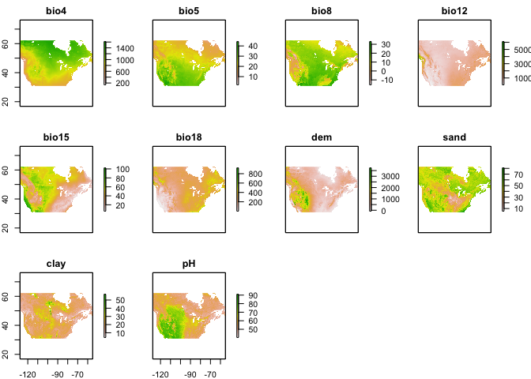<!-- -->

``` r
plot(env[[1]], main="Temp. Seasonality | L. ciliata Occ.")
points(occp, pch = 16, cex = 0.3)
```

<!-- -->

### Spatial Thinning

``` r
thinned <-
  thin( loc.data = occs, 
        lat.col = "lat", long.col = "lon", 
        spec.col = "spp", 
        thin.par = 10, reps = 100, 
        locs.thinned.list.return = TRUE, 
        write.files = TRUE, 
        max.files = 5, 
        out.dir = "../../occ/Lc_thinned_full/", out.base = "Lc_thinned", 
        write.log.file = TRUE,
        log.file = "Lc_thinned_full_log_file.txt" )
```

    ## ********************************************** 
    ##  Beginning Spatial Thinning.
    ##  Script Started at: Sat Sep 25 14:40:25 2021
    ## lat.long.thin.count
    ## 1857 1858 1859 1860 1861 1862 1863 1864 1865 1866 1867 
    ##    1    2    7   14   14   18   13   13   15    1    2 
    ## [1] "Maximum number of records after thinning: 1867"
    ## [1] "Number of data.frames with max records: 2"
    ## [1] "Writing new *.csv files"

    ## Warning in thin(loc.data = occs, lat.col = "lat", long.col = "lon", spec.col =
    ## "spp", : Created new output directory: ../../occ/Lc_thinned_full/

    ## [1] "Writing file: ../../occ/Lc_thinned_full/Lc_thinned_thin1.csv"
    ## [1] "Writing file: ../../occ/Lc_thinned_full/Lc_thinned_thin2.csv"

``` r
plotThin(thinned)
```

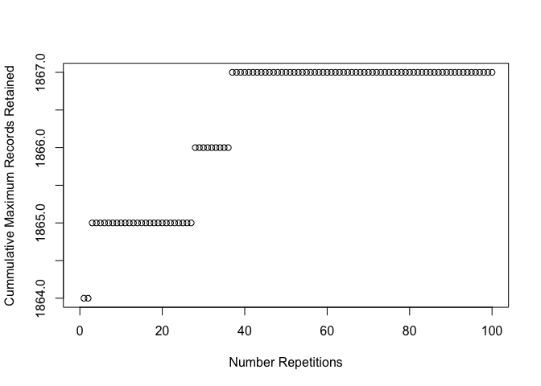<!-- -->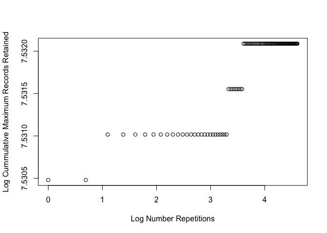<!-- -->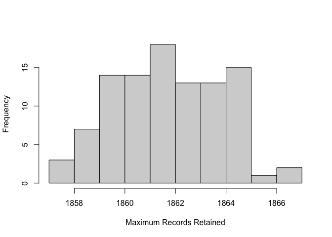<!-- -->

``` r
#Load thinned dataset in place of original
occs <- read_csv("../../occ/lc_thinned_full/Lc_thinned_thin1.csv") %>% 
  select(lat,lon)
  
occs <- rgdal::project(as.matrix(occs[,c("lon","lat")]), proj = "+proj=longlat +ellps=WGS84 +datum=WGS84 +no_defs")
```

## MESS

``` r
occs.z <- raster::extract(env, occs)
occs.sim <- similarity(env, occs.z)
occs.mess <- occs.sim$similarity_min
occs.sp <- sp::SpatialPoints(occs)

myScale <- seq(cellStats(occs.mess, min), cellStats(occs.mess, max), length.out = 100)
rasterVis::levelplot(occs.mess, main = "Environmental similarity", at = myScale, margin = FALSE) + 
  latticeExtra::layer(sp.points(occs.sp, col="black"))
```

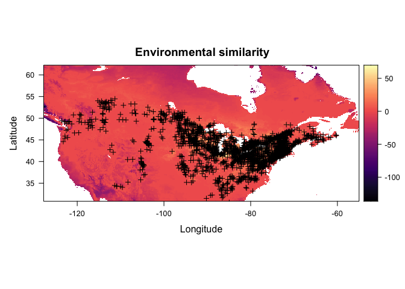<!-- -->

### Random Background Points

``` r
(points <- sum(!is.na(getValues(env[[1]])))*0.4)
```

    ## [1] 94700.8

``` r
bg <- dismo::randomPoints(env, n = round(points)) %>% as.data.frame()
colnames(bg) <- colnames(occs)

plot(env[[1]], main="Mean ann. temp. | Background Points")
points(bg, pch = 20, cex = 0.05)
```

<!-- -->

### Partition for Model Evaluation

``` r
block <- get.block(occs, bg)
table(block$occs.grp)
```

    ## 
    ##   1   2   3   4 
    ## 467 467 467 466

``` r
evalplot.grps(pts = occs, pts.grp = block$occs.grp, envs = env) + 
  ggplot2::ggtitle("Block partitions: occurrences")
```

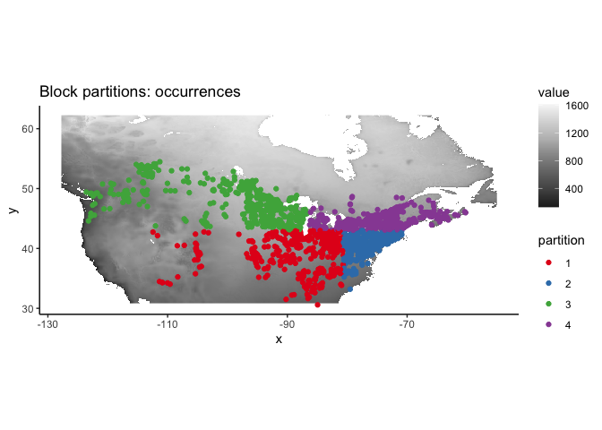<!-- -->

### Env. Similarity of Partions

``` r
occs.z <- cbind(occs, raster::extract(env, occs))
bg.z <- cbind(bg, raster::extract(env, bg))
evalplot.envSim.hist(sim.type = "mess", ref.data = "occs", occs.z = occs.z, bg.z = bg.z, 
                     occs.grp = block$occs.grp, bg.grp = block$bg.grp)
```

<!-- -->

``` r
evalplot.envSim.hist(sim.type = "most_diff", ref.data = "occs", occs.z = occs.z, bg.z = bg.z, 
                     occs.grp = block$occs.grp, bg.grp = block$bg.grp)
```

<!-- -->

``` r
evalplot.envSim.map(sim.type = "mess", ref.data = "occs", envs = env, occs.z = occs.z, 
                    bg.z = bg.z, occs.grp = block$occs.grp, bg.grp = block$bg.grp, bb.buf = 7)
```

<!-- -->

### Tune model

``` r
e.mx <- ENMevaluate(occs = occs, envs = env, bg = bg, 
                    algorithm = 'maxent.jar', partitions = 'block', parallel = TRUE, 
                    tune.args = list(fc = c("L","LQ","LQH","H"), rm = 1:5))
```

    ## *** Running initial checks... ***

    ## * Removed 1 occurrence localities that shared the same grid cell.

    ## * Removed 7 occurrence points with NA predictor variable values.

    ## * Clamping predictor variable rasters...

    ## * Model evaluations with spatial block (4-fold) cross validation and lat_lon orientation...

    ## 
    ## *** Running ENMeval v2.0.0 with maxent.jar v3.4.1 from dismo package v1.3.3 ***

    ##   |                                                                              |                                                                      |   0%

    ## 
    ## Of 4 total cores using 4...

    ## Running in parallel using doSNOW...

    ##   |                                                                              |====                                                                  |   5%  |                                                                              |=======                                                               |  10%  |                                                                              |==========                                                            |  15%  |                                                                              |==============                                                        |  20%  |                                                                              |==================                                                    |  25%  |                                                                              |=====================                                                 |  30%  |                                                                              |========================                                              |  35%  |                                                                              |============================                                          |  40%  |                                                                              |================================                                      |  45%  |                                                                              |===================================                                   |  50%  |                                                                              |======================================                                |  55%  |                                                                              |==========================================                            |  60%  |                                                                              |==============================================                        |  65%  |                                                                              |=================================================                     |  70%  |                                                                              |====================================================                  |  75%  |                                                                              |========================================================              |  80%  |                                                                              |============================================================          |  85%  |                                                                              |===============================================================       |  90%  |                                                                              |==================================================================    |  95%  |                                                                              |======================================================================| 100%
    ## This is MaxEnt version 3.4.1 
    ## This is MaxEnt version 3.4.1 
    ## This is MaxEnt version 3.4.1 
    ## This is MaxEnt version 3.4.1 
    ## This is MaxEnt version 3.4.1 
    ## This is MaxEnt version 3.4.1 
    ## This is MaxEnt version 3.4.1 
    ## This is MaxEnt version 3.4.1 
    ## This is MaxEnt version 3.4.1 
    ## This is MaxEnt version 3.4.1 
    ## This is MaxEnt version 3.4.1 
    ## This is MaxEnt version 3.4.1 
    ## This is MaxEnt version 3.4.1 
    ## This is MaxEnt version 3.4.1 
    ## This is MaxEnt version 3.4.1 
    ## This is MaxEnt version 3.4.1 
    ## This is MaxEnt version 3.4.1 
    ## This is MaxEnt version 3.4.1 
    ## This is MaxEnt version 3.4.1 
    ## This is MaxEnt version 3.4.1 
    ## This is MaxEnt version 3.4.1 
    ## This is MaxEnt version 3.4.1 
    ## This is MaxEnt version 3.4.1 
    ## This is MaxEnt version 3.4.1 
    ## This is MaxEnt version 3.4.1 
    ## This is MaxEnt version 3.4.1 
    ## This is MaxEnt version 3.4.1 
    ## This is MaxEnt version 3.4.1 
    ## This is MaxEnt version 3.4.1 
    ## This is MaxEnt version 3.4.1 
    ## This is MaxEnt version 3.4.1 
    ## This is MaxEnt version 3.4.1 
    ## This is MaxEnt version 3.4.1 
    ## This is MaxEnt version 3.4.1 
    ## This is MaxEnt version 3.4.1 
    ## This is MaxEnt version 3.4.1 
    ## This is MaxEnt version 3.4.1 
    ## This is MaxEnt version 3.4.1 
    ## This is MaxEnt version 3.4.1 
    ## This is MaxEnt version 3.4.1

    ## ENMevaluate completed in 42 minutes 53.7 seconds.

``` r
e.mx
```

    ## An object of class:  ENMevaluation 
    ##  occurrence/background points:  1859 / 94701 
    ##  partition method:  block 
    ##  partition settings:  orientation = lat_lon 
    ##  clamp:  TRUE 
    ##  clamp directions:  left: bio4, bio5, bio8, bio12, bio15, bio18, dem, sand, clay, pH
    ##                     right: bio4, bio5, bio8, bio12, bio15, bio18, dem, sand, clay, pH 
    ##  algorithm:  maxent.jar 
    ##  tune settings:  fc: L,LQ,LQH,H
    ##                  rm: 1,2,3,4,5 
    ##  overlap:  TRUE 
    ## Refer to ?ENMevaluation for information on slots.

### Model turning results and Selection

``` r
evalplot.stats(e = e.mx, stats = c("AICc"), color = "fc", x.var = "rm", 
               error.bars = FALSE)
```

<!-- -->

``` r
evalplot.stats(e = e.mx, stats = c("auc.val"), color = "fc", x.var = "rm", 
               error.bars = FALSE)
```

<!-- -->

``` r
res <- eval.results(e.mx)
kable(res)
```

| fc  | rm | tune.args    | auc.train | cbi.train | auc.diff.avg | auc.diff.sd | auc.val.avg | auc.val.sd | cbi.val.avg | cbi.val.sd | or.10p.avg | or.10p.sd | or.mtp.avg | or.mtp.sd |     AICc | delta.AICc | w.AIC | ncoef |
| :-- | :- | :----------- | --------: | --------: | -----------: | ----------: | ----------: | ---------: | ----------: | ---------: | ---------: | --------: | ---------: | --------: | -------: | ---------: | ----: | ----: |
| L   | 1  | fc.L\_rm.1   | 0.8019100 |     0.991 |    0.2125186 |   0.1717610 |   0.7698863 |  0.2217633 |     0.47625 |  0.9488205 |  0.2543011 | 0.4748173 |  0.0096774 | 0.0166117 | 43555.39 |  2759.6411 |   0.0 |     9 |
| LQ  | 1  | fc.LQ\_rm.1  | 0.8980734 |     0.999 |    0.1099243 |   0.0960428 |   0.8786180 |  0.1262382 |     0.53325 |  0.8514828 |  0.2387108 | 0.4285879 |  0.0021505 | 0.0043011 | 41280.53 |   484.7877 |   0.0 |    15 |
| LQH | 1  | fc.LQH\_rm.1 | 0.9190211 |     0.999 |    0.0823683 |   0.0852990 |   0.8892671 |  0.1023357 |     0.63275 |  0.7025147 |  0.1854955 | 0.3215407 |  0.0037634 | 0.0075269 | 40795.75 |     0.0000 |   0.5 |   174 |
| H   | 1  | fc.H\_rm.1   | 0.9190211 |     0.999 |    0.0821830 |   0.0853671 |   0.8893404 |  0.1022307 |     0.63300 |  0.7026839 |  0.1860343 | 0.3211760 |  0.0037634 | 0.0075269 | 40795.75 |     0.0000 |   0.5 |   174 |
| L   | 2  | fc.L\_rm.2   | 0.8015690 |     0.985 |    0.2148262 |   0.1728969 |   0.7700206 |  0.2252380 |     0.45825 |  0.9577750 |  0.2548387 | 0.4758912 |  0.0075269 | 0.0123539 | 43568.98 |  2773.2325 |   0.0 |     9 |
| LQ  | 2  | fc.LQ\_rm.2  | 0.8797104 |     0.996 |    0.1498713 |   0.1248085 |   0.8499828 |  0.1668051 |     0.49125 |  0.9164029 |  0.2510753 | 0.4560674 |  0.0010753 | 0.0021505 | 41879.04 |  1083.2954 |   0.0 |    13 |
| LQH | 2  | fc.LQH\_rm.2 | 0.9156828 |     0.987 |    0.0758488 |   0.0803047 |   0.8933427 |  0.0937308 |     0.60025 |  0.7762098 |  0.1817309 | 0.3209567 |  0.0005376 | 0.0010753 | 40913.60 |   117.8553 |   0.0 |   161 |
| H   | 2  | fc.H\_rm.2   | 0.9156828 |     0.987 |    0.0763463 |   0.0796778 |   0.8936289 |  0.0937883 |     0.60000 |  0.7760649 |  0.1817309 | 0.3209567 |  0.0005376 | 0.0010753 | 40913.60 |   117.8553 |   0.0 |   161 |
| L   | 3  | fc.L\_rm.3   | 0.8010755 |     0.978 |    0.2166911 |   0.1734396 |   0.7701237 |  0.2283284 |     0.45075 |  0.9498475 |  0.2548387 | 0.4758912 |  0.0075269 | 0.0136577 | 43590.36 |  2794.6133 |   0.0 |     9 |
| LQ  | 3  | fc.LQ\_rm.3  | 0.8602480 |     0.999 |    0.1803817 |   0.1509415 |   0.8166869 |  0.1985524 |     0.49200 |  0.9037710 |  0.2564516 | 0.4722422 |  0.0021505 | 0.0030413 | 42397.40 |  1601.6526 |   0.0 |    11 |
| LQH | 3  | fc.LQH\_rm.3 | 0.9138306 |     0.994 |    0.0788764 |   0.0784798 |   0.8929631 |  0.0945749 |     0.60175 |  0.7672437 |  0.1822662 | 0.3262879 |  0.0010753 | 0.0021505 | 40914.26 |   118.5148 |   0.0 |   124 |
| H   | 3  | fc.H\_rm.3   | 0.9138306 |     0.994 |    0.0785895 |   0.0766780 |   0.8937608 |  0.0933831 |     0.60575 |  0.7572663 |  0.1785039 | 0.3200990 |  0.0005376 | 0.0010753 | 40914.26 |   118.5148 |   0.0 |   124 |
| L   | 4  | fc.L\_rm.4   | 0.8004155 |     0.974 |    0.2187025 |   0.1746444 |   0.7699297 |  0.2312927 |     0.44000 |  0.9419218 |  0.2553763 | 0.4797302 |  0.0091398 | 0.0168764 | 43618.78 |  2823.0298 |   0.0 |     9 |
| LQ  | 4  | fc.LQ\_rm.4  | 0.8390777 |     0.996 |    0.2030802 |   0.1713940 |   0.7879004 |  0.2242387 |     0.44100 |  0.8835817 |  0.2548387 | 0.4758912 |  0.0043011 | 0.0072398 | 42869.54 |  2073.7956 |   0.0 |    10 |
| LQH | 4  | fc.LQH\_rm.4 | 0.9126892 |     0.997 |    0.0838228 |   0.0801018 |   0.8919369 |  0.0989219 |     0.61175 |  0.7451758 |  0.1811886 | 0.3311759 |  0.0010753 | 0.0021505 | 40992.32 |   196.5776 |   0.0 |   128 |
| H   | 4  | fc.H\_rm.4   | 0.9127082 |     0.997 |    0.0817714 |   0.0773387 |   0.8925522 |  0.0959365 |     0.61975 |  0.7258592 |  0.1779628 | 0.3233469 |  0.0005376 | 0.0010753 | 40989.36 |   193.6152 |   0.0 |   127 |
| L   | 5  | fc.L\_rm.5   | 0.7995889 |     0.975 |    0.2200457 |   0.1746545 |   0.7701248 |  0.2329224 |     0.43300 |  0.9371517 |  0.2559140 | 0.4808043 |  0.0102151 | 0.0190234 | 43647.63 |  2851.8854 |   0.0 |     7 |
| LQ  | 5  | fc.LQ\_rm.5  | 0.8192157 |     0.981 |    0.2140459 |   0.1794427 |   0.7772115 |  0.2379908 |     0.42950 |  0.9223757 |  0.2543011 | 0.4775820 |  0.0075269 | 0.0136577 | 43251.17 |  2455.4241 |   0.0 |    10 |
| LQH | 5  | fc.LQH\_rm.5 | 0.9115389 |     0.997 |    0.0873871 |   0.0833348 |   0.8896888 |  0.1033319 |     0.62800 |  0.7153549 |  0.1828003 | 0.3330780 |  0.0016129 | 0.0032258 | 41052.18 |   256.4319 |   0.0 |   126 |
| H   | 5  | fc.H\_rm.5   | 0.9115704 |     0.997 |    0.0849138 |   0.0799846 |   0.8899290 |  0.0995930 |     0.63000 |  0.7006735 |  0.1801133 | 0.3276426 |  0.0005376 | 0.0010753 | 41049.91 |   254.1609 |   0.0 |   125 |

``` r
opt.aicc <- res %>% 
  filter(delta.AICc <= 2) %>% 
  slice_max(auc.val.avg)
kable(opt.aicc)
```

| fc | rm | tune.args  | auc.train | cbi.train | auc.diff.avg | auc.diff.sd | auc.val.avg | auc.val.sd | cbi.val.avg | cbi.val.sd | or.10p.avg | or.10p.sd | or.mtp.avg | or.mtp.sd |     AICc | delta.AICc | w.AIC | ncoef |
| :- | :- | :--------- | --------: | --------: | -----------: | ----------: | ----------: | ---------: | ----------: | ---------: | ---------: | --------: | ---------: | --------: | -------: | ---------: | ----: | ----: |
| H  | 1  | fc.H\_rm.1 | 0.9190211 |     0.999 |     0.082183 |   0.0853671 |   0.8893404 |  0.1022307 |       0.633 |  0.7026839 |  0.1860343 |  0.321176 |  0.0037634 | 0.0075269 | 40795.75 |          0 |   0.5 |   174 |

``` r
par(mar = c(4, 2, 0.5, 1)) 
dismo::response(eval.models(e.mx)[[opt.aicc$tune.args]])
```

    FALSE This is MaxEnt version 3.4.1

    FALSE This is MaxEnt version 3.4.1

    FALSE This is MaxEnt version 3.4.1

    FALSE This is MaxEnt version 3.4.1

    FALSE This is MaxEnt version 3.4.1

    FALSE This is MaxEnt version 3.4.1

    FALSE This is MaxEnt version 3.4.1

    FALSE This is MaxEnt version 3.4.1

    FALSE This is MaxEnt version 3.4.1

    FALSE This is MaxEnt version 3.4.1

<!-- -->

``` r
par(mar = c(4, 2, 1, 1)) 
plot(eval.models(e.mx)[[opt.aicc$tune.args]])
```

<!-- -->

``` r
par(mar = c(5.1, 4.1, 4.1, 2.1))
```

### Prediction

``` r
pred.seq <- eval.predictions(e.mx)[[opt.aicc$tune.args]]
plot(pred.seq)
map('worldHires', fill=FALSE, add=TRUE, xlim = c(-127.75, -55), ylim = c(30.83333, 62.25), lforce = "e")
```

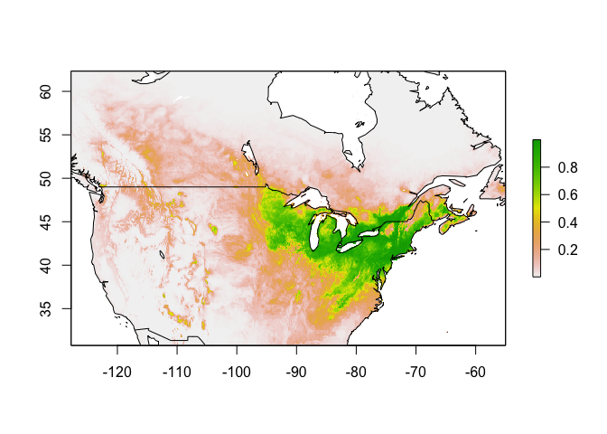<!-- -->

``` r
writeRaster(pred.seq, "../../pred/out/Lc/Lc_SDM_ME_rw_baseline.tif", overwrite = TRUE)
```

### Threshold

#### Minimum training presence

``` r
mtp <- sdm_threshold(pred.seq, occs, type = "mtp")
plot(mtp, xlim = c(-130, -55))
map('worldHires', fill=FALSE, add=TRUE, xlim = c(-127.75, -55), ylim = c(30.83333, 62.25), lforce = "e")
```

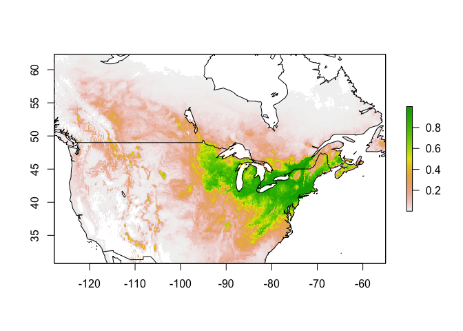<!-- -->

``` r
writeRaster(mtp, "../../pred/out/Lc/Lc_SDM_ME_rw_mtp_baseline.tif", overwrite = TRUE)
```

#### 10th percentile training presence

``` r
p10 <- sdm_threshold(pred.seq, occs, type = "p10")
plot(p10)
map('worldHires', fill=FALSE, add=TRUE, xlim = c(-127.75, -55), ylim = c(30.83333, 62.25), lforce = "e")
```

<!-- -->

``` r
p10.b <- sdm_threshold(pred.seq, occs, type = "p10", binary = TRUE)
plot(p10.b)
map('worldHires', fill=FALSE, add=TRUE, xlim = c(-127.75, -55), ylim = c(30.83333, 62.25), lforce = "e")
```

<!-- -->

``` r
writeRaster(p10, "../../pred/out/Lc/Lc_SDM_ME_rw_p10_baseline.tif", overwrite = TRUE)
```

### Future Climate Models

Select optimal model as determined above using `ENMeval`. This model
will be used to predict over the GCM predictions for years 2041-2060 and
2081-2100 (referred to as 2050 and 2090 respectfully) as well as each of
the four Shared Socioeconomic Pathways (SSP) from CMIP6.

``` r
for (i in 1:length(e.mx@models)) {
  if(names(e.mx@models[i]) == as.character(opt.aicc[,3])) {
    model <- e.mx@models[[i]]
    print(paste("Opt. model : ", names(e.mx@models[i]), sep = ""))
  }
}
```

    ## [1] "Opt. model : fc.H_rm.1"

``` r
(thres <- min(na.omit(as.vector(p10))))
```

    ## [1] 0.1857979

#### 2041 - 2060

##### 2050 | ssp126

``` r
setwd("../../pred/pred_stack_rw/")
mdls <- list.files(pattern = "50.*ssp126.tif")

par(mfrow = c(2,4))
pred <- sapply(mdls, futurePred, envnames = envnames, model = model)
```

    ## This is MaxEnt version 3.4.1

    ## This is MaxEnt version 3.4.1

    ## This is MaxEnt version 3.4.1

    ## This is MaxEnt version 3.4.1

    ## This is MaxEnt version 3.4.1

    ## This is MaxEnt version 3.4.1

    ## This is MaxEnt version 3.4.1

    ## This is MaxEnt version 3.4.1

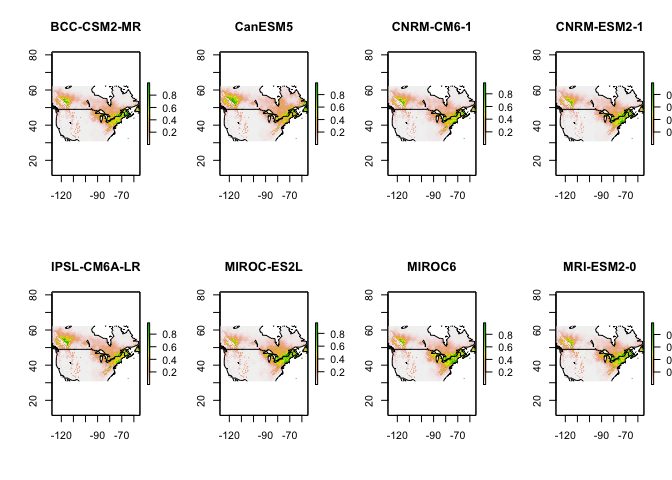<!-- -->

``` r
par(mfrow = c(1,1))
```

##### 2050 | ssp126 | Mean and Threshold

``` r
futureSave(pred, "Lc", "2050", "ssp126", thres = thres)
```

<!-- --><!-- -->

##### 2050 | ssp245

``` r
setwd("../../pred/pred_stack_rw/")
mdls <- list.files(pattern = "50.*ssp245.tif")

par(mfrow = c(2,4))
pred <- sapply(mdls, futurePred, envnames = envnames, model = model)
```

    ## This is MaxEnt version 3.4.1

    ## This is MaxEnt version 3.4.1

    ## This is MaxEnt version 3.4.1

    ## This is MaxEnt version 3.4.1

    ## This is MaxEnt version 3.4.1

    ## This is MaxEnt version 3.4.1

    ## This is MaxEnt version 3.4.1

    ## This is MaxEnt version 3.4.1

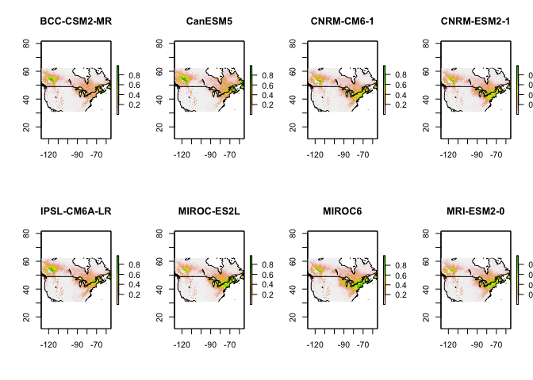<!-- -->

``` r
par(mfrow = c(1,1))
```

##### 2050 | ssp245 | Mean and Threshold

``` r
futureSave(pred, "Lc", "2050", "ssp245", thres = thres)
```

<!-- --><!-- -->

##### 2050 | ssp370

``` r
setwd("../../pred/pred_stack_rw/")
mdls <- list.files(pattern = "50.*ssp370.tif")

par(mfrow = c(2,4))
pred <- sapply(mdls, futurePred, envnames = envnames, model = model)
```

    ## This is MaxEnt version 3.4.1

    ## This is MaxEnt version 3.4.1

    ## This is MaxEnt version 3.4.1

    ## This is MaxEnt version 3.4.1

    ## This is MaxEnt version 3.4.1

    ## This is MaxEnt version 3.4.1

    ## This is MaxEnt version 3.4.1

    ## This is MaxEnt version 3.4.1

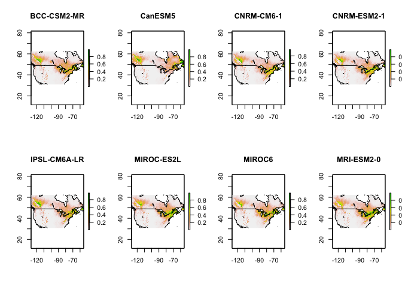<!-- -->

``` r
par(mfrow = c(1,1))
```

##### 2050 | ssp370 | Mean and Threshold

``` r
futureSave(pred, "Lc", "2050", "ssp370", thres = thres)
```

<!-- --><!-- -->

##### 2050 | ssp585

``` r
setwd("../../pred/pred_stack_rw/")
mdls <- list.files(pattern = "50.*ssp585.tif")

par(mfrow = c(2,4))
pred <- sapply(mdls, futurePred, envnames = envnames, model = model)
```

    ## This is MaxEnt version 3.4.1

    ## This is MaxEnt version 3.4.1

    ## This is MaxEnt version 3.4.1

    ## This is MaxEnt version 3.4.1

    ## This is MaxEnt version 3.4.1

    ## This is MaxEnt version 3.4.1

    ## This is MaxEnt version 3.4.1

    ## This is MaxEnt version 3.4.1

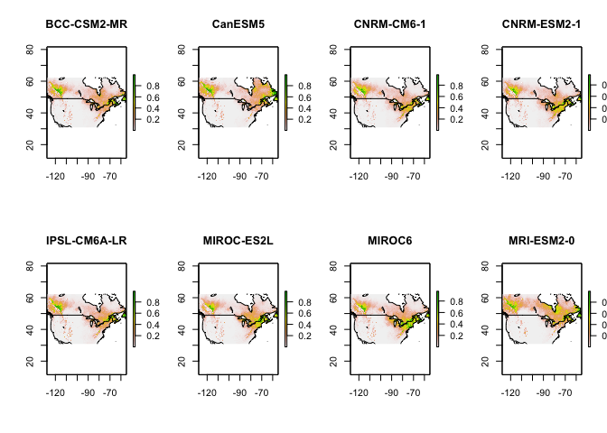<!-- -->

``` r
par(mfrow = c(1,1))
```

##### 2050 | ssp585 | Mean and Threshold

``` r
futureSave(pred, "Lc", "2050", "ssp585", thres = thres)
```

<!-- --><!-- -->

#### 2081 - 2100

##### 2090 | ssp126

``` r
setwd("../../pred/pred_stack_rw/")
mdls <- list.files(pattern = "90.*ssp126.tif")

par(mfrow = c(2,4))
pred <- sapply(mdls, futurePred, envnames = envnames, model = model)
```

    ## This is MaxEnt version 3.4.1

    ## This is MaxEnt version 3.4.1

    ## This is MaxEnt version 3.4.1

    ## This is MaxEnt version 3.4.1

    ## This is MaxEnt version 3.4.1

    ## This is MaxEnt version 3.4.1

    ## This is MaxEnt version 3.4.1

    ## This is MaxEnt version 3.4.1

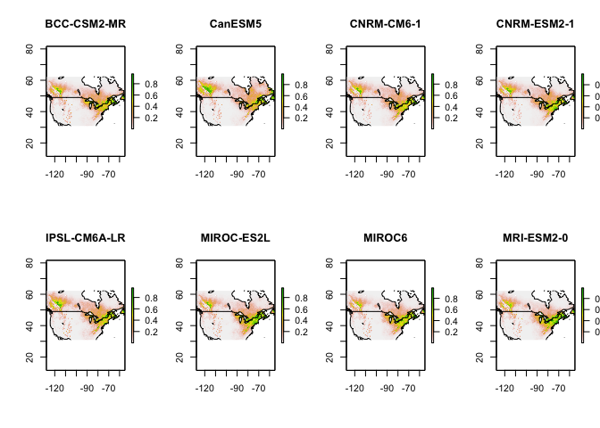<!-- -->

``` r
par(mfrow = c(1,1))
```

##### 2090 | ssp126 | Mean and Threshold

``` r
futureSave(pred, "Lc", "2090", "ssp126", thres = thres)
```

<!-- --><!-- -->

##### 2090 | ssp245

``` r
setwd("../../pred/pred_stack_rw/")
mdls <- list.files(pattern = "90.*ssp245.tif")

par(mfrow = c(2,4))
pred <- sapply(mdls, futurePred, envnames = envnames, model = model)
```

    ## This is MaxEnt version 3.4.1

    ## This is MaxEnt version 3.4.1

    ## This is MaxEnt version 3.4.1

    ## This is MaxEnt version 3.4.1

    ## This is MaxEnt version 3.4.1

    ## This is MaxEnt version 3.4.1

    ## This is MaxEnt version 3.4.1

    ## This is MaxEnt version 3.4.1

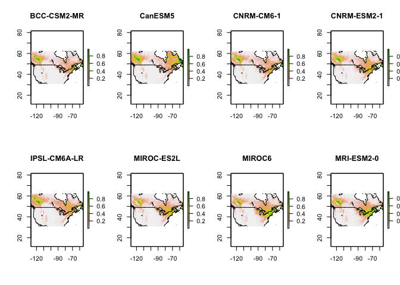<!-- -->

``` r
par(mfrow = c(1,1))
```

##### 2090 | ssp245 | Mean and Threshold

``` r
futureSave(pred, "Lc", "2090", "ssp245", thres = thres)
```

<!-- --><!-- -->

##### 2090 | ssp370

``` r
setwd("../../pred/pred_stack_rw/")
mdls <- list.files(pattern = "90.*ssp370.tif")

par(mfrow = c(2,4))
pred <- sapply(mdls, futurePred, envnames = envnames, model = model)
```

    ## This is MaxEnt version 3.4.1

    ## This is MaxEnt version 3.4.1

    ## This is MaxEnt version 3.4.1

    ## This is MaxEnt version 3.4.1

    ## This is MaxEnt version 3.4.1

    ## This is MaxEnt version 3.4.1

    ## This is MaxEnt version 3.4.1

    ## This is MaxEnt version 3.4.1

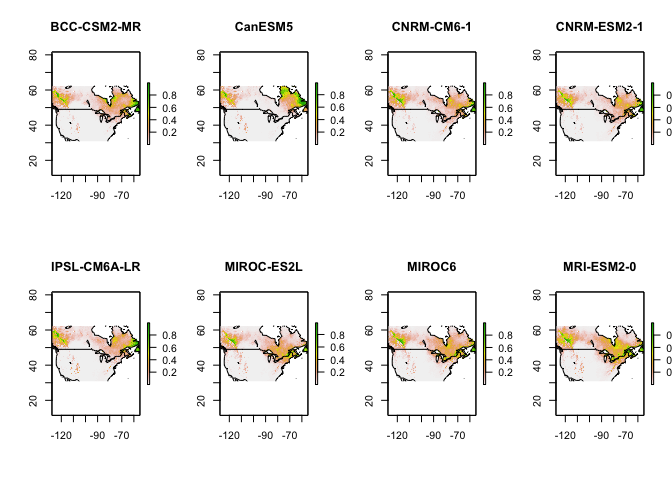<!-- -->

``` r
par(mfrow = c(1,1))
```

##### 2090 | ssp370 | Mean and Threshold

``` r
futureSave(pred, "Lc", "2090", "ssp370", thres = thres)
```

<!-- --><!-- -->

##### 2090 | ssp585

``` r
setwd("../../pred/pred_stack_rw/")
mdls <- list.files(pattern = "90.*ssp585.tif")

par(mfrow = c(2,4))
pred <- sapply(mdls, futurePred, envnames = envnames, model = model)
```

    ## This is MaxEnt version 3.4.1

    ## This is MaxEnt version 3.4.1

    ## This is MaxEnt version 3.4.1

    ## This is MaxEnt version 3.4.1

    ## This is MaxEnt version 3.4.1

    ## This is MaxEnt version 3.4.1

    ## This is MaxEnt version 3.4.1

    ## This is MaxEnt version 3.4.1

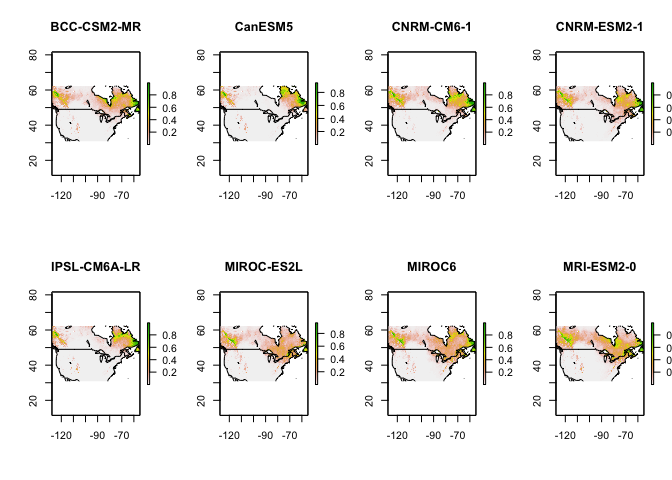<!-- -->

``` r
par(mfrow = c(1,1))
```

##### 2090 | ssp585 | Mean and Threshold

``` r
futureSave(pred, "Lc", "2090", "ssp585", thres = thres)
```

<!-- --><!-- -->
