Macropis nuda | Range-wide distribution under future climate projections
================
Mark Buckner
2021-09-26

  - [Packages](#packages)
  - [Functions](#functions)
  - [Load Occurance Data and
    Predictors](#load-occurance-data-and-predictors)
      - [Spatial Thinning](#spatial-thinning)
  - [MESS](#mess)
      - [Random Background Points](#random-background-points)
      - [Partition for Model
        Evaluation](#partition-for-model-evaluation)
      - [Env. Similarity of Partions](#env-similarity-of-partions)
      - [Tune model](#tune-model)
      - [Model turning results and
        Selection](#model-turning-results-and-selection)
      - [Prediction](#prediction)
      - [Threshold](#threshold)
      - [Future Climate Models](#future-climate-models)

#### Packages

``` r
library(spatial)
library(rgdal)
library(spThin)
library(ENMeval, attach.required = T)
library(rmaxent)
library(raster)
library(tidyverse)
library(lubridate)
library(mapdata)
library(rJava)
library(knitr)
```

#### Functions

``` r
#Function code: https://babichmorrowc.github.io/post/2019-04-12-sdm-threshold/
sdm_threshold <- function(sdm, occs, type = "mtp", binary = FALSE){
  occPredVals <- raster::extract(sdm, occs)
  if(type == "mtp"){
    thresh <- min(na.omit(occPredVals))
  } else if(type == "p10"){
    if(length(occPredVals) < 10){
      p10 <- floor(length(occPredVals) * 0.9)
    } else {
      p10 <- ceiling(length(occPredVals) * 0.9)
    }
    thresh <- rev(sort(occPredVals))[p10]
  }
  sdm_thresh <- sdm
  sdm_thresh[sdm_thresh < thresh] <- NA
  if(binary){
    sdm_thresh[sdm_thresh >= thresh] <- 1
  }
  return(sdm_thresh)
}

#futurePred() : Predicts distribution over a certain model raster stack and plots output. Written to be used with list.files() and sapply().
#file = file name of raster stack; model = training model; envnames = names of predictor layers, vector; host = (optional) two letter abbr. of host, character; drop = names of layers to drop from final raster stack, vector.
futurePred <- function(file, model, envnames, host, drop) {
  path <- paste("./", file, sep = "")
  m <- str_extract(file, "_.*_")
  m <- str_sub(m, 2, -2)
  
  if(missing(host)) {
    r <- stack(path)
  } else {
    yr <- str_extract(file, "\\d+")
    ssp <- str_extract(file, "ssp.*")
    hpath <- paste("../out/", host, "/", host, "_SDM_ME_rw_mean20", yr, ssp, sep = "")
    r <- stack(path, hpath)
  }
  
  names(r) <- envnames
  
  if(!missing(drop)) {
    r <- dropLayer(r, drop)
  }
  
  pred <- predict(model, r)
  
  plot(pred, main = m)
  map('worldHires', fill=FALSE, add=TRUE, xlim = c(-127.75, -55), ylim = c(30.83333, 62.25), lforce = "e")
  
  return(pred)
}

#futureSave() : Calculates the mean distribution for all models at a particular time and ssp, saves results of mean and p10 threshold, and plots.
#pred = mean prediction; spp = two letter species name abbr., character; year = YYYY; ssp = CMIP6 scenario
futureSave <- function(pred, spp, year, ssp, thres) {
  pred.s <- stack(pred)
  pred.m <- calc(pred.s, mean)

  plot(pred.m, main = paste(year, ssp, "mean", sep = "_"))
  map('worldHires', fill=FALSE, add=TRUE, xlim = c(-127.75, -55), ylim = c(30.83333, 62.25), lforce = "e")
  
  name <- paste("../../pred/out/",spp, "/", spp, "_SDM_ME_rw_", "mean", year, ssp, ".tif", sep = "")
  
  writeRaster(pred.m, filename = name, options="INTERLEAVE=BAND", overwrite=TRUE)

  #10th percentile training presence
  if(!missing(thres)) {
    p10 <- pred.m
    p10[p10 < thres] <- NA 
    plot(p10, main = paste(year, ssp, "p10", sep = "_"))
    map('worldHires', fill=FALSE, add=TRUE, xlim = c(-127.75, -55), ylim = c(30.83333, 62.25), lforce = "e")
  
    name <- paste("../../pred/out/",spp, "/", spp, "_SDM_ME_rw_", "p10_", year, ssp, ".tif", sep = "")
  
    writeRaster(p10, filename = name, options="INTERLEAVE=BAND", overwrite=TRUE)
  }
}
```

## Load Occurance Data and Predictors

Occurrence and predictor data processed in `occ_pred_data_NA.Rmd`.
Occurrence data needs to have the unnecessary fields removed and
projected to the project projection (`+proj=longlat +ellps=WGS84
+datum=WGS84 +no_defs`) to create a `matrix array`.

``` r
#Occurrences
occ <- read_csv("../../occ/Mn_RW70.csv")

occs <- select(occ, lat, lon) %>% 
  mutate("spp" = "Mc")

occp <- rgdal::project(as.matrix(occs[,c("lon","lat")]), proj = "+proj=longlat +ellps=WGS84 +datum=WGS84 +no_defs")
```

The predictors are described below. Only bold predictors are included
after accounting for collinearity. All other variables were highly
correlated (r \> 0.7) with one of the other variables and were excluded.
Variables were chosen based on the network of correlation and the
perceived importance.

Bioclimatic variables (USGS descriptions available
[here](https://pubs.usgs.gov/ds/691/ds691.pdf))

  - Bio 1 : Mean Annual Temperature
  - Bio 2 : Annual Mean Diurnal Range
  - Bio 3 : Isothermality
  - **Bio 4 : Temperature Seasonality**
  - Bio 5 : Max Temperature of Warmest Month
  - Bio 7 : Annual Temperature Range
  - **Bio 8 : Mean Temperature of Wettest Quarter**
  - Bio 9 : Mean Temperature of Driest Quarter
  - **Bio 10 : Mean Temperature of Warmest Quarter**
  - Bio 11 : Mean Temperature of Coldest Quarter
  - **Bio 12 : Annual Precipitation**
  - Bio 13 : Precipitation of Wettest Month
  - Bio 14 : Precipitation of Driest Month
  - **Bio 15 : Precipitation Seasonality**
  - Bio 16 : Precipitation of Wettest Quarter
  - Bio 17 : Precipitation of Driest Quarter
  - **Bio 18 : Precipitation of Warmest Quarter**
  - Bio 19 : Precipitation of Coldest Quarter

Topography

  - **DEM : SRTM at 5 arc-minute resolution downloaded from WorldClim**

Other

  - Solar Radiation : Mean solar radiation during meteorological summer
    (June, July, August)
  - **Soil Sand Content : Soil sand content (%) at 0cm of depth**
  - **Soil Clay Content : Soil clay content (%) at 0cm of depth**

Host Plant Distribution

  - **Lc\_sdm : *Lysimachia ciliata* distribution model (see:
    Lc\_SDM\_rw.Rmd)**

General Circulation Models (GCMs)

  - bcc : BCC-CSM2-MR | [Beijing Climate Center Climate System
    Model](https://gmd.copernicus.org/articles/12/1573/2019/)
  - cnrm\_c : CNRM-CM6-1 |
    [CNRM/CERFACS](http://www.umr-cnrm.fr/cmip6/spip.php?article11)
  - cnrm\_e : CNRM-ESM2-1 |
    [CNRM/CERFACS](https://agupubs.onlinelibrary.wiley.com/doi/full/10.1029/2019MS001791)
  - can : CanESM5 | [Canadian Earth System
    Model](https://gmd.copernicus.org/articles/12/4823/2019/gmd-12-4823-2019.html)
  - ipsl : IPSL-CM6A-LR | [Institut Pierre-Simon
    Laplace](https://agupubs.onlinelibrary.wiley.com/doi/full/10.1029/2019MS002010)
  - miroc : MIROC-ES2L |
    <https://gmd.copernicus.org/articles/13/2197/2020/>
  - miroc6 : MIROC6 |
    <https://gmd.copernicus.org/articles/12/2727/2019/>
  - mri : MRI-ESM2-0 | [Meteorological Research
    Institute](https://www.jstage.jst.go.jp/article/jmsj/advpub/0/advpub_2019-051/_article/-char/en)

<!-- end list -->

``` r
lc_sdm <- raster("../../pred/out/Lc/Lc_SDM_ME_rw_baseline.tif")

env <- stack("../../pred/pred_stack_rw/baseline.tif", lc_sdm)

envnames <- c("bio4", "bio8", "bio10", "bio12", "bio15", "bio18", "dem", "sand", "clay", "pH", "LcSDM")

names(env) <- envnames

env <- dropLayer(env, "pH")

plot(env[[1:nlayers(env)]])
```

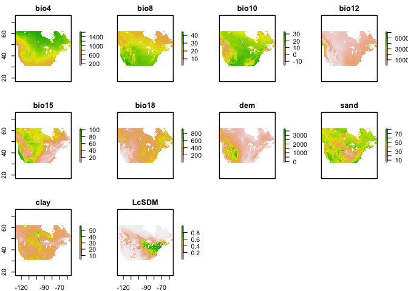<!-- -->

``` r
plot(env[[1]], main="Mean ann. temp. | M. nuda Occ.")
points(occp, pch = 16, cex = 0.5)
```

<!-- -->

### Spatial Thinning

``` r
thinned <-
  thin( loc.data = occs, 
        lat.col = "lat", long.col = "lon", 
        spec.col = "spp", 
        thin.par = 10, reps = 100, 
        locs.thinned.list.return = TRUE, 
        write.files = TRUE, 
        max.files = 5, 
        out.dir = "../../occ/Mn_thinned_full/", out.base = "Mn_thinned", 
        write.log.file = TRUE,
        log.file = "Mn_thinned_full_log_file.txt" )
```

    ## ********************************************** 
    ##  Beginning Spatial Thinning.
    ##  Script Started at: Sun Sep 26 09:53:33 2021
    ## lat.long.thin.count
    ##  60 
    ## 100 
    ## [1] "Maximum number of records after thinning: 60"
    ## [1] "Number of data.frames with max records: 100"
    ## [1] "Writing new *.csv files"

    ## Warning in thin(loc.data = occs, lat.col = "lat", long.col = "lon", spec.col =
    ## "spp", : Created new output directory: ../../occ/Mn_thinned_full/

    ## [1] "Writing file: ../../occ/Mn_thinned_full/Mn_thinned_thin1.csv"
    ## [1] "Writing file: ../../occ/Mn_thinned_full/Mn_thinned_thin2.csv"
    ## [1] "Writing file: ../../occ/Mn_thinned_full/Mn_thinned_thin3.csv"
    ## [1] "Writing file: ../../occ/Mn_thinned_full/Mn_thinned_thin4.csv"
    ## [1] "Writing file: ../../occ/Mn_thinned_full/Mn_thinned_thin5.csv"

``` r
plotThin(thinned)
```

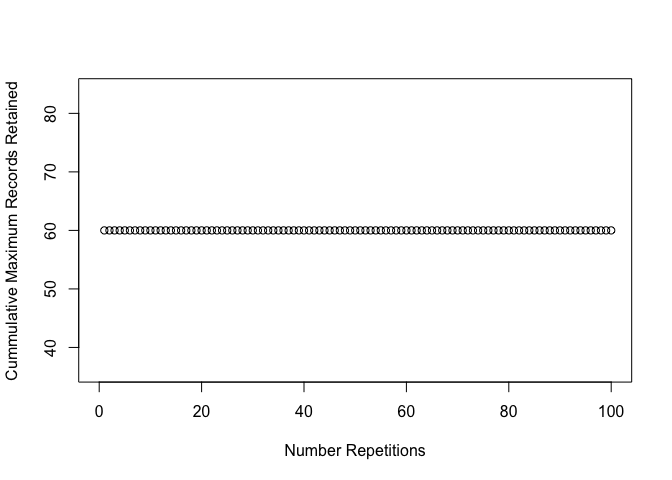<!-- -->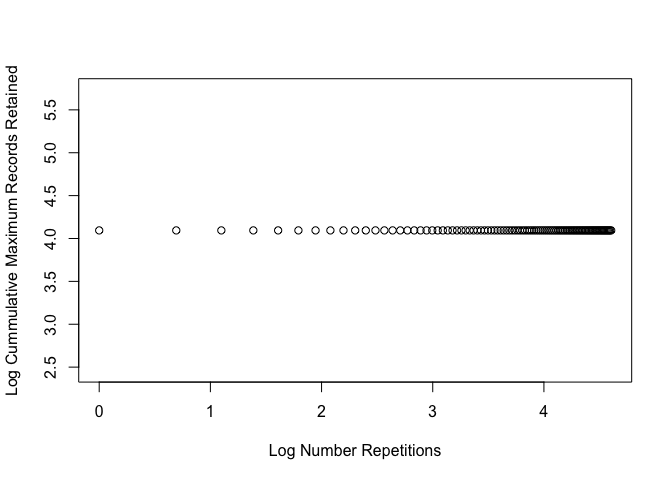<!-- -->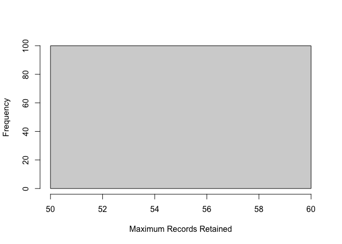<!-- -->

``` r
#Load thinned dataset in place of original
occs <- read_csv("../../occ/Mn_thinned_full/Mn_thinned_thin1.csv") %>% 
  select(lat,lon)
  
occs <- rgdal::project(as.matrix(occs[,c("lon","lat")]), proj = "+proj=longlat +ellps=WGS84 +datum=WGS84 +no_defs")
```

After thinning we are left with 60 occurrences.

## MESS

``` r
occs.z <- raster::extract(env, occs)
occs.sim <- similarity(env, occs.z)
occs.mess <- occs.sim$similarity_min
occs.sp <- sp::SpatialPoints(occs)

myScale <- seq(cellStats(occs.mess, min), cellStats(occs.mess, max), length.out = 100)
rasterVis::levelplot(occs.mess, main = "Environmental similarity", at = myScale, margin = FALSE) + 
  latticeExtra::layer(sp.points(occs.sp, col="black"))
```

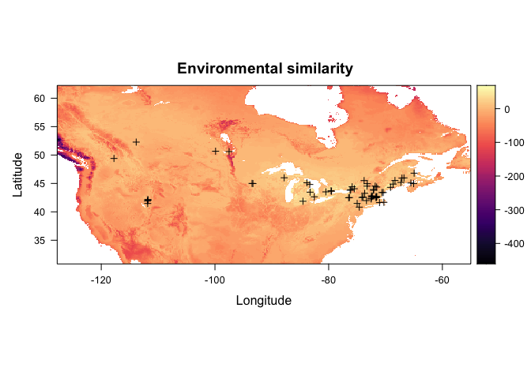<!-- --> 

### Random Background Points

``` r
(points <- sum(!is.na(getValues(env[[1]])))*0.4)
```

    ## [1] 94700.8

``` r
bg <- dismo::randomPoints(env, n = round(points)) %>% as.data.frame()
colnames(bg) <- colnames(occs)

plot(env[[1]], main="Mean ann. temp. | Background Points")
points(bg, pch = 20, cex = 0.05)
```

<!-- -->

### Partition for Model Evaluation

``` r
block <- get.block(occs, bg)
table(block$occs.grp)
```

    ## 
    ##  1  2  3  4 
    ## 15 15 15 15

``` r
evalplot.grps(pts = occs, pts.grp = block$occs.grp, envs = env) + 
  ggplot2::ggtitle("Block partitions: occurrences")
```

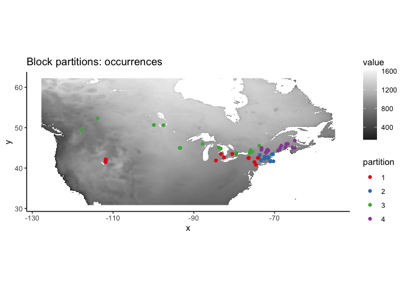<!-- -->

### Env. Similarity of Partions

``` r
occs.z <- cbind(occs, raster::extract(env, occs))
bg.z <- cbind(bg, raster::extract(env, bg))
evalplot.envSim.hist(sim.type = "mess", ref.data = "occs", occs.z = occs.z, bg.z = bg.z, 
                     occs.grp = block$occs.grp, bg.grp = block$bg.grp)
```

<!-- -->

``` r
evalplot.envSim.hist(sim.type = "most_diff", ref.data = "occs", occs.z = occs.z, bg.z = bg.z, 
                     occs.grp = block$occs.grp, bg.grp = block$bg.grp)
```

<!-- -->

``` r
evalplot.envSim.map(sim.type = "mess", ref.data = "occs", envs = env, occs.z = occs.z, 
                    bg.z = bg.z, occs.grp = block$occs.grp, bg.grp = block$bg.grp, bb.buf = 7)
```

<!-- -->

### Tune model

``` r
e.mx <- ENMevaluate(occs = occs, envs = env, bg = bg, 
                    algorithm = 'maxent.jar', partitions = 'block', parallel = TRUE, 
                    tune.args = list(fc = c("L","LQ","LQH","H"), rm = 1:10))
```

    ## *** Running initial checks... ***

    ## * Removed 2 occurrence points with NA predictor variable values.

    ## * Clamping predictor variable rasters...

    ## * Model evaluations with spatial block (4-fold) cross validation and lat_lon orientation...

    ## 
    ## *** Running ENMeval v2.0.0 with maxent.jar v3.4.1 from dismo package v1.3.3 ***

    ##   |                                                                              |                                                                      |   0%

    ## 
    ## Of 4 total cores using 4...

    ## Running in parallel using doSNOW...

    ##   |                                                                              |==                                                                    |   2%  |                                                                              |====                                                                  |   5%  |                                                                              |=====                                                                 |   8%  |                                                                              |=======                                                               |  10%  |                                                                              |=========                                                             |  12%  |                                                                              |==========                                                            |  15%  |                                                                              |============                                                          |  18%  |                                                                              |==============                                                        |  20%  |                                                                              |================                                                      |  22%  |                                                                              |==================                                                    |  25%  |                                                                              |===================                                                   |  28%  |                                                                              |=====================                                                 |  30%  |                                                                              |=======================                                               |  32%  |                                                                              |========================                                              |  35%  |                                                                              |==========================                                            |  38%  |                                                                              |============================                                          |  40%  |                                                                              |==============================                                        |  42%  |                                                                              |================================                                      |  45%  |                                                                              |=================================                                     |  48%  |                                                                              |===================================                                   |  50%  |                                                                              |=====================================                                 |  52%  |                                                                              |======================================                                |  55%  |                                                                              |========================================                              |  58%  |                                                                              |==========================================                            |  60%  |                                                                              |============================================                          |  62%  |                                                                              |==============================================                        |  65%  |                                                                              |===============================================                       |  68%  |                                                                              |=================================================                     |  70%  |                                                                              |===================================================                   |  72%  |                                                                              |====================================================                  |  75%  |                                                                              |======================================================                |  78%  |                                                                              |========================================================              |  80%  |                                                                              |==========================================================            |  82%  |                                                                              |============================================================          |  85%  |                                                                              |=============================================================         |  88%  |                                                                              |===============================================================       |  90%  |                                                                              |=================================================================     |  92%  |                                                                              |==================================================================    |  95%  |                                                                              |====================================================================  |  98%  |                                                                              |======================================================================| 100%
    ## This is MaxEnt version 3.4.1 
    ## This is MaxEnt version 3.4.1 
    ## This is MaxEnt version 3.4.1 
    ## This is MaxEnt version 3.4.1 
    ## This is MaxEnt version 3.4.1 
    ## This is MaxEnt version 3.4.1 
    ## This is MaxEnt version 3.4.1 
    ## This is MaxEnt version 3.4.1 
    ## This is MaxEnt version 3.4.1 
    ## This is MaxEnt version 3.4.1 
    ## This is MaxEnt version 3.4.1 
    ## This is MaxEnt version 3.4.1 
    ## This is MaxEnt version 3.4.1 
    ## This is MaxEnt version 3.4.1 
    ## This is MaxEnt version 3.4.1 
    ## This is MaxEnt version 3.4.1 
    ## This is MaxEnt version 3.4.1 
    ## This is MaxEnt version 3.4.1 
    ## This is MaxEnt version 3.4.1 
    ## This is MaxEnt version 3.4.1 
    ## This is MaxEnt version 3.4.1 
    ## This is MaxEnt version 3.4.1 
    ## This is MaxEnt version 3.4.1 
    ## This is MaxEnt version 3.4.1 
    ## This is MaxEnt version 3.4.1 
    ## This is MaxEnt version 3.4.1 
    ## This is MaxEnt version 3.4.1 
    ## This is MaxEnt version 3.4.1 
    ## This is MaxEnt version 3.4.1 
    ## This is MaxEnt version 3.4.1 
    ## This is MaxEnt version 3.4.1 
    ## This is MaxEnt version 3.4.1 
    ## This is MaxEnt version 3.4.1 
    ## This is MaxEnt version 3.4.1 
    ## This is MaxEnt version 3.4.1 
    ## This is MaxEnt version 3.4.1 
    ## This is MaxEnt version 3.4.1 
    ## This is MaxEnt version 3.4.1 
    ## This is MaxEnt version 3.4.1 
    ## This is MaxEnt version 3.4.1 
    ## This is MaxEnt version 3.4.1 
    ## This is MaxEnt version 3.4.1 
    ## This is MaxEnt version 3.4.1 
    ## This is MaxEnt version 3.4.1 
    ## This is MaxEnt version 3.4.1 
    ## This is MaxEnt version 3.4.1 
    ## This is MaxEnt version 3.4.1 
    ## This is MaxEnt version 3.4.1 
    ## This is MaxEnt version 3.4.1 
    ## This is MaxEnt version 3.4.1 
    ## This is MaxEnt version 3.4.1 
    ## This is MaxEnt version 3.4.1 
    ## This is MaxEnt version 3.4.1 
    ## This is MaxEnt version 3.4.1 
    ## This is MaxEnt version 3.4.1 
    ## This is MaxEnt version 3.4.1 
    ## This is MaxEnt version 3.4.1 
    ## This is MaxEnt version 3.4.1 
    ## This is MaxEnt version 3.4.1 
    ## This is MaxEnt version 3.4.1 
    ## This is MaxEnt version 3.4.1 
    ## This is MaxEnt version 3.4.1 
    ## This is MaxEnt version 3.4.1 
    ## This is MaxEnt version 3.4.1 
    ## This is MaxEnt version 3.4.1 
    ## This is MaxEnt version 3.4.1 
    ## This is MaxEnt version 3.4.1 
    ## This is MaxEnt version 3.4.1 
    ## This is MaxEnt version 3.4.1 
    ## This is MaxEnt version 3.4.1 
    ## This is MaxEnt version 3.4.1 
    ## This is MaxEnt version 3.4.1 
    ## This is MaxEnt version 3.4.1 
    ## This is MaxEnt version 3.4.1 
    ## This is MaxEnt version 3.4.1 
    ## This is MaxEnt version 3.4.1 
    ## This is MaxEnt version 3.4.1 
    ## This is MaxEnt version 3.4.1 
    ## This is MaxEnt version 3.4.1 
    ## This is MaxEnt version 3.4.1

    ## ENMevaluate completed in 54 minutes 40.4 seconds.

``` r
e.mx
```

    ## An object of class:  ENMevaluation 
    ##  occurrence/background points:  58 / 94701 
    ##  partition method:  block 
    ##  partition settings:  orientation = lat_lon 
    ##  clamp:  TRUE 
    ##  clamp directions:  left: bio4, bio8, bio10, bio12, bio15, bio18, dem, sand, clay, LcSDM
    ##                     right: bio4, bio8, bio10, bio12, bio15, bio18, dem, sand, clay, LcSDM 
    ##  algorithm:  maxent.jar 
    ##  tune settings:  fc: L,LQ,LQH,H
    ##                  rm: 1,2,3,4,5,6,7,8,9,10 
    ##  overlap:  TRUE 
    ## Refer to ?ENMevaluation for information on slots.

### Model turning results and Selection

``` r
evalplot.stats(e = e.mx, stats = c("AICc"), color = "fc", x.var = "rm", 
               error.bars = FALSE)
```

    ## Warning: Removed 22 rows containing missing values (geom_point).

    ## Warning: Removed 21 row(s) containing missing values (geom_path).

<!-- -->

``` r
evalplot.stats(e = e.mx, stats = c("auc.val"), color = "fc", x.var = "rm", 
               error.bars = FALSE)
```

<!-- -->

``` r
res <- eval.results(e.mx)
kable(res)
```

| fc  | rm | tune.args     | auc.train | cbi.train | auc.diff.avg | auc.diff.sd | auc.val.avg | auc.val.sd | cbi.val.avg | cbi.val.sd | or.10p.avg | or.10p.sd | or.mtp.avg | or.mtp.sd |     AICc | delta.AICc |     w.AIC | ncoef |
| :-- | :- | :------------ | --------: | --------: | -----------: | ----------: | ----------: | ---------: | ----------: | ---------: | ---------: | --------: | ---------: | --------: | -------: | ---------: | --------: | ----: |
| L   | 1  | fc.L\_rm.1    | 0.9243263 |     0.883 |    0.1065870 |   0.0742261 |   0.8704396 |  0.1121221 |     0.80525 |  0.1354852 |  0.1500000 | 0.1753304 |  0.1500000 | 0.1753304 | 1218.814 |  1.4902439 | 0.0978223 |     9 |
| LQ  | 1  | fc.LQ\_rm.1   | 0.9243918 |     0.867 |    0.1045884 |   0.0671007 |   0.8744089 |  0.1067250 |     0.84600 |  0.1087597 |  0.1500000 | 0.1753304 |  0.1500000 | 0.1753304 | 1224.235 |  6.9111544 | 0.0065058 |    11 |
| LQH | 1  | fc.LQH\_rm.1  | 0.9536237 |     0.906 |    0.0816021 |   0.0747740 |   0.8918022 |  0.0901514 |     0.80050 |  0.1478614 |  0.1666667 | 0.1924501 |  0.1500000 | 0.1753304 |       NA |         NA |        NA |    60 |
| H   | 1  | fc.H\_rm.1    | 0.9559774 |     0.906 |    0.0737165 |   0.0664790 |   0.9008671 |  0.0834656 |     0.77075 |  0.1645425 |  0.2178571 | 0.2191985 |  0.1500000 | 0.1753304 |       NA |         NA |        NA |   139 |
| L   | 2  | fc.L\_rm.2    | 0.9242661 |     0.884 |    0.1039947 |   0.0688678 |   0.8747413 |  0.1091239 |     0.82725 |  0.1126540 |  0.1500000 | 0.1753304 |  0.1333333 | 0.1539601 | 1219.620 |  2.2957249 | 0.0653928 |     9 |
| LQ  | 2  | fc.LQ\_rm.2   | 0.9239700 |     0.863 |    0.1049268 |   0.0636861 |   0.8761727 |  0.1063883 |     0.83850 |  0.1068410 |  0.1500000 | 0.1753304 |  0.1500000 | 0.1753304 | 1222.269 |  4.9446569 | 0.0173909 |    10 |
| LQH | 2  | fc.LQH\_rm.2  | 0.9415533 |     0.922 |    0.0860917 |   0.0642458 |   0.8946515 |  0.0891753 |     0.62850 |  0.3395296 |  0.1666667 | 0.1924501 |  0.1333333 | 0.1539601 | 1290.883 | 73.5587875 | 0.0000000 |    28 |
| H   | 2  | fc.H\_rm.2    | 0.9454026 |     0.921 |    0.0655182 |   0.0454362 |   0.9157654 |  0.0688627 |     0.57050 |  0.3651415 |  0.1666667 | 0.1924501 |  0.0333333 | 0.0666667 |       NA |         NA |        NA |   121 |
| L   | 3  | fc.L\_rm.3    | 0.9239928 |     0.879 |    0.1014492 |   0.0642466 |   0.8783214 |  0.1054744 |     0.90600 |  0.0747930 |  0.1500000 | 0.1753304 |  0.1333333 | 0.1539601 | 1220.817 |  3.4930185 | 0.0359369 |     9 |
| LQ  | 3  | fc.LQ\_rm.3   | 0.9236152 |     0.864 |    0.1032738 |   0.0596180 |   0.8788264 |  0.1037655 |     0.83300 |  0.0973105 |  0.1500000 | 0.1753304 |  0.1333333 | 0.1539601 | 1226.892 |  9.5681033 | 0.0017233 |    11 |
| LQH | 3  | fc.LQH\_rm.3  | 0.9360598 |     0.884 |    0.0915569 |   0.0594964 |   0.8916472 |  0.0924730 |     0.68850 |  0.3600579 |  0.1500000 | 0.1753304 |  0.1000000 | 0.1276569 | 1236.620 | 19.2959701 | 0.0000133 |    17 |
| H   | 3  | fc.H\_rm.3    | 0.9368570 |     0.859 |    0.0700385 |   0.0355730 |   0.9170925 |  0.0653235 |     0.77750 |  0.0704202 |  0.1500000 | 0.1753304 |  0.0500000 | 0.1000000 |       NA |         NA |        NA |   120 |
| L   | 4  | fc.L\_rm.4    | 0.9236453 |     0.884 |    0.0993886 |   0.0603675 |   0.8811937 |  0.1023729 |     0.80725 |  0.1266133 |  0.1500000 | 0.1753304 |  0.1333333 | 0.1539601 | 1219.519 |  2.1952797 | 0.0687608 |     8 |
| LQ  | 4  | fc.LQ\_rm.4   | 0.9225946 |     0.876 |    0.1022888 |   0.0555272 |   0.8809341 |  0.1018758 |     0.77875 |  0.1608133 |  0.1500000 | 0.1753304 |  0.1333333 | 0.1539601 | 1225.525 |  8.2009761 | 0.0034137 |    10 |
| LQH | 4  | fc.LQH\_rm.4  | 0.9333209 |     0.892 |    0.0957704 |   0.0581988 |   0.8886049 |  0.0950222 |     0.81175 |  0.0908346 |  0.1500000 | 0.1753304 |  0.1000000 | 0.1276569 | 1217.749 |  0.4245972 | 0.1666633 |    10 |
| H   | 4  | fc.H\_rm.4    | 0.9299539 |     0.880 |    0.0691246 |   0.0345147 |   0.9166828 |  0.0631682 |     0.70875 |  0.2513104 |  0.1500000 | 0.1753304 |  0.0500000 | 0.1000000 |       NA |         NA |        NA |   104 |
| L   | 5  | fc.L\_rm.5    | 0.9230184 |     0.891 |    0.0978809 |   0.0573740 |   0.8835089 |  0.0997960 |     0.77025 |  0.1326785 |  0.1500000 | 0.1753304 |  0.1166667 | 0.1374369 | 1218.345 |  1.0212775 | 0.1236723 |     7 |
| LQ  | 5  | fc.LQ\_rm.5   | 0.9214348 |     0.897 |    0.1017329 |   0.0519055 |   0.8828641 |  0.0996757 |     0.67800 |  0.1943245 |  0.1500000 | 0.1753304 |  0.1333333 | 0.1539601 | 1227.542 | 10.2182145 | 0.0012450 |    10 |
| LQH | 5  | fc.LQH\_rm.5  | 0.9308659 |     0.869 |    0.0978353 |   0.0553146 |   0.8874436 |  0.0957000 |     0.79050 |  0.1005369 |  0.1500000 | 0.1753304 |  0.1166667 | 0.1374369 | 1221.341 |  4.0165771 | 0.0276600 |    10 |
| H   | 5  | fc.H\_rm.5    | 0.9276955 |     0.935 |    0.0673608 |   0.0329122 |   0.9153514 |  0.0617419 |     0.73175 |  0.2000256 |  0.1500000 | 0.1753304 |  0.0333333 | 0.0666667 |       NA |         NA |        NA |   114 |
| L   | 6  | fc.L\_rm.6    | 0.9222717 |     0.896 |    0.0967595 |   0.0547985 |   0.8853481 |  0.0976796 |     0.71275 |  0.1610432 |  0.1500000 | 0.1753304 |  0.1166667 | 0.1374369 | 1217.324 |  0.0000000 | 0.2060820 |     6 |
| LQ  | 6  | fc.LQ\_rm.6   | 0.9200993 |     0.911 |    0.1015439 |   0.0483136 |   0.8843493 |  0.0976203 |     0.68350 |  0.2135923 |  0.1500000 | 0.1753304 |  0.1166667 | 0.1374369 | 1229.833 | 12.5088403 | 0.0003961 |    10 |
| LQH | 6  | fc.LQH\_rm.6  | 0.9276499 |     0.894 |    0.1010809 |   0.0510407 |   0.8862141 |  0.0961721 |     0.71000 |  0.2458428 |  0.1500000 | 0.1753304 |  0.1166667 | 0.1374369 | 1225.453 |  8.1284734 | 0.0035397 |    10 |
| H   | 6  | fc.H\_rm.6    | 0.9274204 |     0.934 |    0.0623305 |   0.0315907 |   0.9148788 |  0.0590153 |     0.75200 |  0.1843855 |  0.1500000 | 0.1753304 |  0.0333333 | 0.0666667 |       NA |         NA |        NA |   133 |
| L   | 7  | fc.L\_rm.7    | 0.9213954 |     0.912 |    0.0960601 |   0.0523752 |   0.8867842 |  0.0958281 |     0.70450 |  0.1664482 |  0.1500000 | 0.1753304 |  0.1166667 | 0.1374369 | 1218.769 |  1.4452240 | 0.1000492 |     6 |
| LQ  | 7  | fc.LQ\_rm.7   | 0.9190303 |     0.926 |    0.1015017 |   0.0444430 |   0.8857071 |  0.0953233 |     0.69125 |  0.2680030 |  0.1500000 | 0.1753304 |  0.1166667 | 0.1374369 | 1229.152 | 11.8274743 | 0.0005568 |     9 |
| LQH | 7  | fc.LQH\_rm.7  | 0.9228930 |     0.933 |    0.1023101 |   0.0459657 |   0.8866541 |  0.0944544 |     0.70050 |  0.3219984 |  0.1500000 | 0.1753304 |  0.1166667 | 0.1374369 | 1233.175 | 15.8511476 | 0.0000745 |    11 |
| H   | 7  | fc.H\_rm.7    | 0.9270776 |     0.876 |    0.0593678 |   0.0336163 |   0.9135378 |  0.0565399 |     0.79575 |  0.1034678 |  0.1666667 | 0.2000000 |  0.0333333 | 0.0666667 |       NA |         NA |        NA |    98 |
| L   | 8  | fc.L\_rm.8    | 0.9204373 |     0.922 |    0.0957145 |   0.0497291 |   0.8879832 |  0.0941465 |     0.69325 |  0.2167201 |  0.1500000 | 0.1753304 |  0.1166667 | 0.1374369 | 1220.385 |  3.0613934 | 0.0445930 |     6 |
| LQ  | 8  | fc.LQ\_rm.8   | 0.9176264 |     0.925 |    0.1013373 |   0.0408678 |   0.8868189 |  0.0929921 |     0.71975 |  0.2852360 |  0.1500000 | 0.1753304 |  0.1166667 | 0.1374369 | 1228.763 | 11.4391040 | 0.0006762 |     8 |
| LQH | 8  | fc.LQH\_rm.8  | 0.9176237 |     0.922 |    0.1023020 |   0.0419807 |   0.8874099 |  0.0924397 |     0.72375 |  0.3313250 |  0.1500000 | 0.1753304 |  0.1166667 | 0.1374369 | 1228.756 | 11.4322107 | 0.0006785 |     8 |
| H   | 8  | fc.H\_rm.8    | 0.9268096 |     0.868 |    0.0590841 |   0.0367403 |   0.9086664 |  0.0553578 |     0.81150 |  0.0644386 |  0.1845238 | 0.1825897 |  0.0333333 | 0.0666667 |       NA |         NA |        NA |    75 |
| L   | 9  | fc.L\_rm.9    | 0.9193258 |     0.931 |    0.0957104 |   0.0469262 |   0.8890102 |  0.0924603 |     0.69500 |  0.1985313 |  0.1500000 | 0.1753304 |  0.1166667 | 0.1374369 | 1222.164 |  4.8401071 | 0.0183242 |     6 |
| LQ  | 9  | fc.LQ\_rm.9   | 0.9159442 |     0.916 |    0.1003794 |   0.0402049 |   0.8872727 |  0.0911609 |     0.76225 |  0.2341387 |  0.1500000 | 0.1753304 |  0.1166667 | 0.1374369 | 1228.566 | 11.2415439 | 0.0007464 |     7 |
| LQH | 9  | fc.LQH\_rm.9  | 0.9158836 |     0.915 |    0.1012059 |   0.0406051 |   0.8878305 |  0.0905824 |     0.76950 |  0.2353175 |  0.1500000 | 0.1753304 |  0.1166667 | 0.1374369 | 1228.578 | 11.2542096 | 0.0007417 |     7 |
| H   | 9  | fc.H\_rm.9    | 0.9271231 |     0.869 |    0.0604834 |   0.0394760 |   0.9064759 |  0.0563550 |     0.75850 |  0.0470921 |  0.1845238 | 0.1825897 |  0.0500000 | 0.0638285 |       NA |         NA |        NA |    86 |
| L   | 10 | fc.L\_rm.10   | 0.9180076 |     0.917 |    0.0951676 |   0.0459324 |   0.8897518 |  0.0908049 |     0.70575 |  0.2096145 |  0.1500000 | 0.1753304 |  0.1166667 | 0.1374369 | 1224.102 |  6.7779363 | 0.0069539 |     6 |
| LQ  | 10 | fc.LQ\_rm.10  | 0.9140786 |     0.899 |    0.0994727 |   0.0398340 |   0.8875067 |  0.0892863 |     0.80475 |  0.1709062 |  0.1500000 | 0.1753304 |  0.1000000 | 0.1154701 | 1231.259 | 13.9352788 | 0.0001941 |     7 |
| LQH | 10 | fc.LQH\_rm.10 | 0.9140007 |     0.899 |    0.0997541 |   0.0399450 |   0.8879776 |  0.0888101 |     0.80675 |  0.1715952 |  0.1500000 | 0.1753304 |  0.1000000 | 0.1154701 | 1231.267 | 13.9426593 | 0.0001934 |     7 |
| H   | 10 | fc.H\_rm.10   | 0.9264873 |     0.861 |    0.0619513 |   0.0416706 |   0.9044670 |  0.0581124 |     0.72375 |  0.0460968 |  0.2011905 | 0.2098257 |  0.0666667 | 0.0769800 |       NA |         NA |        NA |    77 |

``` r
opt.aicc <- res %>% 
  filter(delta.AICc <= 2) %>% 
  slice_max(auc.val.avg)
kable(opt.aicc)
```

| fc  | rm | tune.args    | auc.train | cbi.train | auc.diff.avg | auc.diff.sd | auc.val.avg | auc.val.sd | cbi.val.avg | cbi.val.sd | or.10p.avg | or.10p.sd | or.mtp.avg | or.mtp.sd |     AICc | delta.AICc |     w.AIC | ncoef |
| :-- | :- | :----------- | --------: | --------: | -----------: | ----------: | ----------: | ---------: | ----------: | ---------: | ---------: | --------: | ---------: | --------: | -------: | ---------: | --------: | ----: |
| LQH | 4  | fc.LQH\_rm.4 | 0.9333209 |     0.892 |    0.0957704 |   0.0581988 |   0.8886049 |  0.0950222 |     0.81175 |  0.0908346 |       0.15 | 0.1753304 |        0.1 | 0.1276569 | 1217.749 |  0.4245972 | 0.1666633 |    10 |

``` r
par(mar = c(4, 2, 0.5, 1)) 
dismo::response(eval.models(e.mx)[[opt.aicc$tune.args]])
```

    ## This is MaxEnt version 3.4.1

    ## This is MaxEnt version 3.4.1

    ## This is MaxEnt version 3.4.1

    ## This is MaxEnt version 3.4.1

    ## This is MaxEnt version 3.4.1

    ## This is MaxEnt version 3.4.1

    ## This is MaxEnt version 3.4.1

    ## This is MaxEnt version 3.4.1

    ## This is MaxEnt version 3.4.1

    ## This is MaxEnt version 3.4.1


``` r
par(mar = c(4, 2, 1, 1)) 
plot(eval.models(e.mx)[[opt.aicc$tune.args]])
```


``` r
par(mar = c(5.1, 4.1, 4.1, 2.1))
```

### Prediction

``` r
pred.seq <- eval.predictions(e.mx)[[opt.aicc$tune.args]]
plot(pred.seq)
map('worldHires', fill=FALSE, add=TRUE, xlim = c(-127.75, -55), ylim = c(30.83333, 62.25), lforce = "e")
```

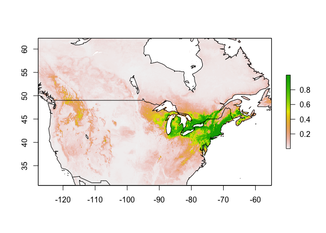<!-- -->

``` r
writeRaster(pred.seq, "../../pred/out/Mn/Mn_SDM_ME_rw_baseline.tif", overwrite = TRUE)
```

### Threshold

#### Minimum training presence

``` r
mtp <- sdm_threshold(pred.seq, occs, type = "mtp")
plot(mtp)
map('worldHires', fill=FALSE, add=TRUE, xlim = c(-127.75, -55), ylim = c(30.83333, 62.25), lforce = "e")

writeRaster(mtp, "../../pred/out/Mn/Mn_SDM_ME_rw_mtp_baseline.tif", overwrite = TRUE)
```

#### 10th percentile training presence

``` r
p10 <- sdm_threshold(pred.seq, occs, type = "p10")
plot(p10)
map('worldHires', fill=FALSE, add=TRUE, xlim = c(-127.75, -55), ylim = c(30.83333, 62.25), lforce = "e")
```

<!-- -->

``` r
p10.b <- sdm_threshold(pred.seq, occs, type = "p10", binary = TRUE)
plot(p10.b)
map('worldHires', fill=FALSE, add=TRUE, xlim = c(-127.75, -55), ylim = c(30.83333, 62.25), lforce = "e")
```

<!-- -->

``` r
writeRaster(p10, "../../pred/out/Mn/Mn_SDM_ME_rw_p10_baseline.tif", overwrite = TRUE)
```

### Future Climate Models

``` r
for (i in 1:length(e.mx@models)) {
  if(names(e.mx@models[i]) == as.character(opt.aicc[,3])) {
    model <- e.mx@models[[i]]
    print(paste("Opt. model : ", names(e.mx@models[i]), sep = ""))
  }
}
```

    ## [1] "Opt. model : fc.LQH_rm.4"

``` r
(thres <- min(na.omit(as.vector(p10))))
```

    ## [1] 0.06724412

#### 2041 - 2060

##### 2050 | ssp126

``` r
setwd("../../pred/pred_stack_rw/")
mdls <- list.files(pattern = "50.*ssp126.tif")

par(mfrow = c(2,4))
pred <- sapply(mdls, futurePred, envnames = envnames, model = model, host = "Lc", drop = "pH")
```

    ## This is MaxEnt version 3.4.1

    ## This is MaxEnt version 3.4.1

    ## This is MaxEnt version 3.4.1

    ## This is MaxEnt version 3.4.1

    ## This is MaxEnt version 3.4.1

    ## This is MaxEnt version 3.4.1

    ## This is MaxEnt version 3.4.1

    ## This is MaxEnt version 3.4.1

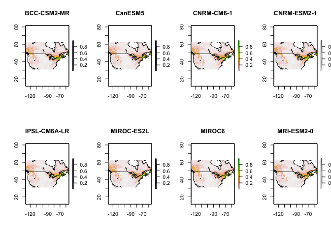<!-- -->

``` r
par(mfrow = c(1,1))
```

##### 2050 | ssp126 | Mean and Threshold

``` r
futureSave(pred, "Mn", "2050", "ssp126", thres = thres)
```

<!-- --><!-- -->

##### 2050 | ssp245

``` r
setwd("../../pred/pred_stack_rw/")
mdls <- list.files(pattern = "50.*ssp245.tif")

par(mfrow = c(2,4))
pred <- sapply(mdls, futurePred, envnames = envnames, model = model, host = "Lc", drop = "pH")
```

    ## This is MaxEnt version 3.4.1

    ## This is MaxEnt version 3.4.1

    ## This is MaxEnt version 3.4.1

    ## This is MaxEnt version 3.4.1

    ## This is MaxEnt version 3.4.1

    ## This is MaxEnt version 3.4.1

    ## This is MaxEnt version 3.4.1

    ## This is MaxEnt version 3.4.1

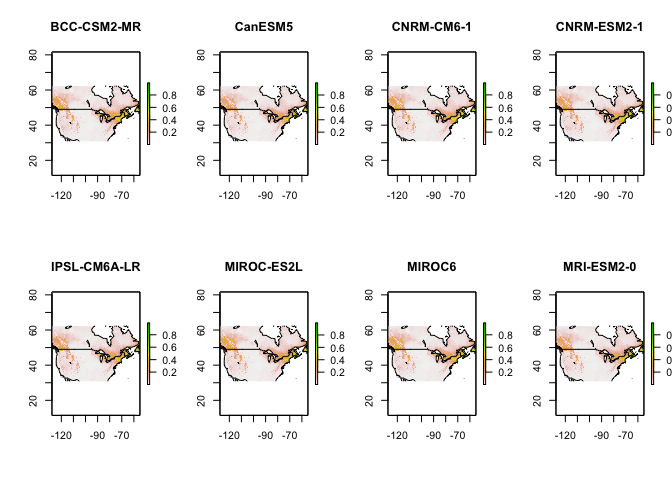<!-- -->

``` r
par(mfrow = c(1,1))
```

##### 2050 | ssp245 | Mean and Threshold

``` r
futureSave(pred, "Mn", "2050", "ssp245", thres = thres)
```

<!-- --><!-- -->

##### 2050 | ssp370

``` r
setwd("../../pred/pred_stack_rw/")
mdls <- list.files(pattern = "50.*ssp370.tif")

par(mfrow = c(2,4))
pred <- sapply(mdls, futurePred, envnames = envnames, model = model, host = "Lc", drop = "pH")
```

    ## This is MaxEnt version 3.4.1

    ## This is MaxEnt version 3.4.1

    ## This is MaxEnt version 3.4.1

    ## This is MaxEnt version 3.4.1

    ## This is MaxEnt version 3.4.1

    ## This is MaxEnt version 3.4.1

    ## This is MaxEnt version 3.4.1

    ## This is MaxEnt version 3.4.1

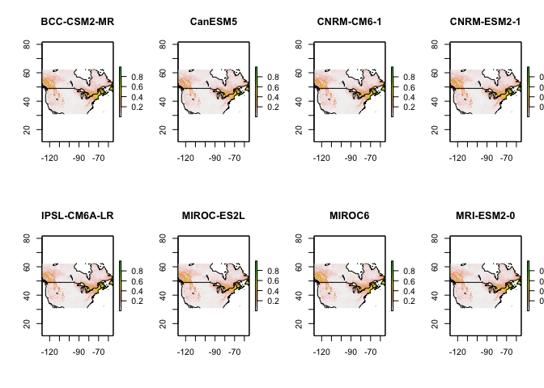<!-- -->

``` r
par(mfrow = c(1,1))
```

##### 2050 | ssp370 | Mean and Threshold

``` r
futureSave(pred, "Mn", "2050", "ssp370", thres = thres)
```

<!-- --><!-- -->

##### 2050 | ssp585

``` r
setwd("../../pred/pred_stack_rw/")
mdls <- list.files(pattern = "50.*ssp585.tif")

par(mfrow = c(2,4))
pred <- sapply(mdls, futurePred, envnames = envnames, model = model, host = "Lc", drop = "pH")
```

    ## This is MaxEnt version 3.4.1

    ## This is MaxEnt version 3.4.1

    ## This is MaxEnt version 3.4.1

    ## This is MaxEnt version 3.4.1

    ## This is MaxEnt version 3.4.1

    ## This is MaxEnt version 3.4.1

    ## This is MaxEnt version 3.4.1

    ## This is MaxEnt version 3.4.1

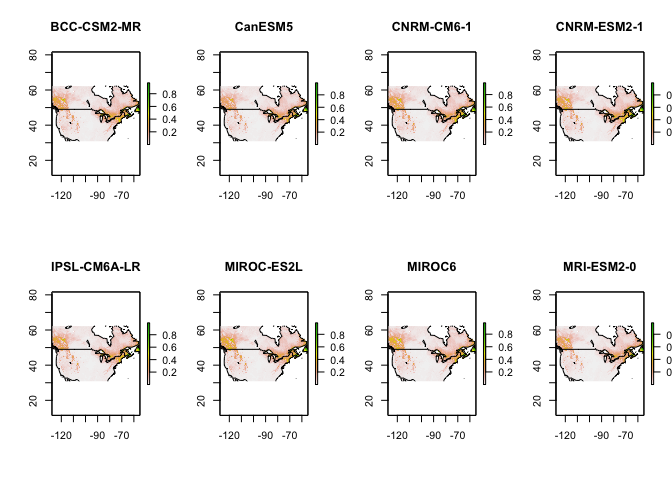<!-- -->

``` r
par(mfrow = c(1,1))
```

##### 2050 | ssp585 | Mean and Threshold

``` r
futureSave(pred, "Mn", "2050", "ssp585", thres = thres)
```

<!-- --><!-- -->

#### 2081 - 2100

##### 2090 | ssp126

``` r
setwd("../../pred/pred_stack_rw/")
mdls <- list.files(pattern = "90.*ssp126.tif")

par(mfrow = c(2,4))
pred <- sapply(mdls, futurePred, envnames = envnames, model = model, host = "Lc", drop = "pH")
```

    ## This is MaxEnt version 3.4.1

    ## This is MaxEnt version 3.4.1

    ## This is MaxEnt version 3.4.1

    ## This is MaxEnt version 3.4.1

    ## This is MaxEnt version 3.4.1

    ## This is MaxEnt version 3.4.1

    ## This is MaxEnt version 3.4.1

    ## This is MaxEnt version 3.4.1

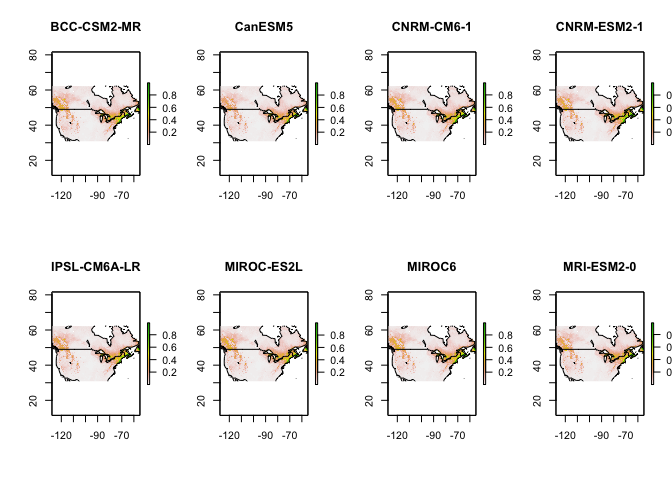<!-- -->

``` r
par(mfrow = c(1,1))
```

##### 2090 | ssp126 | Mean and Threshold

``` r
futureSave(pred, "Mn", "2090", "ssp126", thres = thres)
```

<!-- --><!-- -->

##### 2090 | ssp245

``` r
setwd("../../pred/pred_stack_rw/")
mdls <- list.files(pattern = "90.*ssp245.tif")

par(mfrow = c(2,4))
pred <- sapply(mdls, futurePred, envnames = envnames, model = model, host = "Lc", drop = "pH")
```

    ## This is MaxEnt version 3.4.1

    ## This is MaxEnt version 3.4.1

    ## This is MaxEnt version 3.4.1

    ## This is MaxEnt version 3.4.1

    ## This is MaxEnt version 3.4.1

    ## This is MaxEnt version 3.4.1

    ## This is MaxEnt version 3.4.1

    ## This is MaxEnt version 3.4.1

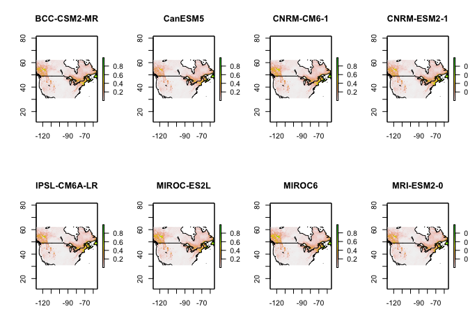<!-- -->

``` r
par(mfrow = c(1,1))
```

##### 2090 | ssp245 | Mean and Threshold

``` r
futureSave(pred, "Mn", "2090", "ssp245", thres = thres)
```

<!-- --><!-- -->

##### 2090 | ssp370

``` r
setwd("../../pred/pred_stack_rw/")
mdls <- list.files(pattern = "90.*ssp370.tif")

par(mfrow = c(2,4))
pred <- sapply(mdls, futurePred, envnames = envnames, model = model, host = "Lc", drop = "pH")
```

    ## This is MaxEnt version 3.4.1

    ## This is MaxEnt version 3.4.1

    ## This is MaxEnt version 3.4.1

    ## This is MaxEnt version 3.4.1

    ## This is MaxEnt version 3.4.1

    ## This is MaxEnt version 3.4.1

    ## This is MaxEnt version 3.4.1

    ## This is MaxEnt version 3.4.1

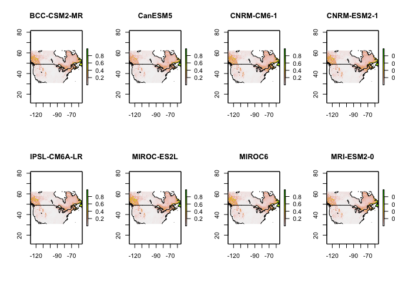<!-- -->

``` r
par(mfrow = c(1,1))
```

##### 2090 | ssp370 | Mean and Threshold

``` r
futureSave(pred, "Mn", "2090", "ssp370", thres = thres)
```

<!-- --><!-- -->

##### 2090 | ssp585

``` r
setwd("../../pred/pred_stack_rw/")
mdls <- list.files(pattern = "90.*ssp585.tif")

par(mfrow = c(2,4))
pred <- sapply(mdls, futurePred, envnames = envnames, model = model, host = "Lc", drop = "pH")
```

    ## This is MaxEnt version 3.4.1

    ## This is MaxEnt version 3.4.1

    ## This is MaxEnt version 3.4.1

    ## This is MaxEnt version 3.4.1

    ## This is MaxEnt version 3.4.1

    ## This is MaxEnt version 3.4.1

    ## This is MaxEnt version 3.4.1

    ## This is MaxEnt version 3.4.1

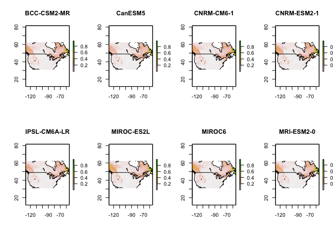<!-- -->

``` r
par(mfrow = c(1,1))
```

##### 2090 | ssp585 | Mean and Threshold

``` r
futureSave(pred, "Mn", "2090", "ssp585", thres = thres)
```

<!-- --><!-- -->
