Macropis nuda | Range-wide distribution under future climate projections
================
Mark Buckner
2021-11-16

  - [Packages](#packages)
  - [Functions](#functions)
  - [Load Occurance Data and
    Predictors](#load-occurance-data-and-predictors)
      - [Spatial Thinning](#spatial-thinning)
  - [MESS](#mess)
      - [Random Background Points](#random-background-points)
      - [Partition for Model
        Evaluation](#partition-for-model-evaluation)
      - [Env. Similarity of Partions](#env-similarity-of-partions)
      - [Tune model](#tune-model)
      - [Model turning results and
        Selection](#model-turning-results-and-selection)
      - [Prediction](#prediction)
      - [Threshold](#threshold)
      - [Future Climate Models](#future-climate-models)

#### Packages

``` r
library(spatial)
library(rgdal)
library(spThin)
library(ENMeval, attach.required = T)
library(rmaxent)
library(raster)
library(tidyverse)
library(lubridate)
library(mapdata)
library(rJava)
library(knitr)
```

#### Functions

``` r
#Function code: https://babichmorrowc.github.io/post/2019-04-12-sdm-threshold/
sdm_threshold <- function(sdm, occs, type = "mtp", binary = FALSE){
  occPredVals <- raster::extract(sdm, occs)
  if(type == "mtp"){
    thresh <- min(na.omit(occPredVals))
  } else if(type == "p10"){
    if(length(occPredVals) < 10){
      p10 <- floor(length(occPredVals) * 0.9)
    } else {
      p10 <- ceiling(length(occPredVals) * 0.9)
    }
    thresh <- rev(sort(occPredVals))[p10]
  }
  sdm_thresh <- sdm
  sdm_thresh[sdm_thresh < thresh] <- NA
  if(binary){
    sdm_thresh[sdm_thresh >= thresh] <- 1
  }
  return(sdm_thresh)
}

#futurePred() : Predicts distribution over a certain model raster stack and plots output. Written to be used with list.files() and sapply().
#file = file name of raster stack; model = training model; envnames = names of predictor layers, vector; host = (optional) two letter abbr. of host, character; drop = names of layers to drop from final raster stack, vector.
futurePred <- function(file, model, envnames, host, drop) {
  path <- paste("./", file, sep = "")
  m <- str_extract(file, "_.*_")
  m <- str_sub(m, 2, -2)
  
  if(missing(host)) {
    r <- stack(path)
  } else {
    yr <- str_extract(file, "\\d+")
    ssp <- str_extract(file, "ssp.*")
    hpath <- paste("../out/", host, "/", host, "_SDM_ME_rw_mean20", yr, ssp, sep = "")
    r <- stack(path, hpath)
  }
  
  names(r) <- envnames
  
  if(!missing(drop)) {
    r <- dropLayer(r, drop)
  }
  
  pred <- predict(model, r)
  
  plot(pred, main = m)
  map('worldHires', fill=FALSE, add=TRUE, xlim = c(-127.75, -55), ylim = c(30.83333, 62.25), lforce = "e")
  
  return(pred)
}

#futureSave() : Calculates the mean distribution for all models at a particular time and ssp, saves results of mean and p10 threshold, and plots.
#pred = mean prediction; spp = two letter species name abbr., character; year = YYYY; ssp = CMIP6 scenario
futureSave <- function(pred, spp, year, ssp, thres) {
  pred.s <- stack(pred)
  pred.m <- calc(pred.s, mean)

  plot(pred.m, main = paste(year, ssp, "mean", sep = "_"))
  map('worldHires', fill=FALSE, add=TRUE, xlim = c(-127.75, -55), ylim = c(30.83333, 62.25), lforce = "e")
  
  name <- paste("../../pred/out/",spp, "/", spp, "_SDM_ME_rw_", "mean", year, ssp, ".tif", sep = "")
  
  writeRaster(pred.m, filename = name, options="INTERLEAVE=BAND", overwrite=TRUE)

  #10th percentile training presence
  if(!missing(thres)) {
    p10 <- pred.m
    p10[p10 < thres] <- NA 
    plot(p10, main = paste(year, ssp, "p10", sep = "_"))
    map('worldHires', fill=FALSE, add=TRUE, xlim = c(-127.75, -55), ylim = c(30.83333, 62.25), lforce = "e")
  
    name <- paste("../../pred/out/",spp, "/", spp, "_SDM_ME_rw_", "p10_", year, ssp, ".tif", sep = "")
  
    writeRaster(p10, filename = name, options="INTERLEAVE=BAND", overwrite=TRUE)
  }
}
```

## Load Occurance Data and Predictors

Occurrence and predictor data processed in `occ_pred_data_NA.Rmd`.
Occurrence data needs to have the unnecessary fields removed and
projected to the project projection (`+proj=longlat +ellps=WGS84
+datum=WGS84 +no_defs`) to create a `matrix array`.

``` r
#Occurrences
occ <- read_csv("../../occ/Mn_RW70.csv")

occs <- select(occ, lat, lon) %>% 
  mutate("spp" = "Mc")

occp <- rgdal::project(as.matrix(occs[,c("lon","lat")]), proj = "+proj=longlat +ellps=WGS84 +datum=WGS84 +no_defs")
```

The predictors are described below. Only bold predictors are included
after accounting for collinearity. All other variables were highly
correlated (r \> 0.7) with one of the other variables and were excluded.
Variables were chosen based on the network of correlation and the
perceived importance.

Bioclimatic variables (USGS descriptions available
[here](https://pubs.usgs.gov/ds/691/ds691.pdf))

  - Bio 1 : Mean Annual Temperature
  - Bio 2 : Annual Mean Diurnal Range
  - Bio 3 : Isothermality
  - **Bio 4 : Temperature Seasonality**
  - Bio 5 : Max Temperature of Warmest Month
  - Bio 7 : Annual Temperature Range
  - **Bio 8 : Mean Temperature of Wettest Quarter**
  - Bio 9 : Mean Temperature of Driest Quarter
  - **Bio 10 : Mean Temperature of Warmest Quarter**
  - Bio 11 : Mean Temperature of Coldest Quarter
  - **Bio 12 : Annual Precipitation**
  - Bio 13 : Precipitation of Wettest Month
  - Bio 14 : Precipitation of Driest Month
  - **Bio 15 : Precipitation Seasonality**
  - Bio 16 : Precipitation of Wettest Quarter
  - Bio 17 : Precipitation of Driest Quarter
  - **Bio 18 : Precipitation of Warmest Quarter**
  - Bio 19 : Precipitation of Coldest Quarter

Topography

  - **DEM : SRTM at 5 arc-minute resolution downloaded from WorldClim**

Other

  - Solar Radiation : Mean solar radiation during meteorological summer
    (June, July, August)
  - **Soil Sand Content : Soil sand content (%) at 0cm of depth**
  - **Soil Clay Content : Soil clay content (%) at 0cm of depth**

Host Plant Distribution

  - Lc\_sdm : *Lysimachia ciliata* distribution model (see:
    Lc\_SDM\_rw.Rmd)

General Circulation Models (GCMs)

  - bcc : BCC-CSM2-MR | [Beijing Climate Center Climate System
    Model](https://gmd.copernicus.org/articles/12/1573/2019/)
  - cnrm\_c : CNRM-CM6-1 |
    [CNRM/CERFACS](http://www.umr-cnrm.fr/cmip6/spip.php?article11)
  - cnrm\_e : CNRM-ESM2-1 |
    [CNRM/CERFACS](https://agupubs.onlinelibrary.wiley.com/doi/full/10.1029/2019MS001791)
  - can : CanESM5 | [Canadian Earth System
    Model](https://gmd.copernicus.org/articles/12/4823/2019/gmd-12-4823-2019.html)
  - ipsl : IPSL-CM6A-LR | [Institut Pierre-Simon
    Laplace](https://agupubs.onlinelibrary.wiley.com/doi/full/10.1029/2019MS002010)
  - miroc : MIROC-ES2L |
    <https://gmd.copernicus.org/articles/13/2197/2020/>
  - miroc6 : MIROC6 |
    <https://gmd.copernicus.org/articles/12/2727/2019/>
  - mri : MRI-ESM2-0 | [Meteorological Research
    Institute](https://www.jstage.jst.go.jp/article/jmsj/advpub/0/advpub_2019-051/_article/-char/en)

<!-- end list -->

``` r
env <- stack("../../pred/pred_stack_rw/baseline.tif")

envnames <- c("bio4", "bio8", "bio10", "bio12", "bio15", "bio18", "dem", "sand", "clay", "pH")

names(env) <- envnames

env <- dropLayer(env, "pH")

plot(env[[1:nlayers(env)]])
```

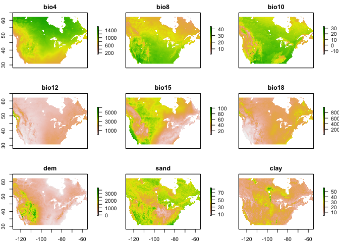<!-- -->

``` r
plot(env[[1]], main="Mean ann. temp. | M. nuda Occ.")
points(occp, pch = 16, cex = 0.5)
```

<!-- -->

### Spatial Thinning

``` r
thinned <-
  thin( loc.data = occs, 
        lat.col = "lat", long.col = "lon", 
        spec.col = "spp", 
        thin.par = 10, reps = 100, 
        locs.thinned.list.return = TRUE, 
        write.files = TRUE, 
        max.files = 5, 
        out.dir = "../../occ/Mn_thinned_full/", out.base = "Mn_thinned", 
        write.log.file = TRUE,
        log.file = "Mn_thinned_full_log_file.txt" )

plotThin(thinned)
```

``` r
#Load thinned dataset in place of original
occs <- read_csv("../../occ/Mn_thinned_full/Mn_thinned_thin1.csv") %>% 
  select(lat,lon)
  
occs <- rgdal::project(as.matrix(occs[,c("lon","lat")]), proj = "+proj=longlat +ellps=WGS84 +datum=WGS84 +no_defs")
```

After thinning we are left with 60 occurrences.

## MESS

``` r
occs.z <- raster::extract(env, occs)
occs.sim <- similarity(env, occs.z)
occs.mess <- occs.sim$similarity_min
occs.sp <- sp::SpatialPoints(occs)

myScale <- seq(cellStats(occs.mess, min), cellStats(occs.mess, max), length.out = 100)
rasterVis::levelplot(occs.mess, main = "Environmental similarity", at = myScale, margin = FALSE) + 
  latticeExtra::layer(sp.points(occs.sp, col="black"))
```

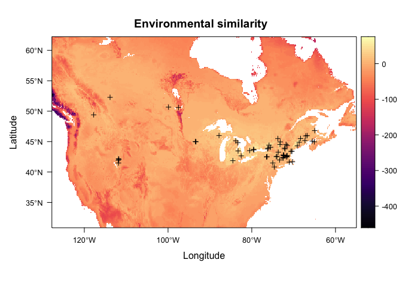<!-- --> 

### Random Background Points

``` r
(points <- sum(!is.na(getValues(env[[1]])))*0.4)
```

    ## [1] 94700.8

``` r
bg <- dismo::randomPoints(env, n = round(points)) %>% as.data.frame()
colnames(bg) <- colnames(occs)

plot(env[[1]], main="Mean ann. temp. | Background Points")
points(bg, pch = 20, cex = 0.05)
```

<!-- -->

### Partition for Model Evaluation

``` r
block <- get.block(occs, bg)
table(block$occs.grp)
```

    ## 
    ##  1  2  3  4 
    ## 15 15 15 15

``` r
evalplot.grps(pts = occs, pts.grp = block$occs.grp, envs = env) + 
  ggplot2::ggtitle("Block partitions: occurrences")
```

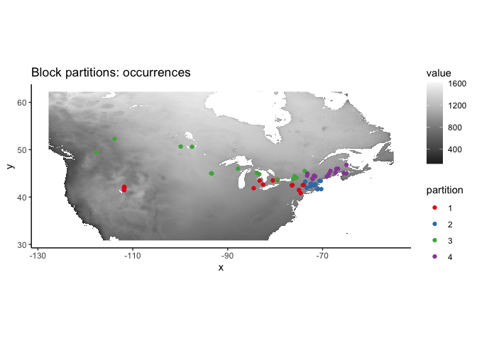<!-- -->

### Env. Similarity of Partions

``` r
occs.z <- cbind(occs, raster::extract(env, occs))
bg.z <- cbind(bg, raster::extract(env, bg))
evalplot.envSim.hist(sim.type = "mess", ref.data = "occs", occs.z = occs.z, bg.z = bg.z, 
                     occs.grp = block$occs.grp, bg.grp = block$bg.grp)
```

<!-- -->

``` r
evalplot.envSim.hist(sim.type = "most_diff", ref.data = "occs", occs.z = occs.z, bg.z = bg.z, 
                     occs.grp = block$occs.grp, bg.grp = block$bg.grp)
```

<!-- -->

``` r
evalplot.envSim.map(sim.type = "mess", ref.data = "occs", envs = env, occs.z = occs.z, 
                    bg.z = bg.z, occs.grp = block$occs.grp, bg.grp = block$bg.grp, bb.buf = 7)
```

<!-- -->

### Tune model

``` r
e.mx <- ENMevaluate(occs = occs, envs = env, bg = bg, 
                    algorithm = 'maxent.jar', partitions = 'block', parallel = TRUE, 
                    tune.args = list(fc = c("L","LQ","LQH","H"), rm = 1:10))
```

    ## *** Running initial checks... ***

    ## * Removed 2 occurrence points with NA predictor variable values.

    ## * Clamping predictor variable rasters...

    ## * Model evaluations with spatial block (4-fold) cross validation and lat_lon orientation...

    ## 
    ## *** Running ENMeval v2.0.0 with maxent.jar v3.4.3 from dismo package v1.3.5 ***

    ##   |                                                                              |                                                                      |   0%

    ## 
    ## Of 4 total cores using 4...

    ## Running in parallel using doSNOW...

    ##   |                                                                              |==                                                                    |   2%  |                                                                              |====                                                                  |   5%  |                                                                              |=====                                                                 |   8%  |                                                                              |=======                                                               |  10%  |                                                                              |=========                                                             |  12%  |                                                                              |==========                                                            |  15%  |                                                                              |============                                                          |  18%  |                                                                              |==============                                                        |  20%  |                                                                              |================                                                      |  22%  |                                                                              |==================                                                    |  25%  |                                                                              |===================                                                   |  28%  |                                                                              |=====================                                                 |  30%  |                                                                              |=======================                                               |  32%  |                                                                              |========================                                              |  35%  |                                                                              |==========================                                            |  38%  |                                                                              |============================                                          |  40%  |                                                                              |==============================                                        |  42%  |                                                                              |================================                                      |  45%  |                                                                              |=================================                                     |  48%  |                                                                              |===================================                                   |  50%  |                                                                              |=====================================                                 |  52%  |                                                                              |======================================                                |  55%  |                                                                              |========================================                              |  58%  |                                                                              |==========================================                            |  60%  |                                                                              |============================================                          |  62%  |                                                                              |==============================================                        |  65%  |                                                                              |===============================================                       |  68%  |                                                                              |=================================================                     |  70%  |                                                                              |===================================================                   |  72%  |                                                                              |====================================================                  |  75%  |                                                                              |======================================================                |  78%  |                                                                              |========================================================              |  80%  |                                                                              |==========================================================            |  82%  |                                                                              |============================================================          |  85%  |                                                                              |=============================================================         |  88%  |                                                                              |===============================================================       |  90%  |                                                                              |=================================================================     |  92%  |                                                                              |==================================================================    |  95%  |                                                                              |====================================================================  |  98%  |                                                                              |======================================================================| 100%

    ## ENMevaluate completed in 48 minutes 42.8 seconds.

``` r
e.mx
```

    ## An object of class:  ENMevaluation 
    ##  occurrence/background points:  58 / 94701 
    ##  partition method:  block 
    ##  partition settings:  orientation = lat_lon 
    ##  clamp:  TRUE 
    ##  clamp directions:  left: bio4, bio8, bio10, bio12, bio15, bio18, dem, sand, clay
    ##                     right: bio4, bio8, bio10, bio12, bio15, bio18, dem, sand, clay 
    ##  algorithm:  maxent.jar 
    ##  tune settings:  fc: L,LQ,LQH,H
    ##                  rm: 1,2,3,4,5,6,7,8,9,10 
    ##  overlap:  TRUE 
    ## Refer to ?ENMevaluation for information on slots.

### Model turning results and Selection

``` r
evalplot.stats(e = e.mx, stats = c("AICc"), color = "fc", x.var = "rm", 
               error.bars = FALSE)
```

    ## Warning: Removed 16 rows containing missing values (geom_point).

    ## Warning: Removed 8 row(s) containing missing values (geom_path).

<!-- -->

``` r
evalplot.stats(e = e.mx, stats = c("auc.val"), color = "fc", x.var = "rm", 
               error.bars = FALSE)
```

<!-- -->

``` r
res <- eval.results(e.mx)
kable(res)
```

| fc  | rm | tune.args     | auc.train | cbi.train | auc.diff.avg | auc.diff.sd | auc.val.avg | auc.val.sd | cbi.val.avg | cbi.val.sd | or.10p.avg | or.10p.sd | or.mtp.avg | or.mtp.sd |     AICc | delta.AICc |     w.AIC | ncoef |
| :-- | :- | :------------ | --------: | --------: | -----------: | ----------: | ----------: | ---------: | ----------: | ---------: | ---------: | --------: | ---------: | --------: | -------: | ---------: | --------: | ----: |
| L   | 1  | fc.L\_rm.1    | 0.8695619 |     0.938 |    0.1570862 |   0.0614033 |   0.8427024 |  0.1558742 |     0.85300 |  0.1595640 |  0.1500000 | 0.1753304 |  0.0833333 | 0.1666667 | 1307.517 |   57.24223 | 0.0000000 |     9 |
| LQ  | 1  | fc.LQ\_rm.1   | 0.9237761 |     0.884 |    0.1002570 |   0.0485550 |   0.8710511 |  0.1283597 |     0.42150 |  0.2637252 |  0.1500000 | 0.1753304 |  0.0833333 | 0.1666667 | 1250.275 |    0.00000 | 0.9991730 |    12 |
| LQH | 1  | fc.LQH\_rm.1  | 0.9526400 |     0.918 |    0.0986237 |   0.0826265 |   0.8647703 |  0.1255702 |     0.57100 |  0.2448659 |  0.1666667 | 0.2000000 |  0.1500000 | 0.1753304 |       NA |         NA |        NA |    78 |
| H   | 1  | fc.H\_rm.1    | 0.9538366 |     0.936 |    0.0957809 |   0.0805183 |   0.8764404 |  0.1157931 |     0.60925 |  0.3466568 |  0.1833333 | 0.2134375 |  0.1500000 | 0.1753304 |       NA |         NA |        NA |    85 |
| L   | 2  | fc.L\_rm.2    | 0.8690357 |     0.916 |    0.1539846 |   0.0677462 |   0.8455699 |  0.1532860 |     0.86350 |  0.1424418 |  0.1500000 | 0.1753304 |  0.0833333 | 0.1666667 | 1308.528 |   58.25300 | 0.0000000 |     9 |
| LQ  | 2  | fc.LQ\_rm.2   | 0.9063515 |     0.941 |    0.1276815 |   0.0550563 |   0.8595942 |  0.1409916 |     0.70400 |  0.1068550 |  0.1500000 | 0.1753304 |  0.0833333 | 0.1666667 | 1264.469 |   14.19462 | 0.0008266 |     8 |
| LQH | 2  | fc.LQH\_rm.2  | 0.9357890 |     0.918 |    0.1001965 |   0.0590736 |   0.8694009 |  0.1295952 |     0.41925 |  0.1903232 |  0.1666667 | 0.2000000 |  0.1000000 | 0.1586984 | 1623.383 |  373.10813 | 0.0000000 |    45 |
| H   | 2  | fc.H\_rm.2    | 0.9415388 |     0.923 |    0.0908352 |   0.0427691 |   0.8849406 |  0.1144669 |     0.43100 |  0.2075588 |  0.1666667 | 0.1924501 |  0.0833333 | 0.1666667 |       NA |         NA |        NA |   102 |
| L   | 3  | fc.L\_rm.3    | 0.8683535 |     0.897 |    0.1534830 |   0.0707092 |   0.8460055 |  0.1529852 |     0.87175 |  0.1192655 |  0.1666667 | 0.2000000 |  0.0833333 | 0.1666667 | 1304.390 |   54.11515 | 0.0000000 |     7 |
| LQ  | 3  | fc.LQ\_rm.3   | 0.8942783 |     0.921 |    0.1418851 |   0.0652930 |   0.8504077 |  0.1459062 |     0.83375 |  0.1035354 |  0.1500000 | 0.1753304 |  0.0833333 | 0.1666667 | 1280.136 |   29.86149 | 0.0000003 |     8 |
| LQH | 3  | fc.LQH\_rm.3  | 0.9239682 |     0.939 |    0.1082996 |   0.0593023 |   0.8677147 |  0.1325512 |     0.80625 |  0.0803259 |  0.1500000 | 0.1753304 |  0.0833333 | 0.1666667 | 1425.599 |  175.32452 | 0.0000000 |    37 |
| H   | 3  | fc.H\_rm.3    | 0.9338625 |     0.951 |    0.0956852 |   0.0491031 |   0.8798090 |  0.1170102 |     0.53750 |  0.5414650 |  0.1500000 | 0.1753304 |  0.0833333 | 0.1666667 |       NA |         NA |        NA |    78 |
| L   | 4  | fc.L\_rm.4    | 0.8681398 |     0.904 |    0.1536136 |   0.0737484 |   0.8458648 |  0.1530084 |     0.86600 |  0.0996159 |  0.1666667 | 0.2000000 |  0.0833333 | 0.1666667 | 1305.870 |   55.59552 | 0.0000000 |     7 |
| LQ  | 4  | fc.LQ\_rm.4   | 0.8814909 |     0.895 |    0.1475411 |   0.0712800 |   0.8481755 |  0.1484964 |     0.86225 |  0.0933501 |  0.1500000 | 0.1753304 |  0.0833333 | 0.1666667 | 1294.601 |   44.32628 | 0.0000000 |     8 |
| LQH | 4  | fc.LQH\_rm.4  | 0.9128264 |     0.896 |    0.1193532 |   0.0647024 |   0.8617307 |  0.1377674 |     0.75425 |  0.1724304 |  0.1500000 | 0.1753304 |  0.0833333 | 0.1666667 | 1362.807 |  112.53193 | 0.0000000 |    30 |
| H   | 4  | fc.H\_rm.4    | 0.9272191 |     0.905 |    0.1012236 |   0.0601949 |   0.8752448 |  0.1202883 |     0.86525 |  0.1074007 |  0.1833333 | 0.2268953 |  0.0833333 | 0.1666667 |       NA |         NA |        NA |   106 |
| L   | 5  | fc.L\_rm.5    | 0.8677606 |     0.887 |    0.1535025 |   0.0767313 |   0.8456733 |  0.1531798 |     0.83800 |  0.1345090 |  0.1666667 | 0.2000000 |  0.0833333 | 0.1666667 | 1307.662 |   57.38764 | 0.0000000 |     7 |
| LQ  | 5  | fc.LQ\_rm.5   | 0.8713809 |     0.873 |    0.1490802 |   0.0744436 |   0.8479048 |  0.1485264 |     0.84225 |  0.1178682 |  0.1666667 | 0.2000000 |  0.0833333 | 0.1666667 | 1306.786 |   56.51135 | 0.0000000 |     8 |
| LQH | 5  | fc.LQH\_rm.5  | 0.9036701 |     0.907 |    0.1318254 |   0.0699852 |   0.8544336 |  0.1441080 |     0.88950 |  0.1105788 |  0.1500000 | 0.1753304 |  0.0833333 | 0.1666667 | 1335.922 |   85.64771 | 0.0000000 |    24 |
| H   | 5  | fc.H\_rm.5    | 0.9195126 |     0.863 |    0.1080400 |   0.0736047 |   0.8699639 |  0.1242127 |     0.82125 |  0.1344058 |  0.1666667 | 0.2211083 |  0.0833333 | 0.1666667 |       NA |         NA |        NA |   135 |
| L   | 6  | fc.L\_rm.6    | 0.8672137 |     0.893 |    0.1532067 |   0.0798115 |   0.8453700 |  0.1534370 |     0.82150 |  0.1583467 |  0.1666667 | 0.2000000 |  0.1000000 | 0.2000000 | 1309.740 |   59.46516 | 0.0000000 |     7 |
| LQ  | 6  | fc.LQ\_rm.6   | 0.8685556 |     0.888 |    0.1486957 |   0.0776151 |   0.8478802 |  0.1486602 |     0.82875 |  0.1671195 |  0.1666667 | 0.2000000 |  0.0833333 | 0.1666667 | 1309.070 |   58.79545 | 0.0000000 |     7 |
| LQH | 6  | fc.LQH\_rm.6  | 0.8945409 |     0.895 |    0.1427816 |   0.0763300 |   0.8482821 |  0.1479234 |     0.84650 |  0.1365882 |  0.1666667 | 0.2000000 |  0.0833333 | 0.1666667 | 1287.922 |   37.64713 | 0.0000000 |     9 |
| H   | 6  | fc.H\_rm.6    | 0.9084756 |     0.852 |    0.1205509 |   0.0890340 |   0.8610506 |  0.1313495 |     0.74575 |  0.2129043 |  0.1333333 | 0.2244334 |  0.0833333 | 0.1666667 |       NA |         NA |        NA |   126 |
| L   | 7  | fc.L\_rm.7    | 0.8665378 |     0.893 |    0.1528744 |   0.0829222 |   0.8453045 |  0.1539812 |     0.80225 |  0.2218924 |  0.1833333 | 0.2268953 |  0.1000000 | 0.2000000 | 1312.075 |   61.80038 | 0.0000000 |     7 |
| LQ  | 7  | fc.LQ\_rm.7   | 0.8677602 |     0.872 |    0.1484974 |   0.0807809 |   0.8475979 |  0.1488119 |     0.81925 |  0.2183688 |  0.1666667 | 0.2000000 |  0.0833333 | 0.1666667 | 1309.413 |   59.13835 | 0.0000000 |     6 |
| LQH | 7  | fc.LQH\_rm.7  | 0.8829488 |     0.866 |    0.1484979 |   0.0807733 |   0.8475965 |  0.1488130 |     0.81950 |  0.2184956 |  0.1666667 | 0.2000000 |  0.0833333 | 0.1666667 | 1299.831 |   49.55664 | 0.0000000 |     8 |
| H   | 7  | fc.H\_rm.7    | 0.8968310 |     0.814 |    0.1295959 |   0.1112307 |   0.8520869 |  0.1424901 |     0.77125 |  0.1724440 |  0.1166667 | 0.2333333 |  0.1000000 | 0.2000000 |       NA |         NA |        NA |   140 |
| L   | 8  | fc.L\_rm.8    | 0.8657147 |     0.870 |    0.1525817 |   0.0856224 |   0.8453040 |  0.1543070 |     0.81600 |  0.1866548 |  0.1833333 | 0.2268953 |  0.1000000 | 0.2000000 | 1314.645 |   64.37079 | 0.0000000 |     7 |
| LQ  | 8  | fc.LQ\_rm.8   | 0.8671255 |     0.868 |    0.1484030 |   0.0840806 |   0.8472994 |  0.1491165 |     0.77550 |  0.2793057 |  0.1666667 | 0.2000000 |  0.0833333 | 0.1666667 | 1312.278 |   62.00295 | 0.0000000 |     6 |
| LQH | 8  | fc.LQH\_rm.8  | 0.8712454 |     0.861 |    0.1484158 |   0.0840566 |   0.8472993 |  0.1491174 |     0.77550 |  0.2793057 |  0.1666667 | 0.2000000 |  0.0833333 | 0.1666667 | 1316.431 |   66.15648 | 0.0000000 |     9 |
| H   | 8  | fc.H\_rm.8    | 0.8796264 |     0.758 |    0.1321971 |   0.1116676 |   0.8518028 |  0.1407639 |     0.74575 |  0.1968474 |  0.1166667 | 0.2333333 |  0.1000000 | 0.2000000 | 1489.267 |  238.99195 | 0.0000000 |    34 |
| L   | 9  | fc.L\_rm.9    | 0.8650396 |     0.845 |    0.1523912 |   0.0882376 |   0.8453409 |  0.1546364 |     0.81300 |  0.2015159 |  0.1833333 | 0.2268953 |  0.1000000 | 0.2000000 | 1314.425 |   64.14996 | 0.0000000 |     6 |
| LQ  | 9  | fc.LQ\_rm.9   | 0.8664026 |     0.867 |    0.1482891 |   0.0876035 |   0.8469148 |  0.1496867 |     0.79650 |  0.2484693 |  0.1833333 | 0.2268953 |  0.0833333 | 0.1666667 | 1315.384 |   65.10891 | 0.0000000 |     6 |
| LQH | 9  | fc.LQH\_rm.9  | 0.8664026 |     0.869 |    0.1482875 |   0.0876020 |   0.8469062 |  0.1496800 |     0.79450 |  0.2484814 |  0.1833333 | 0.2268953 |  0.0833333 | 0.1666667 | 1315.382 |   65.10760 | 0.0000000 |     6 |
| H   | 9  | fc.H\_rm.9    | 0.8540334 |     0.558 |    0.1355913 |   0.1141282 |   0.8477654 |  0.1451076 |     0.74600 |  0.1883844 |  0.1166667 | 0.2333333 |  0.1000000 | 0.2000000 | 1463.453 |  213.17873 | 0.0000000 |    30 |
| L   | 10 | fc.L\_rm.10   | 0.8644398 |     0.855 |    0.1517243 |   0.0906746 |   0.8452724 |  0.1549437 |     0.79825 |  0.2232015 |  0.1833333 | 0.2268953 |  0.1000000 | 0.2000000 | 1316.806 |   66.53093 | 0.0000000 |     6 |
| LQ  | 10 | fc.LQ\_rm.10  | 0.8654657 |     0.870 |    0.1480532 |   0.0916258 |   0.8464265 |  0.1502016 |     0.78250 |  0.2558821 |  0.1833333 | 0.2268953 |  0.0833333 | 0.1666667 | 1318.706 |   68.43168 | 0.0000000 |     6 |
| LQH | 10 | fc.LQH\_rm.10 | 0.8654659 |     0.870 |    0.1480924 |   0.0915364 |   0.8464018 |  0.1501970 |     0.78150 |  0.2560996 |  0.1833333 | 0.2268953 |  0.0833333 | 0.1666667 | 1318.706 |   68.43118 | 0.0000000 |     6 |
| H   | 10 | fc.H\_rm.10   | 0.8485168 |     0.520 |    0.1362323 |   0.1133306 |   0.8482328 |  0.1461120 |     0.72575 |  0.1933001 |  0.1333333 | 0.2666667 |  0.1000000 | 0.2000000 | 1487.930 |  237.65565 | 0.0000000 |    32 |

``` r
opt.aicc <- res %>% 
  filter(delta.AICc <= 2) %>% 
  slice_max(auc.val.avg)
kable(opt.aicc)
```

| fc | rm | tune.args   | auc.train | cbi.train | auc.diff.avg | auc.diff.sd | auc.val.avg | auc.val.sd | cbi.val.avg | cbi.val.sd | or.10p.avg | or.10p.sd | or.mtp.avg | or.mtp.sd |     AICc | delta.AICc |    w.AIC | ncoef |
| :- | :- | :---------- | --------: | --------: | -----------: | ----------: | ----------: | ---------: | ----------: | ---------: | ---------: | --------: | ---------: | --------: | -------: | ---------: | -------: | ----: |
| LQ | 1  | fc.LQ\_rm.1 | 0.9237761 |     0.884 |     0.100257 |    0.048555 |   0.8710511 |  0.1283597 |      0.4215 |  0.2637252 |       0.15 | 0.1753304 |  0.0833333 | 0.1666667 | 1250.275 |          0 | 0.999173 |    12 |

``` r
par(mar = c(4, 2, 0.5, 1)) 
dismo::response(eval.models(e.mx)[[opt.aicc$tune.args]])
```


``` r
par(mar = c(4, 2, 1, 1)) 
plot(eval.models(e.mx)[[opt.aicc$tune.args]])
```


``` r
par(mar = c(5.1, 4.1, 4.1, 2.1))
```

### Prediction

``` r
pred.seq <- eval.predictions(e.mx)[[opt.aicc$tune.args]]
plot(pred.seq)
map('worldHires', fill=FALSE, add=TRUE, xlim = c(-127.75, -55), ylim = c(30.83333, 62.25), lforce = "e")
```

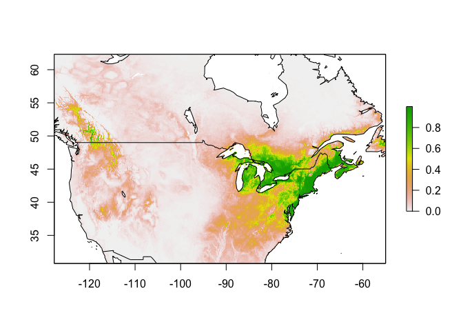<!-- -->

``` r
writeRaster(pred.seq, "../../pred/out/Mn/Mn_SDM_ME_rw_baseline_np.tif", overwrite = TRUE)
```

### Threshold

#### Minimum training presence

``` r
mtp <- sdm_threshold(pred.seq, occs, type = "mtp")
plot(mtp)
map('worldHires', fill=FALSE, add=TRUE, xlim = c(-127.75, -55), ylim = c(30.83333, 62.25), lforce = "e")

writeRaster(mtp, "../../pred/out/Mn/Mn_SDM_ME_rw_mtp_baseline_np.tif", overwrite = TRUE)
```

#### 10th percentile training presence

``` r
p10 <- sdm_threshold(pred.seq, occs, type = "p10")
plot(p10)
map('worldHires', fill=FALSE, add=TRUE, xlim = c(-127.75, -55), ylim = c(30.83333, 62.25), lforce = "e")
```

<!-- -->

``` r
p10.b <- sdm_threshold(pred.seq, occs, type = "p10", binary = TRUE)
plot(p10.b)
map('worldHires', fill=FALSE, add=TRUE, xlim = c(-127.75, -55), ylim = c(30.83333, 62.25), lforce = "e")
```

<!-- -->

``` r
writeRaster(p10, "../../pred/out/Mn/Mn_SDM_ME_rw_p10_baseline_np.tif", overwrite = TRUE)
```

### Future Climate Models

``` r
for (i in 1:length(e.mx@models)) {
  if(names(e.mx@models[i]) == as.character(opt.aicc[,3])) {
    model <- e.mx@models[[i]]
    print(paste("Opt. model : ", names(e.mx@models[i]), sep = ""))
  }
}
```

    ## [1] "Opt. model : fc.LQ_rm.1"

``` r
(thres <- min(na.omit(as.vector(p10))))
```

    ## [1] 0.07958563

#### 2041 - 2060

##### 2050 | ssp126

``` r
setwd("../../pred/pred_stack_rw/")
mdls <- list.files(pattern = "50.*ssp126.tif")

par(mfrow = c(2,4))
pred <- sapply(mdls, futurePred, envnames = envnames, model = model, drop = "pH")
```

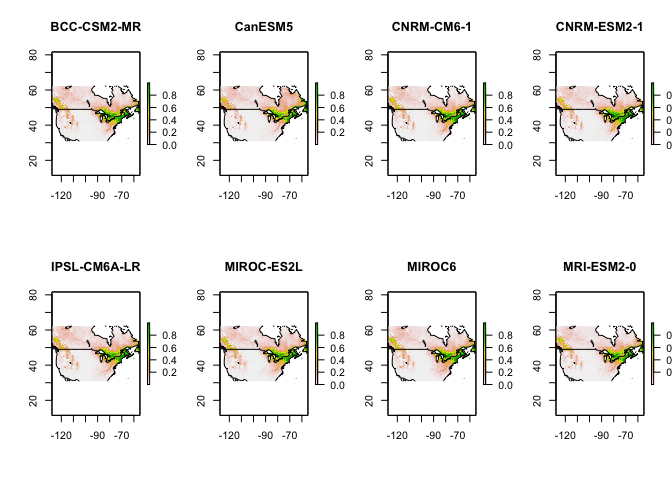<!-- -->

``` r
par(mfrow = c(1,1))
```

##### 2050 | ssp126 | Mean and Threshold

``` r
futureSave(pred, "Mn", "2050", "ssp126_np", thres = thres)
```

<!-- --><!-- -->

##### 2050 | ssp245

``` r
setwd("../../pred/pred_stack_rw/")
mdls <- list.files(pattern = "50.*ssp245.tif")

par(mfrow = c(2,4))
pred <- sapply(mdls, futurePred, envnames = envnames, model = model, drop = "pH")
```

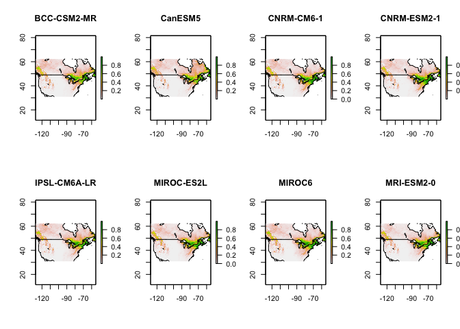<!-- -->

``` r
par(mfrow = c(1,1))
```

##### 2050 | ssp245 | Mean and Threshold

``` r
futureSave(pred, "Mn", "2050", "ssp245_np", thres = thres)
```

<!-- --><!-- -->

##### 2050 | ssp370

``` r
setwd("../../pred/pred_stack_rw/")
mdls <- list.files(pattern = "50.*ssp370.tif")

par(mfrow = c(2,4))
pred <- sapply(mdls, futurePred, envnames = envnames, model = model, drop = "pH")
```

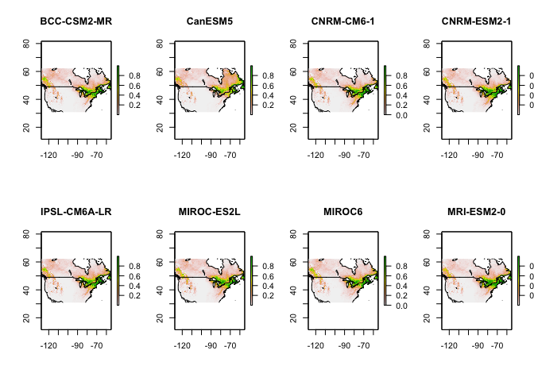<!-- -->

``` r
par(mfrow = c(1,1))
```

##### 2050 | ssp370 | Mean and Threshold

``` r
futureSave(pred, "Mn", "2050", "ssp370_np", thres = thres)
```

<!-- --><!-- -->

##### 2050 | ssp585

``` r
setwd("../../pred/pred_stack_rw/")
mdls <- list.files(pattern = "50.*ssp585.tif")

par(mfrow = c(2,4))
pred <- sapply(mdls, futurePred, envnames = envnames, model = model, drop = "pH")
```

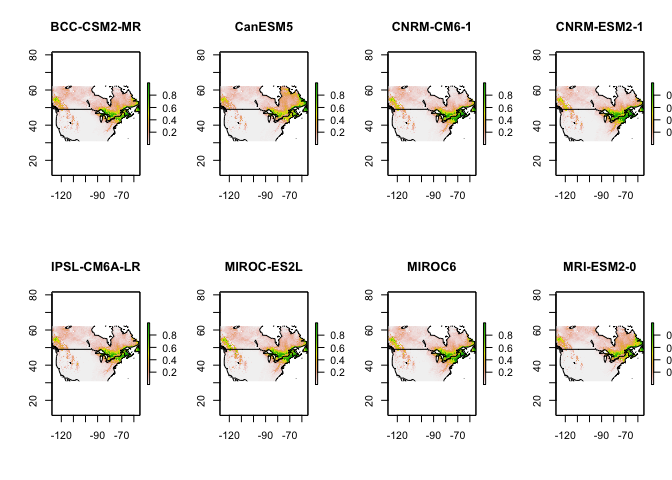<!-- -->

``` r
par(mfrow = c(1,1))
```

##### 2050 | ssp585 | Mean and Threshold

``` r
futureSave(pred, "Mn", "2050", "ssp585_np", thres = thres)
```

<!-- --><!-- -->

#### 2081 - 2100

##### 2090 | ssp126

``` r
setwd("../../pred/pred_stack_rw/")
mdls <- list.files(pattern = "90.*ssp126.tif")

par(mfrow = c(2,4))
pred <- sapply(mdls, futurePred, envnames = envnames, model = model, drop = "pH")
```

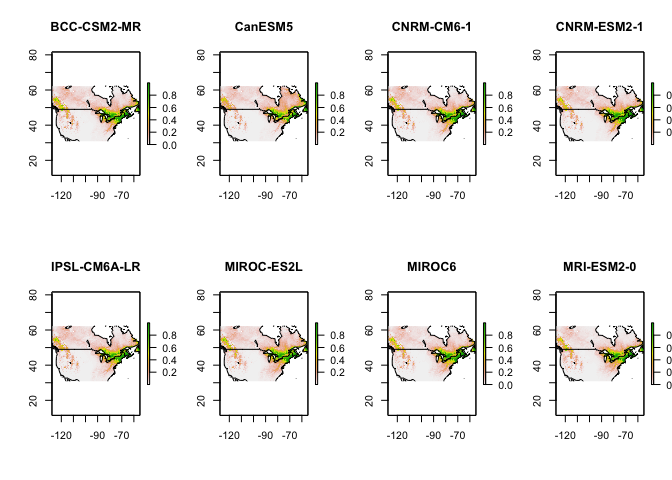<!-- -->

``` r
par(mfrow = c(1,1))
```

##### 2090 | ssp126 | Mean and Threshold

``` r
futureSave(pred, "Mn", "2090", "ssp126_np", thres = thres)
```

<!-- --><!-- -->

##### 2090 | ssp245

``` r
setwd("../../pred/pred_stack_rw/")
mdls <- list.files(pattern = "90.*ssp245.tif")

par(mfrow = c(2,4))
pred <- sapply(mdls, futurePred, envnames = envnames, model = model, drop = "pH")
```

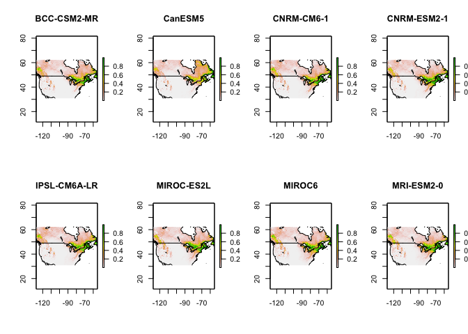<!-- -->

``` r
par(mfrow = c(1,1))
```

##### 2090 | ssp245 | Mean and Threshold

``` r
futureSave(pred, "Mn", "2090", "ssp245_np", thres = thres)
```

<!-- --><!-- -->

##### 2090 | ssp370

``` r
setwd("../../pred/pred_stack_rw/")
mdls <- list.files(pattern = "90.*ssp370.tif")

par(mfrow = c(2,4))
pred <- sapply(mdls, futurePred, envnames = envnames, model = model, drop = "pH")
```

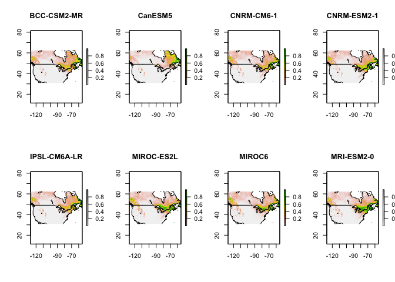<!-- -->

``` r
par(mfrow = c(1,1))
```

##### 2090 | ssp370 | Mean and Threshold

``` r
futureSave(pred, "Mn", "2090", "ssp370_np", thres = thres)
```

<!-- --><!-- -->

##### 2090 | ssp585

``` r
setwd("../../pred/pred_stack_rw/")
mdls <- list.files(pattern = "90.*ssp585.tif")

par(mfrow = c(2,4))
pred <- sapply(mdls, futurePred, envnames = envnames, model = model, drop = "pH")
```

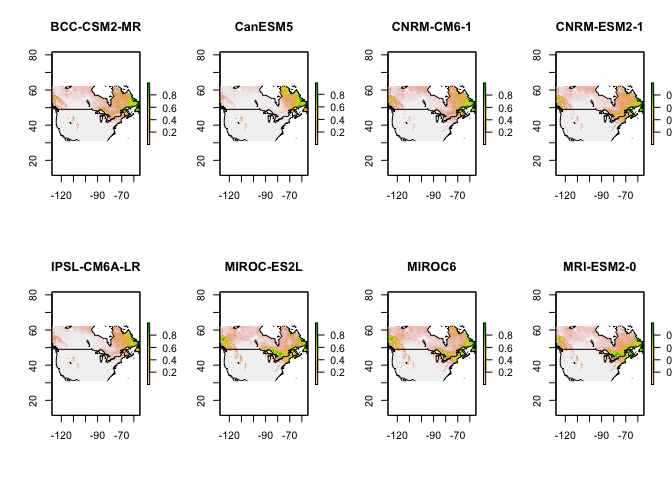<!-- -->

``` r
par(mfrow = c(1,1))
```

##### 2090 | ssp585 | Mean and Threshold

``` r
futureSave(pred, "Mn", "2090", "ssp585_np", thres = thres)
```

<!-- --><!-- -->
