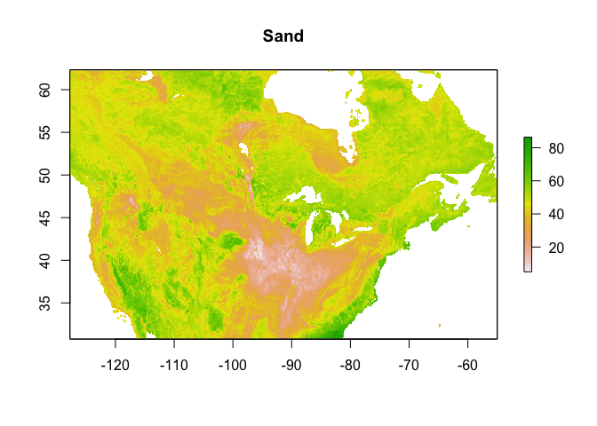
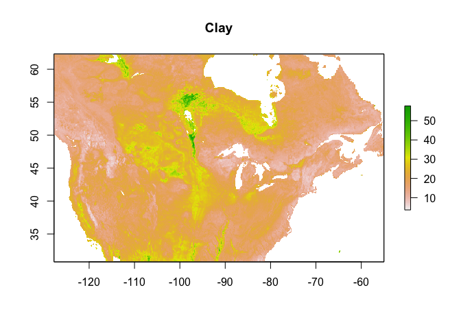
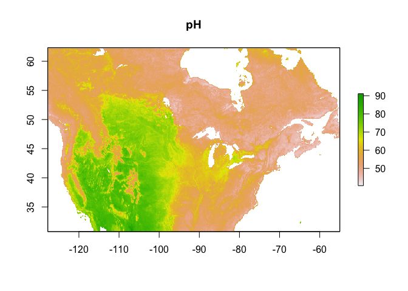
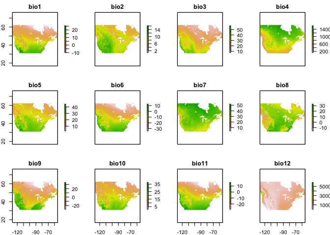
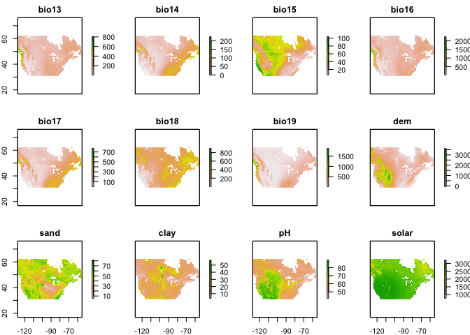
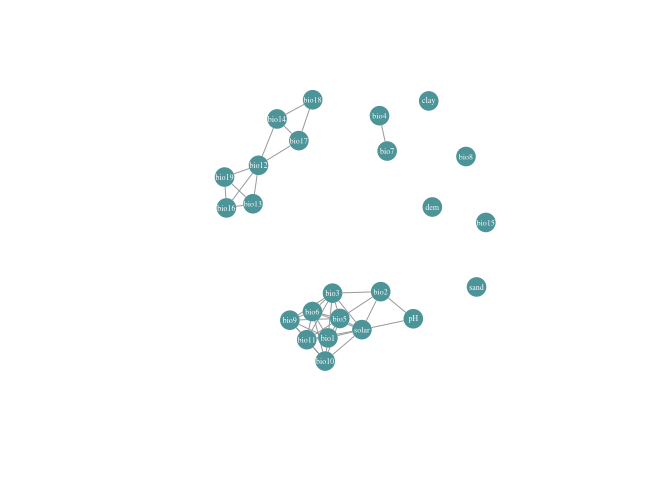
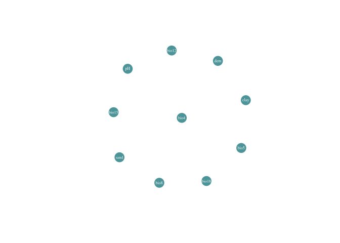

Mn SDM | Occurance and Predictor Data Processing
================
Mark Buckner
2021-09-19

  - [Packages](#packages)
  - [Functions](#functions)
  - [Occurance data](#occurance-data)
      - [*Macropis nuda*](#macropis-nuda)
      - [*Lysimachia ciliata*](#lysimachia-ciliata)
      - [*Apocynum androsaemifolium*](#apocynum-androsaemifolium)
  - [Predictors](#predictors)
      - [Baseline Data](#baseline-data)
      - [Topographic, soil, and solar radiation
        data](#topographic-soil-and-solar-radiation-data)
      - [Future Climate](#future-climate)

#### Packages

``` r
#install.packages("remotes")
#remotes::install_github("SEEG-Oxford/seegSDM")

library(raster)
library(tidyverse)
library(gtools)
library(lubridate)
library(knitr)
library(rgbif)
library(countrycode)
library(CoordinateCleaner)
library(seegSDM)
library(corrr)
library(igraph)
```

#### Functions

``` r
rastLoad <- function(file) {
  path <- paste("./", file, sep = "")
  r <- raster(path)
  return(r)
}

#futureStack() : Crops and Saves raster stacks of climate models under future projections for later use in spp. dis. projections. Written to be used with list.files() and sapply(). 
#File = Raster downloaded from WorldClim; Year = 2 digit year, character; bb = bounding box, extent obj.; mask = raster to use as mask; pred = additional predictor/s, vector of rasters; drop = vector of env. layer names to drop; cor = r2 value, numeric; matrix = reference correlation matrix, matrix/array

futureStack <- function(file, year, bb, mmask, pred, envnames, drop, cor = 0.70, cormatrix) {
  path <- paste("./", file, sep = "")
  m <- str_extract(file, "\\w[[:upper:]].*ssp\\d{3}")
  name <-  paste("../../../pred_stack_rw/", year, m, ".tif", sep = "")
  
  r <- stack(path) %>% 
    crop(bb, snap = "in")
  
  r <- stack(c(r, pred)) %>% 
    mask(mask = mmask)
  
  names(r) <- envnames
  
  r.d <- dropLayer(r, drop)
  
  PredCor <- layerStats(r.d, stat = "pearson", na.rm = T)

  PredCorrr <- as_cordf(PredCor$`pearson correlation coefficient`)
  PredCorrrH <- PredCorrr %>% 
    shave() %>% 
    stretch() %>% 
    filter(abs(r)>= cor)
  
  dif <- round(PredCor$`pearson correlation coefficient`, 2) - round(cormatrix,2)
  
  if(all(abs(dif) >= 0.1)) {
    print(paste(m, ": correlation shift", sep = " "))
    print(dif)
  } else if(nrow(PredCorrrH)>0) {
    print(paste(m, ": correlation shift", sep = " "))
    print(PredCorrrH)
  } else{
    print(paste(m, ": no substantial change in correlation", sep = " "))
  }
  
  writeRaster(r.d, filename = name, options="INTERLEAVE=BAND", overwrite=TRUE)
  
}
```

## Occurance data

I obtained occurrence data for each species (both bees and their host
plants) from several different sources.

### *Macropis nuda*

*SCAN* - Symbiota Collections of Arthropods Network, online database of
arthropod observation data (Accessed: 03/24/2021).

*GBIF* - Global Biodiversity Information Facility, online database of
observation data (Accessed: 03/24/2021).

*AMNH* - American Museum of Natural History’s Arthropod Easy Capture
locality database. (Accessed: 01/18/2021).

*BISON* - USGS’ Biodiversity Information Serving Our Nation database
(Accessed: 03/24/2021).

*CSBM* - Crowd sourced locality data from the bee monitoring list serve.
Multiple sources see .txt in folder. Includes additional observations
from iNaturalist in 2021 and personal observations from my targeted
collection efforts in July of 2021.

``` r
scan <- read_csv("../../occ/Mn/macropis_scan_03242021/occurrences.csv")

gbif <- read_tsv("../../occ/Mn/macropis_gbif_03242021/occurrence.txt")

amnh <- read_csv("../../occ/Mn/Macropis_query_result_20210118_d.csv")

bison <- read_csv("../../occ/Mn/macropis_bison_03242021.csv")

csbm <- read_csv("../../occ/Mn/csbm_08022021.csv")
```

Each dataset is formatted differently but contains a unique identifier,
date of collection, and decimal latitude and longitude data. Each
database is transformed to only retain these columns with the date in
“yyyy-mm-dd” format. All location data was rounded to five decimal
places to facilitate the identification and removal of duplicate
observations between each dataset. BISON reports lat/lon with a greater
number of digits than the other sources even for the same observations.
Ultimately, MaxEnt will remove any duplicates in the same raster cell
during modeling.

``` r
t_scan <- scan %>% 
  select(id, date = eventDate, lat = decimalLatitude, lon = decimalLongitude) %>% 
  drop_na() %>% 
  mutate(lat = round(lat,5), lon = round(lon,5)) %>%
  mutate(source = "SCAN")

t_gbif <- gbif %>% 
  select(gbifID, eventDate, verbatimEventDate, lat = decimalLatitude, lon = decimalLongitude) %>% 
  separate(eventDate, c("date", NA), sep = " ") %>% 
  mutate(verbatimEventDate = ifelse(is.na(date), verbatimEventDate, NA)) %>% 
  unite(date, date, verbatimEventDate, na.rm = TRUE) %>% 
  mutate(date = parse_date_time(date, orders = c("mdy", "ymd", "dmy"))) %>% 
  drop_na() %>% 
  mutate(lat = round(lat,5), lon = round(lon,5)) %>%
  mutate(source = "GBIF")

t_amnh <- amnh %>% 
  mutate(date = parse_date_time(amnh$Start_Date, orders = c("mdy", "dmy"))) %>%
  filter(species == "nuda") %>%
  select(PBIUSI, date, lat = Lat, lon = Lon) %>% 
  drop_na() %>% 
  mutate(lat = round(lat,5), lon = round(lon,5)) %>%
  mutate(source = "AMNH")

t_bison <- bison %>% 
  mutate(date = parse_date_time(bison$eventDate, orders = "ymd")) %>% 
  select(bisonID, date, lat = decimalLatitude, lon = decimalLongitude) %>% 
  drop_na() %>% 
  mutate(lat = round(lat,5), lon = round(lon,5)) %>% 
  mutate(source = "BISON")

t_csbm <- csbm %>% 
  mutate(date = parse_date_time(csbm$date, orders = "mdy")) %>% 
  select(id, date, lat, lon) %>% 
  drop_na() %>% 
  mutate(lat = round(lat,5), lon = round(lon,5)) %>%
  mutate(source = "BMN")
```

#### Joining datasets and removing duplicates

``` r
j_data_d <- full_join(t_scan, t_gbif, by = c("date", "lat", "lon")) %>% 
  full_join(t_amnh, by = c("date", "lat", "lon")) %>% 
  full_join(t_bison, by = c("date", "lat", "lon")) %>% 
  full_join(t_csbm, by = c("date", "lat", "lon"))

j_data <- j_data_d %>%
  filter(!duplicated(j_data_d[c("date", "lat", "lon")])) %>% 
  unite(data_source,source, source.x, source.y, source.x.x, source.y.y, sep = "/", na.rm = TRUE) %>% 
  select(date, lat, lon, data_source, scanID = id.x, gbifID, PBIUSI, bisonID, bmID = id.y)


kable(head(j_data))
```

| date       |      lat |        lon | data\_source |   scanID | gbifID | PBIUSI |    bisonID | bmID |
| :--------- | -------: | ---------: | :----------- | -------: | -----: | :----- | ---------: | :--- |
| 1949-07-19 | 44.23329 | \-95.61918 | SCAN         | 49221888 |     NA | NA     |         NA | NA   |
| 1926-08-01 | 41.98954 | \-73.09566 | SCAN         | 26199040 |     NA | NA     |         NA | NA   |
| 1894-07-12 | 42.23899 | \-71.36978 | SCAN         | 26206680 |     NA | NA     |         NA | NA   |
| 1890-07-05 | 42.44063 | \-76.49661 | SCAN         | 26206681 |     NA | NA     |         NA | NA   |
| 1892-07-06 | 42.68620 | \-72.04397 | SCAN         | 26206975 |     NA | NA     |         NA | NA   |
| 1984-07-19 | 42.38028 | \-72.52361 | SCAN/BISON   | 14207212 |     NA | NA     | 1039034317 | NA   |

#### Subset to observations

I limited observations to during or after 1970 to better align with
baseline climate data. However, I have allowed for a temporal mismatch
to remain post 2000. This allows for a greater number of observations
and in particular a greater number with more accurate locality data. The
accuracy location data was evaluated manually in QGIS to check for
misplaced observations.

``` r
Mn_NA70 <- j_data %>% 
  filter(date >= as.Date("1970-01-01") & date <= as.Date("2021-12-31")) %>% 
  mutate(lat = floor(lat*10000)/10000, lon = floor(lon*10000)/10000) %>% 
  select(lat, lon) %>% 
  unique()


write_csv(Mn_NA70, file = "../../Occ/Mn_RW70.csv")
```

### *Lysimachia ciliata*

*Lysimachia ciliata* observations are downloaded directly from GBIF
using the package `rgbif` and checked for inaccurate localities using
`CoordinateClearner` before being cleaned and parsed to the same format
as the *Macropis* observations.

``` r
key <- name_suggest(q = "Lysimachia ciliata", rank = "species")$data$key[1]

lc <- occ_data(taxonKey = key, hasCoordinate = TRUE, limit = 20000, decimalLongitude = "-130, -55", decimalLatitude = "25, 65", year = "1970,2020")  

lc.occ <- lc$data

lc.occ$countryCode <-  countrycode(lc.occ$countryCode, origin =  'iso2c', destination = 'iso3c')
flags <- clean_coordinates(x = lc.occ, 
                           lon = "decimalLongitude", 
                           lat = "decimalLatitude",
                           countries = "countryCode",
                           species = "species",
                          tests =  c("capitals", "centroids", "equal", "gbif", "institutions", "outliers", 
                                     "seas", "zeros")) 

summary(flags)
```

    ##     .val     .equ     .zer     .cap     .cen     .otl     .gbf    .inst 
    ##        0        0        0       55        6       67        0       11 
    ## .summary 
    ##      134

``` r
plot(flags, lon = "decimalLongitude", lat = "decimalLatitude")
```

<!-- -->

``` r
lc.occ.fl <- lc.occ[!flags$.summary,] %>% 
  select(-networkKeys)

write_csv(lc.occ.fl, file = "../../occ/Lc/lc_flagged.csv")

hist(lc.occ$coordinateUncertaintyInMeters / 1000, breaks = 20)
```

<!-- -->

``` r
#Simplify data structure to only include relevant data for modeling, parse dates, remove NAs, and round coordinates.
rm <- c(1212007115, 2814308747, 2465322406, 1321501674, 1317805708, 3027995787, 3027992038, 3028133474, 3348612353, 2242394259, 2242409762, 2242411272, 441784288, 2898280914, 1988070303)

Lc_NA70 <- lc.occ %>% 
  select(gbifID, eventDate, verbatimEventDate, lat = decimalLatitude, lon = decimalLongitude) %>% 
  separate(eventDate, c("date", NA), sep = "T") %>% 
  mutate(verbatimEventDate = ifelse(is.na(date), verbatimEventDate, NA)) %>% 
  unite(date, date, verbatimEventDate, na.rm = TRUE) %>% 
  mutate(lat = round(lat,5), lon = round(lon,5)) %>%
  filter(!gbifID %in% c(1212007115, 2814308747, 2465322406, 1321501674, 1317805708, 3027995787, 3027992038, 3028133474, 3348612353, 2242394259, 2242409762, 2242411272, 441784288, 2898280914, 1988070303))
#  filter(gbifID != 668779322 & gbifID != 1212007115 & gbifID != 2242409762 & gbifID != 2242411272 & gbifID != 441784288 & gbifID != 1988070303)

write_csv(Lc_NA70, file = "../../occ/Lc_RW70.csv")
```

clean\_coordinates() flagged a number of observations which I evaluated
in QGIS. Observations with inconsistent coordinates and site
descriptions including 1212007115 (Center of UConn campus), 2814308747
(located in the Ottowa River), 2465322406 (center of highway
intersection, no additional data), 1321501674 (site description and
coordinates do not match, approx 1km off), 1317805708 (US botanic
Gardens), 3027995787 (US botanic Gardens), 3027992038 (US botanic
Gardens), 3028133474 (US botanic Gardens), 3348612353 (US capitol
building), 2242394259 (Denver Botanic Gardens), 2242409762 (Denver
Botanic Gardens), 2242411272 (Denver Botanic Gardens), 441784288
(approx. 3km NNE of presumed location based on point), 2898280914
(coordinates assigned to park coordinates), and 1988070303 (UBC
Botanical Gardens)

15 observations (GBIF IDs 1212007115, 2814308747, 2465322406,
1321501674, 1317805708, 3027995787, 3027992038, 3028133474, 3348612353,
2242394259, 2242409762, 2242411272, 441784288, 2898280914, 1988070303)
were removed.

### *Apocynum androsaemifolium*

A distribution model of *A. androsaemifolium* was included when modeling
the regional distribution for M. nuda in the northeast. However,
following field observations the importance of the link between this
specific species and *M. nuda* were not clear. Other *Apocynum* species
(eg. *cannabinum*) can be a source of nectar along with several other
species.

## Predictors

### Baseline Data

I use bioclimatic variables from [CHELSA
ver. 2.1](https://chelsa-climate.org/downloads/). For this large study
area, I will use a moderate resolution, `5 arc-minutes` or approximately
`10km` at the equator. I use 8 of the 9 GCMs available from WorldClim. I
have excluded GFDL-ESM4 due to the lack of complete data for ssp245 and
ssp585 scenarios. Each species distribution will be projected using each
GCM at all 4 SSP scenarios and the averaged for a final model output.

#### Set bbox

The box is 10 degrees larger in each direction than the known range of
*M. nuda*.

``` r
lat.min <- min(Mn_NA70$lat)-10
lat.max <- max(Mn_NA70$lat)+10

lon.max <- min(Mn_NA70$lon)-10
lon.min <- max(Mn_NA70$lon)+10

#bb <- extent(c(-130,-55, 25, 65))

#Set study area bbox
(bb <- extent(c(lon.max, lon.min, lat.min, lat.max)))
```

    ## class      : Extent 
    ## xmin       : -127.7632 
    ## xmax       : -54.9654 
    ## ymin       : 30.8314 
    ## ymax       : 62.277

### Topographic, soil, and solar radiation data

DEM obtained from a DEM from
[SRTM](https://www.usgs.gov/centers/eros/science/usgs-eros-archive-digital-elevation-shuttle-radar-topography-mission-srtm-1-arc?qt-science_center_objects=0#qt-science_center_objects)
which was available at 5 arc-minute resolution through WorldClim.

Due to the relatively course resolution, slope and aspect are not
representative and are not used.

``` r
dem <- raster("../../pred/in/wc2.1_5m_elev.tif") %>% 
  crop(bb, snap = "in", filename = "../../pred/in/dem_rw.tif", overwrite = TRUE)
#dem <- resample(dem, baseline$wc5_baseline.1, method = "bilinear", filename = "../../pred/in/dem_rw.tif", overwrite = TRUE)
```

Water proximity was not used for this range wide data set since the
course resolution would likely mask any effect from proximity to water.

I have included three soil metrics which were obtained from
[openlandmap.org](openlandmap.org), [sand
content](https://zenodo.org/record/2525662#.YMDGYi2cbRY), [clay
content](https://zenodo.org/record/2525663#.YSkz5tNKidY), and [soil
pH](https://zenodo.org/record/2525664#.YTDhodNKidY) at 0cm depth. The
regional model used [soil water
content](https://zenodo.org/record/2784001#.YMDKPi2cbRY) at 0cm depth
under 33kpa suction making it an estimate of field capacity. This won’t
be included in this model due to the possibility for changes in field
capacity resulting from climate change (Allen D.E., Singh B.P., Dalal
R.C. 2011). The soil layers were roughly cropped to the project extent
in QGIS and then projected and refined here. These layers also functions
as a water mask.

``` r
soil_sand <- raster("../../pred/in/sand_rw.tif")
soil_sand <- resample(soil_sand, dem, method = "bilinear")
plot(soil_sand, main = "Sand")
```

<!-- -->

``` r
soil_clay <- raster("../../pred/in/clay_rw.tif")
soil_clay <- resample(soil_clay, dem, method = "bilinear")
plot(soil_clay, main = "Clay")
```

<!-- -->

``` r
soil_ph <- raster("../../pred/in/ph_rw.tif")
soil_ph <- resample(soil_ph, dem, method = "bilinear")
plot(soil_ph, main = "pH")
```

<!-- -->

Mean solar irradiation during the northern hemisphere’s meteorological
summer (June, July, August) which corresponds with host plant activity
(downloaded from CHELSA v1.2 on 08/17/2021).
``` r
setwd("../../pred/in/srad")
vars <- list.files()

srad <- stack(vars)
srad <- projectRaster(srad, dem, method = "bilinear")

srad <- mean(srad)
plot(srad, main = "Solar Radiation")
```

<!-- -->

#### Baseline Climate | 1971 - 2000

``` r
setwd("../../pred/in/ch0.5")
chvars <- list.files()

chbaseline <- stack(chvars) %>% 
  crop(bb, snap = "out", filename = "../ch05_baseline.tif", overwrite = TRUE)

baseline <- resample(chbaseline, dem, method = "bilinear")
```

#### Mask and Save

Using `masterMask()` from the `seegSDM` package function:

``` r
masks <- stack(c(baseline, dem, soil_sand, soil_clay, soil_ph, srad))
mmask <- masterMask(masks)

#Combine predictors into baseline stack, mask, and save.
baseline <- stack(c(baseline, dem, soil_sand, soil_clay, soil_ph, srad)) %>% 
  mask(mask = mmask)

names(baseline) <- c(paste("bio", seq(1,19), sep = ""), "dem", "sand", "clay", "pH", "solar")

plot(baseline[[1:12]])
```

<!-- -->

``` r
plot(baseline[[13:nlayers(baseline)]])
```

<!-- -->

#### Address Collinearity of predictors

With predictions into new areas or times correlation structure may
change and hinder prediction accuracy (Elith et al 2010), this
‘collinearity shift’ is important to address and can be quantified as
suggested by Feng et al 2019. One method to look into is detailed in
Feng et al 2015 (Borzee et al 2019).

``` r
PredCor <- layerStats(baseline, stat = "pearson", na.rm = T)
kable(PredCor$`pearson correlation coefficient`)
```

|       |        bio1 |        bio2 |        bio3 |        bio4 |        bio5 |        bio6 |        bio7 |        bio8 |        bio9 |       bio10 |       bio11 |       bio12 |       bio13 |       bio14 |       bio15 |       bio16 |       bio17 |       bio18 |       bio19 |         dem |        sand |        clay |          pH |       solar |
| :---- | ----------: | ----------: | ----------: | ----------: | ----------: | ----------: | ----------: | ----------: | ----------: | ----------: | ----------: | ----------: | ----------: | ----------: | ----------: | ----------: | ----------: | ----------: | ----------: | ----------: | ----------: | ----------: | ----------: | ----------: |
| bio1  |   1.0000000 |   0.5948266 |   0.8002110 | \-0.7720050 |   0.9214992 |   0.9642780 | \-0.7152326 |   0.3874224 |   0.8448237 |   0.9465312 |   0.9710207 |   0.0681691 | \-0.0364615 |   0.1002587 | \-0.1422336 | \-0.0278588 |   0.1172107 | \-0.2228549 |   0.1775901 |   0.0570132 | \-0.2651821 |   0.1530656 |   0.5131894 |   0.7320305 |
| bio2  |   0.5948266 |   1.0000000 |   0.8429685 | \-0.4682573 |   0.7250030 |   0.5784309 | \-0.2597113 |   0.2457269 |   0.5357133 |   0.5867267 |   0.6024698 | \-0.3854462 | \-0.3353108 | \-0.3913980 |   0.2556159 | \-0.3486225 | \-0.3886359 | \-0.5570600 | \-0.1869419 |   0.5773286 | \-0.1428491 |   0.2119595 |   0.7558273 |   0.7350523 |
| bio3  |   0.8002110 |   0.8429685 |   1.0000000 | \-0.8402808 |   0.7415763 |   0.8580601 | \-0.7078602 |   0.1459968 |   0.7997450 |   0.6615024 |   0.8656990 | \-0.0289006 | \-0.0120434 | \-0.1001718 |   0.1031240 | \-0.0199156 | \-0.0818825 | \-0.4295968 |   0.2051350 |   0.4886092 | \-0.1350518 |   0.0751460 |   0.6172501 |   0.7216440 |
| bio4  | \-0.7720050 | \-0.4682573 | \-0.8402808 |   1.0000000 | \-0.5388888 | \-0.8999761 |   0.9659217 |   0.0453414 | \-0.8520579 | \-0.5349320 | \-0.8955686 | \-0.3546397 | \-0.2817808 | \-0.2908706 |   0.2098797 | \-0.2865243 | \-0.3150030 |   0.1461781 | \-0.5225796 | \-0.3286241 |   0.1022799 |   0.1601740 | \-0.3162421 | \-0.5167947 |
| bio5  |   0.9214992 |   0.7250030 |   0.7415763 | \-0.5388888 |   1.0000000 |   0.8328454 | \-0.4245857 |   0.4719156 |   0.7151448 |   0.9735558 |   0.8444907 | \-0.2000384 | \-0.2581298 | \-0.1576935 |   0.0296965 | \-0.2541083 | \-0.1481018 | \-0.3959018 | \-0.0761258 |   0.0874155 | \-0.3019229 |   0.3001885 |   0.6509117 |   0.8300988 |
| bio6  |   0.9642780 |   0.5784309 |   0.8580601 | \-0.8999761 |   0.8328454 |   1.0000000 | \-0.8536346 |   0.2375121 |   0.8927069 |   0.8429399 |   0.9960819 |   0.1675372 |   0.0818009 |   0.1526792 | \-0.1474153 |   0.0878601 |   0.1735278 | \-0.2320277 |   0.3148539 |   0.1768236 | \-0.2370094 |   0.0494069 |   0.4856261 |   0.7135205 |
| bio7  | \-0.7152326 | \-0.2597113 | \-0.7078602 |   0.9659217 | \-0.4245857 | \-0.8536346 |   1.0000000 |   0.0531465 | \-0.7909200 | \-0.4673775 | \-0.8373103 | \-0.4643916 | \-0.3794909 | \-0.3997917 |   0.2652114 | \-0.3854756 | \-0.4253274 |   0.0059465 | \-0.5909231 | \-0.1940474 |   0.0963030 |   0.1977135 | \-0.1764022 | \-0.3818755 |
| bio8  |   0.3874224 |   0.2457269 |   0.1459968 |   0.0453414 |   0.4719156 |   0.2375121 |   0.0531465 |   1.0000000 | \-0.0434501 |   0.5294599 |   0.2477420 | \-0.2609396 | \-0.2639078 | \-0.1877478 |   0.1303696 | \-0.2699443 | \-0.1923881 |   0.1093766 | \-0.4085831 | \-0.2327768 | \-0.2155661 |   0.3839809 |   0.2901405 |   0.2502068 |
| bio9  |   0.8448237 |   0.5357133 |   0.7997450 | \-0.8520579 |   0.7151448 |   0.8927069 | \-0.7909200 | \-0.0434501 |   1.0000000 |   0.7057705 |   0.8957268 |   0.1817825 |   0.0828086 |   0.1816217 | \-0.2136693 |   0.0904685 |   0.2047010 | \-0.3218793 |   0.3993354 |   0.2498407 | \-0.1374123 | \-0.0605171 |   0.4112405 |   0.6366527 |
| bio10 |   0.9465312 |   0.5867267 |   0.6615024 | \-0.5349320 |   0.9735558 |   0.8429399 | \-0.4673775 |   0.5294599 |   0.7057705 |   1.0000000 |   0.8534979 | \-0.1054292 | \-0.2049819 | \-0.0328209 | \-0.0755158 | \-0.1960409 | \-0.0229530 | \-0.2559613 | \-0.0337459 | \-0.0478410 | \-0.3035797 |   0.2789007 |   0.5513356 |   0.7486509 |
| bio11 |   0.9710207 |   0.6024698 |   0.8656990 | \-0.8955686 |   0.8444907 |   0.9960819 | \-0.8373103 |   0.2477420 |   0.8957268 |   0.8534979 |   1.0000000 |   0.1550314 |   0.0586019 |   0.1546543 | \-0.1648548 |   0.0661927 |   0.1742982 | \-0.2313088 |   0.2972953 |   0.1834930 | \-0.2200553 |   0.0458070 |   0.4925875 |   0.7169186 |
| bio12 |   0.0681691 | \-0.3854462 | \-0.0289006 | \-0.3546397 | \-0.2000384 |   0.1675372 | \-0.4643916 | \-0.2609396 |   0.1817825 | \-0.1054292 |   0.1550314 |   1.0000000 |   0.9102064 |   0.8190915 | \-0.4788759 |   0.9276444 |   0.8506661 |   0.6499239 |   0.8975921 | \-0.2344431 | \-0.0462403 | \-0.3621349 | \-0.5505888 | \-0.3547852 |
| bio13 | \-0.0364615 | \-0.3353108 | \-0.0120434 | \-0.2817808 | \-0.2581298 |   0.0818009 | \-0.3794909 | \-0.2639078 |   0.0828086 | \-0.2049819 |   0.0586019 |   0.9102064 |   1.0000000 |   0.5386643 | \-0.1129203 |   0.9948534 |   0.5819777 |   0.5027860 |   0.8821880 | \-0.1557665 | \-0.0303479 | \-0.2590248 | \-0.4569738 | \-0.3279775 |
| bio14 |   0.1002587 | \-0.3913980 | \-0.1001718 | \-0.2908706 | \-0.1576935 |   0.1526792 | \-0.3997917 | \-0.1877478 |   0.1816217 | \-0.0328209 |   0.1546543 |   0.8190915 |   0.5386643 |   1.0000000 | \-0.8001719 |   0.5653895 |   0.9941997 |   0.7124379 |   0.6308923 | \-0.2696934 | \-0.0175494 | \-0.4122575 | \-0.5672421 | \-0.3931613 |
| bio15 | \-0.1422336 |   0.2556159 |   0.1031240 |   0.2098797 |   0.0296965 | \-0.1474153 |   0.2652114 |   0.1303696 | \-0.2136693 | \-0.0755158 | \-0.1648548 | \-0.4788759 | \-0.1129203 | \-0.8001719 |   1.0000000 | \-0.1494879 | \-0.7889961 | \-0.4505552 | \-0.3106788 |   0.1339763 |   0.0235376 |   0.3830894 |   0.3887159 |   0.2024660 |
| bio16 | \-0.0278588 | \-0.3486225 | \-0.0199156 | \-0.2865243 | \-0.2541083 |   0.0878601 | \-0.3854756 | \-0.2699443 |   0.0904685 | \-0.1960409 |   0.0661927 |   0.9276444 |   0.9948534 |   0.5653895 | \-0.1494879 |   1.0000000 |   0.6079659 |   0.5180084 |   0.8945578 | \-0.1753038 | \-0.0268176 | \-0.2710471 | \-0.4738353 | \-0.3308910 |
| bio17 |   0.1172107 | \-0.3886359 | \-0.0818825 | \-0.3150030 | \-0.1481018 |   0.1735278 | \-0.4253274 | \-0.1923881 |   0.2047010 | \-0.0229530 |   0.1742982 |   0.8506661 |   0.5819777 |   0.9941997 | \-0.7889961 |   0.6079659 |   1.0000000 |   0.7126914 |   0.6704855 | \-0.2674486 | \-0.0200764 | \-0.4113747 | \-0.5651270 | \-0.3837247 |
| bio18 | \-0.2228549 | \-0.5570600 | \-0.4295968 |   0.1461781 | \-0.3959018 | \-0.2320277 |   0.0059465 |   0.1093766 | \-0.3218793 | \-0.2559613 | \-0.2313088 |   0.6499239 |   0.5027860 |   0.7124379 | \-0.4505552 |   0.5180084 |   0.7126914 |   1.0000000 |   0.2781901 | \-0.4053012 | \-0.0386791 | \-0.2468448 | \-0.6457282 | \-0.6565956 |
| bio19 |   0.1775901 | \-0.1869419 |   0.2051350 | \-0.5225796 | \-0.0761258 |   0.3148539 | \-0.5909231 | \-0.4085831 |   0.3993354 | \-0.0337459 |   0.2972953 |   0.8975921 |   0.8821880 |   0.6308923 | \-0.3106788 |   0.8945578 |   0.6704855 |   0.2781901 |   1.0000000 | \-0.0672559 |   0.0161461 | \-0.3372297 | \-0.3689280 | \-0.1348863 |
| dem   |   0.0570132 |   0.5773286 |   0.4886092 | \-0.3286241 |   0.0874155 |   0.1768236 | \-0.1940474 | \-0.2327768 |   0.2498407 | \-0.0478410 |   0.1834930 | \-0.2344431 | \-0.1557665 | \-0.2696934 |   0.1339763 | \-0.1753038 | \-0.2674486 | \-0.4053012 | \-0.0672559 |   1.0000000 |   0.1314926 | \-0.1234962 |   0.4840570 |   0.3549266 |
| sand  | \-0.2651821 | \-0.1428491 | \-0.1350518 |   0.1022799 | \-0.3019229 | \-0.2370094 |   0.0963030 | \-0.2155661 | \-0.1374123 | \-0.3035797 | \-0.2200553 | \-0.0462403 | \-0.0303479 | \-0.0175494 |   0.0235376 | \-0.0268176 | \-0.0200764 | \-0.0386791 |   0.0161461 |   0.1314926 |   1.0000000 | \-0.5737114 | \-0.1830450 | \-0.2172130 |
| clay  |   0.1530656 |   0.2119595 |   0.0751460 |   0.1601740 |   0.3001885 |   0.0494069 |   0.1977135 |   0.3839809 | \-0.0605171 |   0.2789007 |   0.0458070 | \-0.3621349 | \-0.2590248 | \-0.4122575 |   0.3830894 | \-0.2710471 | \-0.4113747 | \-0.2468448 | \-0.3372297 | \-0.1234962 | \-0.5737114 |   1.0000000 |   0.3960216 |   0.2927032 |
| pH    |   0.5131894 |   0.7558273 |   0.6172501 | \-0.3162421 |   0.6509117 |   0.4856261 | \-0.1764022 |   0.2901405 |   0.4112405 |   0.5513356 |   0.4925875 | \-0.5505888 | \-0.4569738 | \-0.5672421 |   0.3887159 | \-0.4738353 | \-0.5651270 | \-0.6457282 | \-0.3689280 |   0.4840570 | \-0.1830450 |   0.3960216 |   1.0000000 |   0.7653109 |
| solar |   0.7320305 |   0.7350523 |   0.7216440 | \-0.5167947 |   0.8300988 |   0.7135205 | \-0.3818755 |   0.2502068 |   0.6366527 |   0.7486509 |   0.7169186 | \-0.3547852 | \-0.3279775 | \-0.3931613 |   0.2024660 | \-0.3308910 | \-0.3837247 | \-0.6565956 | \-0.1348863 |   0.3549266 | \-0.2172130 |   0.2927032 |   0.7653109 |   1.0000000 |

``` r
PredCorrr <- as_cordf(PredCor$`pearson correlation coefficient`)
PredCorrrH <- PredCorrr %>% 
  shave() %>% 
  stretch() %>% 
  filter(abs(r)>= 0.70) %>% 
  arrange(r)

kable(PredCorrrH)
```

| x     | y     |           r |
| :---- | :---- | ----------: |
| bio4  | bio6  | \-0.8999761 |
| bio4  | bio11 | \-0.8955686 |
| bio6  | bio7  | \-0.8536346 |
| bio4  | bio9  | \-0.8520579 |
| bio3  | bio4  | \-0.8402808 |
| bio7  | bio11 | \-0.8373103 |
| bio14 | bio15 | \-0.8001719 |
| bio7  | bio9  | \-0.7909200 |
| bio15 | bio17 | \-0.7889961 |
| bio1  | bio4  | \-0.7720050 |
| bio1  | bio7  | \-0.7152326 |
| bio3  | bio7  | \-0.7078602 |
| bio9  | bio10 |   0.7057705 |
| bio14 | bio18 |   0.7124379 |
| bio17 | bio18 |   0.7126914 |
| bio6  | solar |   0.7135205 |
| bio5  | bio9  |   0.7151448 |
| bio11 | solar |   0.7169186 |
| bio3  | solar |   0.7216440 |
| bio2  | bio5  |   0.7250030 |
| bio1  | solar |   0.7320305 |
| bio2  | solar |   0.7350523 |
| bio3  | bio5  |   0.7415763 |
| bio10 | solar |   0.7486509 |
| bio2  | pH    |   0.7558273 |
| pH    | solar |   0.7653109 |
| bio3  | bio9  |   0.7997450 |
| bio1  | bio3  |   0.8002110 |
| bio12 | bio14 |   0.8190915 |
| bio5  | solar |   0.8300988 |
| bio5  | bio6  |   0.8328454 |
| bio6  | bio10 |   0.8429399 |
| bio2  | bio3  |   0.8429685 |
| bio5  | bio11 |   0.8444907 |
| bio1  | bio9  |   0.8448237 |
| bio12 | bio17 |   0.8506661 |
| bio10 | bio11 |   0.8534979 |
| bio3  | bio6  |   0.8580601 |
| bio3  | bio11 |   0.8656990 |
| bio13 | bio19 |   0.8821880 |
| bio6  | bio9  |   0.8927069 |
| bio16 | bio19 |   0.8945578 |
| bio9  | bio11 |   0.8957268 |
| bio12 | bio19 |   0.8975921 |
| bio12 | bio13 |   0.9102064 |
| bio1  | bio5  |   0.9214992 |
| bio12 | bio16 |   0.9276444 |
| bio1  | bio10 |   0.9465312 |
| bio1  | bio6  |   0.9642780 |
| bio4  | bio7  |   0.9659217 |
| bio1  | bio11 |   0.9710207 |
| bio5  | bio10 |   0.9735558 |
| bio14 | bio17 |   0.9941997 |
| bio13 | bio16 |   0.9948534 |
| bio6  | bio11 |   0.9960819 |

``` r
PredCorrP <- PredCor$`pearson correlation coefficient`
PredCorrP[PredCorrP<0.70] <- 0
network <- graph_from_adjacency_matrix(PredCorrP, weighted = T, mode = "undirected", diag = FALSE)
plot(network,
    vertex.size=15,
    vertex.color= "#5CA4A9", 
    vertex.label.cex=0.5,
    vertex.label.color="white",
    vertex.frame.color="transparent")
```

<!-- -->

``` r
#For worldclim
#drop <- c("bio1", "bio2", "bio3", "bio5", "bio6", "bio7", "bio9", "bio11", "bio13", "bio14", "bio16", "bio17", "bio19", "solar")
drop <- c("bio1", "bio2", "bio3", "bio6", "bio7", "bio9", "bio10", "bio11", "bio13", "bio14", "bio16", "bio17", "bio19", "solar")
baseline.d <- dropLayer(baseline, drop)

PredCor <- layerStats(baseline.d, stat = "pearson", na.rm = T)

PredCorrP <- PredCor$`pearson correlation coefficient`
PredCorrP[PredCorrP<0.70] <- 0
network <- graph_from_adjacency_matrix(PredCorrP, weighted = T, mode = "undirected", diag = FALSE)
plot(network,
    vertex.size=15,
    vertex.color= "#5CA4A9", 
    vertex.label.cex=0.5,
    vertex.label.color="white",
    vertex.frame.color="transparent")
```

<!-- -->

#### Save

``` r
writeRaster(baseline.d, filename="../../pred/pred_stack_rw/baseline.tif", options="INTERLEAVE=BAND", overwrite=TRUE)
```

### Future Climate

``` r
envnames <- names(baseline)
cormatrix <- PredCor$`pearson correlation coefficient`
```

Each of the 8 GCMs were downloaded from WorldClim for each SSP during
two time periods, `2041-2060` and `2081-2100`. The custom function used
below creates a raster stack for each model at each time and scenario
with the variables selected above. Additionally, it checks for shifts in
correlation between the baseline and future climate predictions. In this
function I consider a “correlation shift” any change in correlation
greater than `|0.1|` or which results in a correlation coefficient
greater than our assigned threshold of `0.7`. Shifts above `0.7` may not
be particularly influential but do require additional review, and are
flagged.

#### 2041 - 2060

##### ssp126 | 2041 - 2060

``` r
setwd("../../pred/in/wc5_future/2050_ssp126")
mdls <- list.files(pattern = "wc2.*")

ssp126 <- sapply(mdls, futureStack, year = "50", bb = bb, mmask = mmask, pred = c(dem, soil_sand, soil_clay, soil_ph, srad), envnames = envnames, drop = drop, cormatrix = cormatrix)
```

    ## [1] "_BCC-CSM2-MR_ssp126 : no substantial change in correlation"
    ## [1] "_CanESM5_ssp126 : no substantial change in correlation"
    ## [1] "_CNRM-CM6-1_ssp126 : no substantial change in correlation"
    ## [1] "_CNRM-ESM2-1_ssp126 : no substantial change in correlation"
    ## [1] "_IPSL-CM6A-LR_ssp126 : no substantial change in correlation"
    ## [1] "_MIROC-ES2L_ssp126 : correlation shift"
    ## # A tibble: 1 x 3
    ##   x     y         r
    ##   <chr> <chr> <dbl>
    ## 1 bio12 bio18 0.711
    ## [1] "_MIROC6_ssp126 : no substantial change in correlation"
    ## [1] "_MRI-ESM2-0_ssp126 : no substantial change in correlation"

##### ssp 245 | 2041 - 2060

``` r
setwd("../../pred/in/wc5_future/2050_ssp245")
mdls <- list.files(pattern = "wc2.*")

ssp245 <- sapply(mdls, futureStack, year = "50", bb = bb, mmask = mmask, pred = c(dem, soil_sand, soil_clay, soil_ph, srad), envnames = envnames, drop = drop, cormatrix = cormatrix)
```

    ## [1] "_BCC-CSM2-MR_ssp245 : no substantial change in correlation"
    ## [1] "_CanESM5_ssp245 : no substantial change in correlation"
    ## [1] "_CNRM-CM6-1_ssp245 : no substantial change in correlation"
    ## [1] "_CNRM-ESM2-1_ssp245 : no substantial change in correlation"
    ## [1] "_IPSL-CM6A-LR_ssp245 : no substantial change in correlation"
    ## [1] "_MIROC-ES2L_ssp245 : no substantial change in correlation"
    ## [1] "_MIROC6_ssp245 : no substantial change in correlation"
    ## [1] "_MRI-ESM2-0_ssp245 : no substantial change in correlation"

##### ssp 370 | 2041 - 2060

``` r
setwd("../../pred/in/wc5_future/2050_ssp370")
mdls <- list.files(pattern = "wc2.*")

ssp370 <- sapply(mdls, futureStack, year = "50", bb = bb, mmask = mmask, pred = c(dem, soil_sand, soil_clay, soil_ph, srad), envnames = envnames, drop = drop, cormatrix = cormatrix)
```

    ## [1] "_BCC-CSM2-MR_ssp370 : no substantial change in correlation"
    ## [1] "_CanESM5_ssp370 : no substantial change in correlation"
    ## [1] "_CNRM-CM6-1_ssp370 : no substantial change in correlation"
    ## [1] "_CNRM-ESM2-1_ssp370 : no substantial change in correlation"
    ## [1] "_IPSL-CM6A-LR_ssp370 : no substantial change in correlation"
    ## [1] "_MIROC-ES2L_ssp370 : correlation shift"
    ## # A tibble: 1 x 3
    ##   x     y         r
    ##   <chr> <chr> <dbl>
    ## 1 bio12 bio18 0.729
    ## [1] "_MIROC6_ssp370 : no substantial change in correlation"
    ## [1] "_MRI-ESM2-0_ssp370 : correlation shift"
    ## # A tibble: 1 x 3
    ##   x     y         r
    ##   <chr> <chr> <dbl>
    ## 1 bio5  pH    0.701

##### ssp 585 | 2041 - 2060

``` r
setwd("../../pred/in/wc5_future/2050_ssp585")
mdls <- list.files(pattern = "wc2.*")

ssp585 <- sapply(mdls, futureStack, year = "50", bb = bb, mmask = mmask, pred = c(dem, soil_sand, soil_clay, soil_ph, srad), envnames = envnames, drop = drop, cormatrix = cormatrix)
```

    ## [1] "_BCC-CSM2-MR_ssp585 : no substantial change in correlation"
    ## [1] "_CanESM5_ssp585 : no substantial change in correlation"
    ## [1] "_CNRM-CM6-1_ssp585 : no substantial change in correlation"
    ## [1] "_CNRM-ESM2-1_ssp585 : no substantial change in correlation"
    ## [1] "_IPSL-CM6A-LR_ssp585 : no substantial change in correlation"
    ## [1] "_MIROC-ES2L_ssp585 : correlation shift"
    ## # A tibble: 1 x 3
    ##   x     y         r
    ##   <chr> <chr> <dbl>
    ## 1 bio12 bio18 0.710
    ## [1] "_MIROC6_ssp585 : no substantial change in correlation"
    ## [1] "_MRI-ESM2-0_ssp585 : correlation shift"
    ## # A tibble: 1 x 3
    ##   x     y         r
    ##   <chr> <chr> <dbl>
    ## 1 bio5  pH    0.715

#### 2081 - 2100

##### ssp126 | 2081 - 2100

``` r
setwd("../../pred/in/wc5_future/2090_ssp126")
mdls <- list.files(pattern = "wc2.*")

ssp126 <- sapply(mdls, futureStack, year = "90", bb = bb, mmask = mmask, pred = c(dem, soil_sand, soil_clay, soil_ph, srad), envnames = envnames, drop = drop, cormatrix = cormatrix)
```

    ## [1] "_BCC-CSM2-MR_ssp126 : no substantial change in correlation"
    ## [1] "_CanESM5_ssp126 : no substantial change in correlation"
    ## [1] "_CNRM-CM6-1_ssp126 : no substantial change in correlation"
    ## [1] "_CNRM-ESM2-1_ssp126 : no substantial change in correlation"
    ## [1] "_IPSL-CM6A-LR_ssp126 : no substantial change in correlation"
    ## [1] "_MIROC-ES2L_ssp126 : correlation shift"
    ## # A tibble: 1 x 3
    ##   x     y         r
    ##   <chr> <chr> <dbl>
    ## 1 bio12 bio18 0.701
    ## [1] "_MIROC6_ssp126 : no substantial change in correlation"
    ## [1] "_MRI-ESM2-0_ssp126 : no substantial change in correlation"

##### ssp 245 | 2081 - 2100

``` r
setwd("../../pred/in/wc5_future/2090_ssp245")
mdls <- list.files(pattern = "wc2.*")

ssp245 <- sapply(mdls, futureStack, year = "90", bb = bb, mmask = mmask, pred = c(dem, soil_sand, soil_clay, soil_ph, srad), envnames = envnames, drop = drop, cormatrix = cormatrix)
```

    ## [1] "_BCC-CSM2-MR_ssp245 : no substantial change in correlation"
    ## [1] "_CanESM5_ssp245 : no substantial change in correlation"
    ## [1] "_CNRM-CM6-1_ssp245 : no substantial change in correlation"
    ## [1] "_CNRM-ESM2-1_ssp245 : no substantial change in correlation"
    ## [1] "_IPSL-CM6A-LR_ssp245 : no substantial change in correlation"
    ## [1] "_MIROC-ES2L_ssp245 : correlation shift"
    ## # A tibble: 1 x 3
    ##   x     y         r
    ##   <chr> <chr> <dbl>
    ## 1 bio12 bio18 0.715
    ## [1] "_MIROC6_ssp245 : no substantial change in correlation"
    ## [1] "_MRI-ESM2-0_ssp245 : no substantial change in correlation"

##### ssp 370 | 2081 - 2100

``` r
setwd("../../pred/in/wc5_future/2090_ssp370")
mdls <- list.files(pattern = "wc2.*")

ssp370 <- sapply(mdls, futureStack, year = "90", bb = bb, mmask = mmask, pred = c(dem, soil_sand, soil_clay, soil_ph, srad), envnames = envnames, drop = drop, cormatrix = cormatrix)
```

    ## [1] "_BCC-CSM2-MR_ssp370 : no substantial change in correlation"
    ## [1] "_CanESM5_ssp370 : no substantial change in correlation"
    ## [1] "_CNRM-CM6-1_ssp370 : no substantial change in correlation"
    ## [1] "_CNRM-ESM2-1_ssp370 : correlation shift"
    ## # A tibble: 1 x 3
    ##   x     y         r
    ##   <chr> <chr> <dbl>
    ## 1 bio5  pH    0.701
    ## [1] "_IPSL-CM6A-LR_ssp370 : correlation shift"
    ## # A tibble: 1 x 3
    ##   x     y         r
    ##   <chr> <chr> <dbl>
    ## 1 bio12 bio18 0.705
    ## [1] "_MIROC-ES2L_ssp370 : correlation shift"
    ## # A tibble: 1 x 3
    ##   x     y         r
    ##   <chr> <chr> <dbl>
    ## 1 bio12 bio18 0.712
    ## [1] "_MIROC6_ssp370 : correlation shift"
    ## # A tibble: 1 x 3
    ##   x     y         r
    ##   <chr> <chr> <dbl>
    ## 1 bio12 bio18 0.702
    ## [1] "_MRI-ESM2-0_ssp370 : no substantial change in correlation"

##### ssp 585 | 2081 - 2100

``` r
setwd("../../pred/in/wc5_future/2090_ssp585")
mdls <- list.files(pattern = "wc2.*")

ssp585 <- sapply(mdls, futureStack, year = "90", bb = bb, mmask = mmask, pred = c(dem, soil_sand, soil_clay, soil_ph, srad), envnames = envnames, drop = drop, cormatrix = cormatrix)
```

    ## [1] "_BCC-CSM2-MR_ssp585 : no substantial change in correlation"
    ## [1] "_CanESM5_ssp585 : correlation shift"
    ## # A tibble: 1 x 3
    ##   x     y         r
    ##   <chr> <chr> <dbl>
    ## 1 bio5  pH    0.703
    ## [1] "_CNRM-CM6-1_ssp585 : correlation shift"
    ## # A tibble: 1 x 3
    ##   x     y         r
    ##   <chr> <chr> <dbl>
    ## 1 bio5  pH    0.705
    ## [1] "_CNRM-ESM2-1_ssp585 : correlation shift"
    ## # A tibble: 2 x 3
    ##   x     y         r
    ##   <chr> <chr> <dbl>
    ## 1 bio5  pH    0.716
    ## 2 bio12 bio18 0.716
    ## [1] "_IPSL-CM6A-LR_ssp585 : correlation shift"
    ## # A tibble: 2 x 3
    ##   x     y         r
    ##   <chr> <chr> <dbl>
    ## 1 bio5  pH    0.706
    ## 2 bio12 bio18 0.707
    ## [1] "_MIROC-ES2L_ssp585 : correlation shift"
    ## # A tibble: 2 x 3
    ##   x     y         r
    ##   <chr> <chr> <dbl>
    ## 1 bio5  pH    0.712
    ## 2 bio12 bio18 0.726
    ## [1] "_MIROC6_ssp585 : correlation shift"
    ## # A tibble: 1 x 3
    ##   x     y         r
    ##   <chr> <chr> <dbl>
    ## 1 bio12 bio18 0.701
    ## [1] "_MRI-ESM2-0_ssp585 : correlation shift"
    ## # A tibble: 1 x 3
    ##   x     y         r
    ##   <chr> <chr> <dbl>
    ## 1 bio5  pH    0.715

There were no substantial shifts in correlation. In a number of
scenarios the correlation coefficient between `Bio 12` and `Bio 18` in
`MIROC-ES2L` exceeded our threshold of `0.7`. Additionally, in ssp370
and ssp585 for 2081-2100 `Bio 12` and `Bio 18` also exceeded the
threshold in `IPSL-CM6A-LR`, and `MIROC_ES2L`, and `MIROC6` and in
`CNRM-ESM2-1` in only ssp585. `Bio 5` and `pH` also experienced a shift
which exceeded the `0.7` threshold in `MRI-ESM2` during 2050 with
ssp585, in `CNRM-ESM2` 2090/ssp370 and `CanESM5`, `CNRM-CM6-1`,
`CNRM-ESM2`, `IPSL-CM6A-LR`, and `MIROC-ES2L` in 2090/ssp585. However in
all cases the change was less than `0.1` indicating a minor shift that
would likely have little impact on model transferability.
